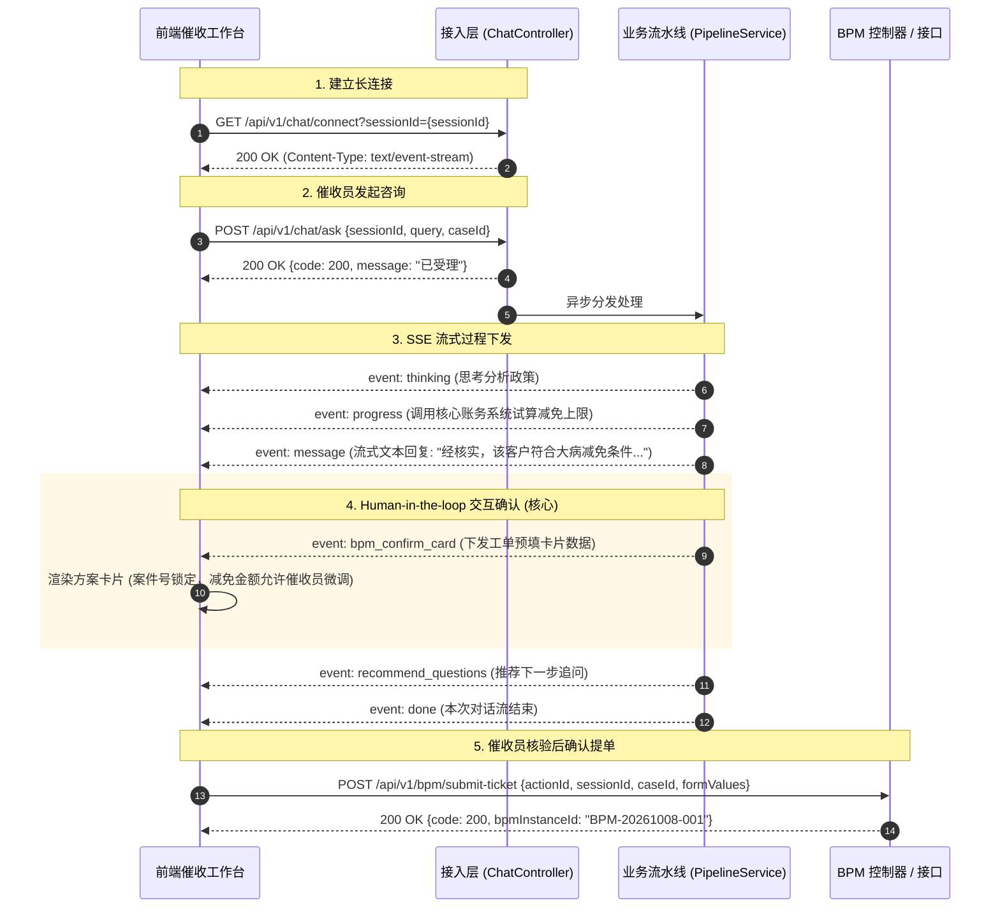

# 催收答疑机器人：前后端接口与 SSE 事件流协议契约规范

## 1. 文档概述

本文档定义了催收域智能答疑机器人在**接入层（Access Layer）**的前后端交互规范。系统采用 **HTTP REST + Server-Sent Events (SSE)** 双向/流式交互模式：
- **下行通道 (Server ➔ Client)**：通过 SSE 单向长连接，实时推送大模型思考链 (`thinking`)、打字机文字块 (`message`)、工具调用进度 (`progress`)、方案确认卡片 (`bpm_confirm_card`) 以及后续推荐问题 (`recommend_questions`)。
- **上行通道 (Client ➔ Server)**：通过标准 HTTP POST 发送催收员提问，并在催收员核验方案后提交工单数据。

---

## 2. 交互时序流程图



---

## 3. HTTP 接口定义

### 3.1 建立 SSE 通道连接
* **接口路径**：`GET /api/v1/chat/connect`
* **协议头**：`Accept: text/event-stream`
* **请求参数**：
  | 参数名 | 类型 | 必填 | 说明 |
  | :--- | :--- | :--- | :--- |
  | `sessionId` | String | 是 | 唯一会话标识，用于多轮对话关联与 Emitter 索引 |

* **返回格式**：`text/event-stream;charset=UTF-8`

---

### 3.2 催收员发送提问
* **接口路径**：`POST /api/v1/chat/ask`
* **Content-Type**：`application/json`
* **请求体 (Request Body)**：
```json
{
  "sessionId": "sess_88921a9f-4310",
  "query": "案件 10086 客户声称刚做完大手术无力还款，如何申请免除罚息？",
  "userId": "AGENT_007",
  "caseId": "CASE_10086"
}
```
* **响应体 (Response Body)**：
```json
{
  "code": 200,
  "message": "请求已提交处理",
  "sessionId": "sess_88921a9f-4310"
}
```

---

### 3.3 确认并提交 BPM 审批工单
* **接口路径**：`POST /api/v1/bpm/submit-ticket`
* **Content-Type**：`application/json`
* **请求体 (Request Body)**：
```json
{
  "actionId": "act_9f8a32b14e9a",
  "sessionId": "sess_88921a9f-4310",
  "caseId": "CASE_10086",
  "bpmProcessKey": "DEBT_SPECIAL_RELIEF_FLOW",
  "formValues": {
    "relief_amount": 500.00,
    "relief_type": "因病特殊纾困豁免",
    "apply_reason": "借款人确诊重大疾病住院，已上传县级以上医院确诊诊断书，申请酌情豁免罚息。"
  }
}
```
* **响应体 (Response Body)**：
```json
{
  "code": 200,
  "message": "BPM 工单提报成功",
  "bpmInstanceId": "BPM-20261008-9821",
  "processKey": "DEBT_SPECIAL_RELIEF_FLOW"
}
```

---

## 4. SSE 事件流协议与 Payload 契约

后端向前端推送的标准格式遵循 W3C EventSource 规范：
```text
event: <eventType>\n
id: <timestamp>\n
data: <JSON_STRING>\n\n
```

### 4.1 事件全集一览

| 事件类型 (`event`) | 产生时机 | 前端渲染表现 |
| :--- | :--- | :--- |
| `thinking` | Agent 推理中 | 灰色字体折叠面板，带有“思考中...”动态动画 |
| `progress` | 调用 RAG / 核心账务 / BPM 查询时 | 步骤条/轻提示（如：“正在调取账务减免上限...”） |
| `message` | 大模型文本输出 | 打字机逐字输出 Markdown 正文 |
| `bpm_confirm_card` | 形成明确解决方案，需人工核验提单 | 渲染交互式表单卡片，提供输入框、金额微调与提交按钮 |
| `recommend_questions`| 流结束前 | 输出 2~3 个相关联的快捷提问气泡 |
| `done` | 当前回合结束 | 停止加载动画，激活提问输入框 |
| `error` | 处理发生严重异常 | 红色轻提示或降级错误信息 |

---

### 4.2 核心事件 Payload 样例

#### (1) `thinking` 思考事件
```json
{
  "event": "thinking",
  "data": {
    "content": "正在检索催收法条法规及《重大疾病减免管理实施细则》，核对借款人免息凭证要求..."
  }
}
```

#### (2) `progress` 业务进度事件
```json
{
  "event": "progress",
  "data": {
    "stage": "POLICY_RETRIEVAL",
    "description": "已命中毒重病豁免标准条目，正在核算可减免息费上限"
  }
}
```

#### (3) `message` 打字机内容流
```json
{
  "event": "message",
  "data": {
    "content": "经核实，客户提供的诊断证明符合特殊救助政策。\n"
  }
}
```

#### (4) `bpm_confirm_card` BPM 方案确认卡片（关键协议）
```json
{
  "event": "bpm_confirm_card",
  "data": {
    "actionId": "act_9f8a32b14e9a",
    "bpmProcessKey": "DEBT_SPECIAL_RELIEF_FLOW",
    "title": "催收特殊费用减免方案申请",
    "description": "系统已根据借款人病历资料与逾期账龄完成初审测算，建议减免罚息 500.00 元。",
    "formFields": [
      {
        "fieldKey": "case_id",
        "label": "案件编号",
        "type": "text",
        "value": "CASE_10086",
        "editable": false,
        "required": true
      },
      {
        "fieldKey": "relief_type",
        "label": "减免类型",
        "type": "text",
        "value": "因病特殊纾困豁免",
        "editable": false,
        "required": true
      },
      {
        "fieldKey": "relief_amount",
        "label": "拟减免金额 (元)",
        "type": "number",
        "value": 500.00,
        "maxLimit": 650.00,
        "editable": true,
        "required": true
      },
      {
        "fieldKey": "apply_reason",
        "label": "提单说明",
        "type": "textarea",
        "value": "借款人确诊重大疾病住院，已上传县级以上医院确诊诊断书，申请酌情豁免罚息。",
        "editable": true,
        "required": true
      }
    ],
    "confirmButtonText": "确认并提交审批",
    "cancelButtonText": "放弃提单"
  }
}
```

#### (5) `recommend_questions` 推荐问题事件
```json
{
  "event": "recommend_questions",
  "data": {
    "questions": [
      "大病减免需留存哪些凭证材料？",
      "审批通过后多长时间系统更新还款账单？",
      "如何申请该案件的30天临时停催报备？"
    ]
  }
}
```

#### (6) `done` 流终结事件
```json
{
  "event": "done",
  "data": {
    "status": "completed"
  }
}
```

---

## 5. 前端 EventSource 集成示例代码

```javascript
// 前端初始化 SSE 监听示例
const sessionId = "sess_" + Date.now();
const eventSource = new EventSource(`/api/v1/chat/connect?sessionId=${sessionId}`);

eventSource.addEventListener("thinking", (e) => {
  const data = JSON.parse(e.data);
  appendThinkingBubble(data.content);
});

eventSource.addEventListener("progress", (e) => {
  const data = JSON.parse(e.data);
  updateProgressBar(data.stage, data.description);
});

eventSource.addEventListener("message", (e) => {
  const data = JSON.parse(e.data);
  appendTypewriterText(data.content);
});

eventSource.addEventListener("bpm_confirm_card", (e) => {
  const cardData = JSON.parse(e.data);
  renderInteractiveFormCard(cardData, (confirmedValues) => {
    // 用户点击卡片提交工单
    fetch('/api/v1/bpm/submit-ticket', {
      method: 'POST',
      headers: { 'Content-Type': 'application/json' },
      body: JSON.stringify({
        actionId: cardData.actionId,
        sessionId: sessionId,
        caseId: confirmedValues.case_id,
        bpmProcessKey: cardData.bpmProcessKey,
        formValues: confirmedValues
      })
    }).then(res => res.json()).then(res => {
      alert('提单成功，工单号：' + res.bpmInstanceId);
    });
  });
});

eventSource.addEventListener("recommend_questions", (e) => {
  const data = JSON.parse(e.data);
  renderQuestionChips(data.questions);
});

eventSource.addEventListener("done", () => {
  enableInput();
});
```
