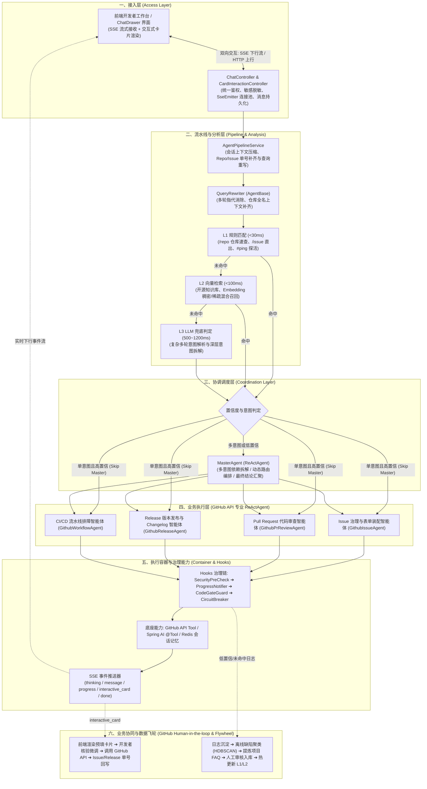
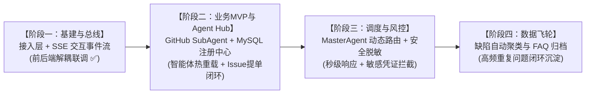

# 系统架构全景与实施规划：基于 GitHub API 的研发协同多智能体助手

> **文档版本**：v2.0.0 (GitHub 研发协同体系重构版)  
> **更新时间**：2026-10-08  
> **适用对象**：开源架构师、后端研发、前端研发、AI算法工程师、DevOps 负责人、技术团队管理者

---

## 目录
1. [项目背景与核心业务目标](#1-项目背景与核心业务目标)
2. [系统总体架构蓝图](#2-系统总体架构蓝图)
3. [多智能体分层矩阵与职责划分](#3-多智能体分层矩阵与职责划分)
4. [核心功能一：重复缺陷诊断与自动化归档 FAQ（数据闭环）](#4-核心功能一重复缺陷诊断与自动化归档-faq数据闭环)
5. [核心功能二：代码诊断与 GitHub Issue/PR 人机确认（Human-in-the-loop）](#5-核心功能二代码诊断与-github-issuepr-人机确认human-in-the-loop)
6. [接入层通信与 SSE 事件流协议契约](#6-接入层通信与-sse-事件流协议契约)
7. [意图串行降级与安全合规 Hooks 治理链](#7-意图串行降级与安全合规-hooks-治理链)
8. [技术栈选型与系统库表设计](#8-技术栈选型与系统库表设计)
9. [分阶段实施演进路线与阶段成果](#9-分阶段实施演进路线与阶段成果)

---

## 1. 项目背景与核心业务目标

### 1.1 业务背景
在现代软件研发与开源项目协同中，工程师面临高频的**仓库规范查询、Issue 缺陷分类与排查、Pull Request 代码审查、Release 发版日志编写、以及 GitHub Actions CI/CD 流水线排障**等工作。传统方式下缺乏自动化上下文串联，导致响应滞后、代码审查门禁不一、高频重复问题得不到沉淀。

### 1.2 核心业务目标
打造一个高可用、可插拔、具备自我进化能力的**企业级 GitHub 研发协同与多智能体助手**，重点闭环两大核心功能：
1. **重复问题自动归档 FAQ / SOP**：沉淀历史 Issue 与构建报错排查路径，基于离线语义聚类和 LLM 提炼，自动生成标准故障排查手册，经 Review 后回流至知识库。
2. **辅助代码诊断并闭环 GitHub Issue / Release 人机确认（Human-in-the-loop）**：针对 Bug 报告、PR Review、版本发布等实质状态流转，由 AI 调用 GitHub API 测算生成结构化方案与预填表单，前端以交互卡片呈现供开发者确认微调，一键调用 GitHub API 提交。

---

## 2. 系统总体架构蓝图

系统采用**“微内核骨架、分层解耦、串行降级、人机协同、数据自进化”**的设计哲学，划分为六大核心层级：



---

## 3. 多智能体分层矩阵与职责划分

### 3.1 GitHub 研发协同智能体矩阵对照表

| 架构分层 | 智能体编码 | 智能体名称 | 核心职责 | 挂载底座与工具 (Tools) |
| :--- | :--- | :--- | :--- | :--- |
| **分析层** | `QUERY_REWRITER` | 会话分析与查询重写智能体 | 消除代词（“这个PR为什么挂了”），补齐为“spring-projects/spring-ai PR #512 构建失败原因” | 会话短期记忆 (Redis) |
| | `INTENT_ROUTER` | 意图识别与分级路由器 | 串行执行 L1 规则、L2 向量、L3 大模型识别，判断属于速查、Review 还是发版 | 前缀/正则字典、VectorStore、ChatModel |
| | `SECURITY_GUARD` | 研发凭证与安全预检智能体 | 开发者输入文本中 GitHub Token、AWS AK/SK、数据库密码脱敏与拦截 | 正则掩码引擎 + 敏感词 Trie 树 |
| **协调层** | `MASTER_AGENT` | GitHub 协同主调度智能体 | 单意图直跳（Skip）；多意图分解为子任务编排依赖（例如：先查 CI 报错日志，再比对 PR Diff，最后输出综合分析报告） | SubAgentTool 动态注册表 |
| **业务层** | `GITHUB_ISSUE_AGENT` | Issue 治理与表单装配智能体 | 检索历史 Issue、根据报错堆栈判定标签（bug/enhancement）、装配创建 Issue 的 `InteractiveCard` 预填卡片 | `githubApiTool.queryIssues` |
| | `GITHUB_PR_AGENT` | PR 代码审查智能体 | 检查 PR Diff 变更文件列表、执行代码规范与静态缺陷审查、评估合入风险 | `githubApiTool.queryPullRequest` |
| | `GITHUB_RELEASE_AGENT`| Release 版本发布与 Changelog 智能体 | 抓取相邻 Release Tag 之间的提交记录、自动生成 Markdown Changelog、装配发版确认卡片 | `githubApiTool.queryLatestRelease` |
| | `GITHUB_WORKFLOW_AGENT`| CI/CD 流水线排障智能体 | 检索 GitHub Actions 工作流状态、提取构建失败错误栈（测试失败、超时）并给出修复指引 | `githubApiTool.queryWorkflowRuns` |
| **数据闭环**| `DEV_KNOWLEDGE_MINER` | 研发知识沉淀与 FAQ 挖掘智能体 | 汇总仓库历史缺陷咨询，离线文本聚类，自动提炼标准 Troubleshooting 指南草稿 | 文本聚类算法 (HDBSCAN) + 总结 Prompt |

### 3.2 智能体持久化与双层治理边界（MySQL 升格与生命周期）
多智能体定义全面升格至 MySQL 数据库（`sys_agent_definition`）并落地双层治理：
1. **骨架管道类（Pipeline Core，`is_system_core = 1`）**：
   - 包含 `QUERY_REWRITER` 与 `MASTER_AGENT`；
   - 处于硬编码流水线主拓扑上，数据库**仅维护 System Prompt、模型版本与温度超参**，严禁动态增减或下线。
2. **业务领域 Sub-Agent（Business Sub，`is_system_core = 0`）**：
   - 包含 `GITHUB_ISSUE_AGENT`、`GITHUB_PR_AGENT` 等垂域专家；
   - 作为 `MasterAgent` 的外挂插件池，**支持后台全量动态新增、修改人设、挂载工具池及软下线**；
   - 严格禁止物理 `DELETE`，必须经由 `DRAFT` ➔ `ONLINE` ➔ `DEPRECATED` ➔ `OFFLINE` 状态机流转，并前置执行规则与工作流依赖审计。

---

## 4. 核心功能一：重复缺陷诊断与自动化归档 FAQ（数据闭环）

通过“线上提问与报错沉淀 $\rightarrow$ 离线聚类 $\rightarrow$ LLM 提炼标准 FAQ/Troubleshooting $\rightarrow$ 人工审核 $\rightarrow$ 知识库更新”构建自进化闭环。

---

## 5. 核心功能二：代码诊断与 GitHub Issue/PR 人机确认（Human-in-the-loop）

对于创建 GitHub Issue、发布 Release 等写操作，**AI 严禁在无人工授权下直接调用底层系统写接口**。系统严格推行 **“AI 分析诊断 $\rightarrow$ 前端卡片确认/微调 $\rightarrow$ 开发者确认提交 $\rightarrow$ GitHub API 写入”** 的人机协同架构。

### 5.1 交互卡片数据协议 (`interactive_card`)

```json
{
  "event": "interactive_card",
  "data": {
    "actionId": "act_github_issue_9821",
    "bpmProcessKey": "GITHUB_CREATE_ISSUE_FLOW",
    "title": "新建 GitHub Issue 缺陷工单确认",
    "description": "AI 已根据异常日志完成根因定位与排查，为您预填了 Issue 模板，请核对后确认提交：",
    "formFields": [
      {
        "fieldKey": "repo",
        "label": "目标仓库",
        "type": "text",
        "value": "spring-projects/spring-ai",
        "editable": false,
        "required": true
      },
      {
        "fieldKey": "title",
        "label": "Issue 标题",
        "type": "text",
        "value": "[Bug]: RedisConnectionException on High Concurrent Load",
        "editable": true,
        "required": true
      },
      {
        "fieldKey": "labels",
        "label": "推荐标签",
        "type": "text",
        "value": "bug, high-priority",
        "editable": true,
        "required": true
      },
      {
        "fieldKey": "body",
        "label": "复现步骤与错误堆栈",
        "type": "textarea",
        "value": "### 复现环境\n- Spring AI 2.0.0\n- 并发线程数: 200\n### 报错信息\nJedisConnectionPool timeout waiting for idle object...",
        "editable": true,
        "required": true
      }
    ],
    "confirmButtonText": "确认并创建 Issue",
    "cancelButtonText": "取消"
  }
}
```

---

## 6. 接入层通信与 SSE 事件流协议契约

系统采用 **HTTP REST (上行) + Server-Sent Events (下行)** 架构。

### 6.1 HTTP 接口规范
1. **建立 SSE 连接**：`GET /api/v1/chat/connect?sessionId={sessionId}`，返回 `text/event-stream`。
2. **发送用户提问**：`POST /api/v1/chat/ask`，入参包含 `sessionId`, `query`, `userId`, `caseId`。
3. **提交表单确认**：`POST /api/v1/card/submit`，入参包含 `actionId`, `sessionId`, `caseId`, `processKey`, `formValues`。

### 6.2 SSE 下行事件全集表

| 事件类型 (`event`) | 产生时机 | 前端渲染表现 |
| :--- | :--- | :--- |
| `thinking` | Agent 深度推理中 | 灰色字体折叠面板，带有“思考中...”动态动画 |
| `progress` | 调用 GitHub API / 工具查询时 | 步骤条/轻提示（如：“正在调取仓库 PR 变更信息...”） |
| `message` | 大模型文本输出 | 打字机逐字输出 Markdown 正文 |
| `interactive_card` | 形成明确操作方案，需人工确认 | 渲染交互式表单卡片，提供输入框、可编辑内容与提交按钮 |
| `recommend_questions`| 流结束前 | 输出 2~3 个相关联的快捷提问气泡 |
| `done` | 当前回合结束 | 停止加载动画，激活提问输入框 |
| `error` | 处理发生严重异常 | 红色轻提示或降级错误信息 |

---

## 7. 意图串行降级与安全合规 Hooks 治理链

### 7.1 意图三级串行降级表

| 层级 | 技术选型与实现 | 响应耗时 | 覆盖场景 | 降级机制 |
| :--- | :--- | :--- | :--- | :--- |
| **L1 规则匹配** | 前缀字典树 (Trie)、正则表达式、精确匹配表 | `< 30ms` | `/repo` 仓库直查、`/issue` 列表速查、`#ping` 探活 | 未命中时下沉到 L2 |
| **L2 向量检索** | Spring AI VectorStore + 专有 Embedding | `< 100ms` | 历史常见报错 FAQ、已沉淀文档语义匹配（相似度 $\ge 0.86$） | 未达置信度下沉到 L3 |
| **L3 LLM 兜底** | Spring AI ChatModel 结构化输出（JSON Schema） | `500~1200ms` | 复合复杂诉求、口语化模糊表述改写 | 改写判定后直接进入调度 |

---

## 8. 技术栈选型与系统库表设计

### 8.1 技术栈选型
- **后端框架**：Java 21 + Spring Boot 4.x
- **AI 编排框架**：Spring AI 2.x（统一抽象 `ChatModel`, `Prompt`, `@Tool`, `VectorStore`）
- **流式通信**：Spring MVC `SseEmitter` + W3C EventSource
- **数据库**：MySQL 8.0+
- **多智能体数据模型**：`sys_agent_definition`、`sys_rule_definition`（详见 `sql/init_schema.sql`）

---

## 9. 分阶段实施演进路线与阶段成果


