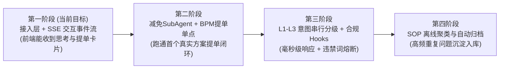

# 第一阶段实施规划与接入指南：接入层与 SSE 交互事件总线

## 1. 为什么第一阶段先做「接入层与 SSE 交互总线」？

在多智能体（Multi-Agent）与人机协同（Human-in-the-loop）系统中，很多团队容易一开始就陷入 Prompt 调优或向量库选型，结果导致：
1. **前后端脱节**：前端不知道大模型的思考、过程进度、提单确认卡片长什么样，界面无从下手。
2. **调试极其困难**：后端没有统一的事件下发通道，排查超时与多智能体流转非常被动。

因此，按照工程最佳实践，**第一阶段（Step 1）必须优先落地「接入层与 SSE 交互事件总线」**。

---

## 2. 第一阶段的目标与交付物

### 2.1 核心目标
1. 建立前后端双向通道：前端建立 EventSource 长连接，发送 HTTP 提问，能收到结构化的 SSE 事件流。
2. 跑通全链路事件闭环：前端依次接收到 `thinking` ➔ `progress` ➔ `message` ➔ `bpm_confirm_card` ➔ `recommend_questions` ➔ `done`。
3. 跑通卡片提交闭环：前端在卡片上点击“确认提交工单”，触发 `POST /api/v1/bpm/submit-ticket` 并回显工单号。

### 2.2 交付物清单
| 模块 / 文件 | 类型 | 职责说明 |
| :--- | :--- | :--- |
| `SseEventType.java` | 核心枚举 | 规范所有事件类型字符串 (`thinking`, `bpm_confirm_card` 等) |
| `SsePacket.java` | 协议包装 | 封装事件名、时间戳与数据载荷 |
| `BpmConfirmCard.java` | 交互卡片模型 | 预填字段列表、只读控制、金额上限与确认按钮属性 |
| `SseEmitterManager.java` | 连接管理组件 | 并发安全的连接池管理、超时（5分钟）与异常断开清理 |
| `SseEventPublisher.java` | 统一事件发布器 | 提供上层 Agent 调用的一行代码推送 API |
| `ChatController.java` | 接入控制器 | 提供 `/connect` 长连接、`/ask` 提问、`/stream-ask` 快速调试接口 |
| `BpmInteractionController.java` | 提单控制器 | 接收前端卡片确认、执行防重放幂等校验、模拟调用 BPM 接口 |
| `01-前后端接口与SSE事件协议契约.md` | 对接契约 | 前后端研发联调依据规范 |

---

## 3. 研发分工与协同任务表

### 3.1 前端开发任务 (UI Team)
1. **EventSource 客户端封装**：
   - 封装 SSE 监听器，支持自动重连。
   - 解析不同的 `event` 类型，分发给不同 UI 渲染组件。
2. **组件开发**：
   - **思考折叠面板组件**：监听 `thinking` 事件，默认收起，点击可展开查看推理过程。
   - **打字机 Markdown 渲染组件**：监听 `message` 事件，实现逐字平滑渲染。
   - **BPM 方案确认卡片组件 (核心)**：
     - 监听 `bpm_confirm_card` 事件。
     - 表单根据 `editable: false/true` 进行只读或可输入控制。
     - 监听“确认提交”按钮点击，组装表单数据调用 `POST /api/v1/bpm/submit-ticket`。
   - **推荐问题气泡组件**：监听 `recommend_questions` 事件，点击快捷问题可直接作为新问题发送。

### 3.2 后端开发任务 (Backend Team)
1. **环境准备与基建对齐**：
   - 确认 JDK 版本匹配（Spring Boot 4.x / 3.x 需 Java 17+ 运行环境）。
   - 接入统一日志切面与跨域配置（CORS）。
2. **连接生命周期健壮性**：
   - 完善 SseEmitter 的客户端主动断开与网络抖动清理机制。
   - 实现防刷与单用户并发连接数限制。
3. **Mock 业务验证流**：
   - 在 `AgentPipelineService` 中组织标准的 Mock 事件流，供前端无依赖独立联调。

---

## 4. 第一阶段联调与验收标准 (Acceptance Checklist)

- [ ] **连通性验收**：
  - 打开浏览器直接访问 `GET /api/v1/chat/stream-ask?sessionId=test_01&query=减免咨询`，能看到浏览器按序接收到全部 6 类事件流。
- [ ] **打字机流畅度验收**：
  - 前端收到 `message` 数据包时，文字逐块平滑追加，无卡顿或界面跳动。
- [ ] **交互卡片渲染验收**：
  - 收到 `bpm_confirm_card` 事件后，前端准确呈现表单；不可修改项（案件号、减免类型）处于禁用状态，可修改项（金额、说明）可输入。
- [ ] **提单幂等性验收**：
  - 催收员在卡片上点击【确认提交】，后端返回成功工单号 `BPM-YYYYMMDD-XXXX`；再次重复点击提交相同 `actionId` 时，后端返回 HTTP 409 拒绝重复提交。
- [ ] **生命周期验收**：
  - 会话流正常结束时，触发 `done` 事件，前端输入框恢复可输入状态；网络异常或客户端刷新时，后端连接正常释放无内存泄露。
