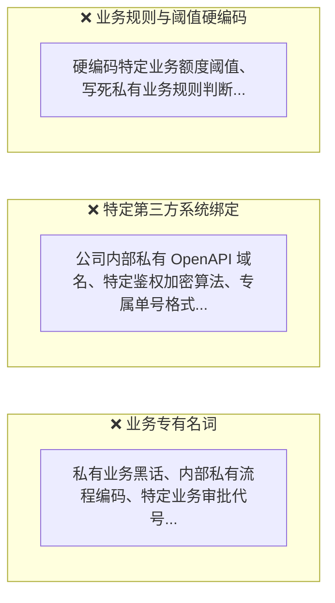
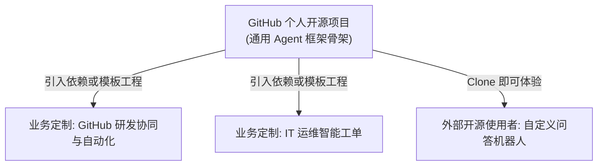

# 通用 Agent 骨架边界与核心设计哲学

> **文档定位**：本项目唯一核心设计准则。后续所有的代码重构与扩展开发，必须严格遵循本文档划定的边界。

---

## 一、 这个框架到底是什么？（一句话定位）

> 它不是“特定业务答疑机器人”，也不是单一的“HR 审批助手”。  
> 它的本质是一个 **面向企业级应用、支持人机协同交互卡片（Human-in-the-loop）的通用 Multi-Agent 流式骨架（Microkernel Agent Framework）**。

### 它帮所有业务开发者解决什么痛点？
无论任何企业做大模型落地，都会遇到 4 个极其繁琐、不断重复造轮子的技术难题：
1. **长连接与打字机卡顿**：如何用 SSE 稳定下发思考链（thinking）、步骤进度（progress）与文本流？
2. **大模型不能直接写系统**：大模型有幻觉，绝对不能让它直接调用写接口，必须有人类确认环节（Human-in-the-loop）。
3. **调用成本与时延居高不下**：全部问题问大模型又慢又贵，如何用规则匹配和向量检索进行分级降级？
4. **前端组件太难写**：思考折叠、逐字打字、表单卡片交互，前端往往要花几周时间调试。

**这个框架做的事情，就是把上面这 4 件事标准化、通用化。任何业务（客户服务、审批流转、IT运维等）只要插上自己的业务逻辑，10分钟就能跑起来。**

---

## 二、 框架的“三条绝对红线”（绝对不能包含什么）

如果要将此项目作为个人开源作品放到 GitHub，**以下三类内容严禁出现在框架核心代码中**：

* **合规与版权安全**：一旦框架内出现公司业务名词或特定 API，就无法作为纯粹的个人开源项目发布。
* **架构纯粹性**：优秀的开源框架（如 Spring、LangChain）永远只有抽象协议，没有具体业务偏见。

---

## 三、 核心设计哲学：插座与插头（微内核 + SPI）

框架如何做到**“自身不包含业务，却能支持任何业务”**？核心就是：**框架提供插座（Interface），业务提供插头（Implementation）**。

### 1. 核心插槽一：交互卡片插槽（Human-in-the-loop）
* **框架提供的插座 (`InteractiveCard`)**：
  框架只定义卡片的数据契约：“我支持下发一张卡片，包含标题、一段说明文字、若干输入框（可配置只读或可编辑）、以及一个确认按钮”。
* **业务插入的插头**：
  - **研发协同插头**：填入“目标仓库（只读）”、“Issue 标题（可编辑）”，用户点确认后，**调用 GitHub OpenAPI 创建 Issue**。
  - **行政业务插头**：填入“员工工号（只读）”、“申请请假天数（可编辑）”，用户点确认后，**调用公司 OA 接口**。
  - **开源默认插头**：提供一个通用的模拟实现（打印日志，生成虚拟单号），保证开源用户下载后无需任何外部系统也能跑通。

### 2. 核心插槽二：专业智能体插槽 (`SubAgent`)
* **框架负责的事情**：维护流水线、意图识别降级调度、监控执行耗时与熔断。
* **业务负责的事情**：写一个类实现 `SubAgent`，注入自己的 System Prompt、自己的知识库 RAG、自己的计算工具。

### 3. 核心插槽三：数据安全拦截插槽 (`DataFilterHook`)
* **框架负责的事情**：在大模型处理前和处理后，预留出前置/后置拦截点。
* **业务负责的事情**：
  - 研发业务插入：Token 密钥与数据库连接串正则脱敏、高危写入操作前置拦截。
  - 医疗业务插入：病历隐私脱敏。

> 在内核设计中，该插槽统一为 `AgentHook`（覆盖解析前、Agent 执行前、输出流过滤、回合结束、异常五个切面）。

### 4. 插槽全景与实现状态

上述三大插槽是面向业务方的“主插槽”。为了让流水线本身可插拔，内核还需要若干支撑性扩展点。完整接口草案见 [07-内核架构设计与演进路线](./07-内核架构设计与演进路线.md#42-扩展点spi全集)。

| 扩展点 | 谁来实现 | 框架默认实现 | 状态 |
| :--- | :--- | :--- | :---: |
| `CardSubmitHandler`（卡片插槽） | 业务方 | `DefaultMockCardSubmitHandler` | ✅ 已实现 |
| 智能体元数据注册中心（Agent Hub） | 管理员配置 | `AgentPromptRegistry` + `AgentChatClientFactory` | ✅ 已实现 |
| `SubAgent`（智能体行为插槽） | 业务方 | `GeneralChatAgent`（通用对话 + `@Tool`） | 📐 设计中 |
| `AgentHook`（拦截插槽） | 业务方 | 空链 | 📐 设计中 |
| `IntentResolver`（意图解析链 L1/L2/L3） | 框架为主，业务可扩展 | L1 规则解析器（已有规则引擎） | 🚧 L1 已有，待抽象 |
| `L1ClusterSync`（集群同步） | 框架 | 空实现；可选 Apollo OpenAPI | ✅ 已实现 |
| `ConversationMemory` / `CardRegistry` / `SessionEventBus` | 框架 | 内存实现，可选 Redis | 📐 设计中 |

**元数据 ≠ 行为**：注册中心让智能体的人设、模型、工具可以在后台动态调整，但智能体“做什么”（调用哪些工具、是否下发卡片）仍需要 `SubAgent` 插槽承载。两者都具备，新增业务智能体才能做到不改框架代码。

**判定标准**：只有当业务方“不改框架一行代码”就能完成接入时，对应插槽才算真正完成。

---

## 四、 开源骨架与后续公司定制的关系

1. **第一阶段（当前在 GitHub 上）**：
   - 框架代码 100% 通用。
   - 自带一个“Demo 演示场景”（GitHub 研发协同助手，见 [01](./01-系统架构全景与实施规划.md)），开箱即用。
2. **第二阶段（拉到公司内部时）**：
   - 框架作为一个干净的底座引入。
   - 在具体的业务包里，编写特定业务 SubAgent、注入公司 BPM 客户端、加载业务知识库。
   - **底座框架不需要改动一行核心代码！**

### 交付形态要求
要让“引入依赖、零改动”成立，框架不能是一个单体应用，而应拆分为：
- **`agentflow-core`**：只含接口与流水线内核，不依赖任何具体存储或配置中心；
- **`agentflow-spring-boot-starter`**：自动装配与默认内存实现；
- **可选模块**：L1 规则 JDBC 存储、Apollo 集群同步、Redis 状态存储等，按需引入；
- **`agentflow-sample-github`**：GitHub 研发协同 Demo 与前端，使用内嵌数据库，Clone 即可运行。

当前代码仍是单一 Spring Boot 工程：MySQL 为硬依赖，GitHub Demo 的工具、卡片和业务智能体编码也还写在内核代码里。拆分计划见 [07 第 6 节](./07-内核架构设计与演进路线.md#6-交付形态模块拆分)。

---

## 五、 本文结语与共识判定

只要我们时刻记住：
> **“框架只负责制定通信规则与人机交互协议，业务只负责填充数据和处理最终动作。”**

我们就绝不会把业务逻辑和通用骨架混为一谈。
