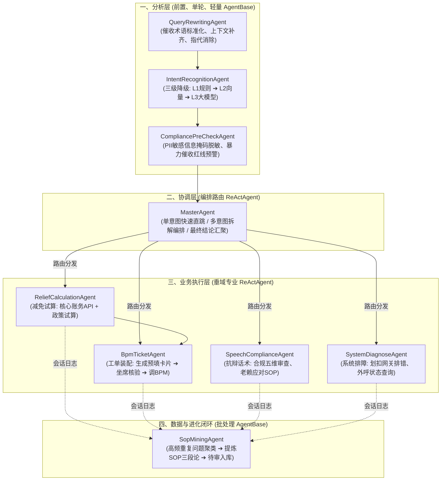

# 催收域多智能体职责矩阵与三层分工规范

## 1. 架构设计哲学

本系统采用 **“按生命周期流水线拆分、按能力复杂度选型（AgentBase vs. ReActAgent）”** 的多智能体协作范式，坚决杜绝“一个大模型兼管所有任务”。

---

## 2. 智能体职责清单与技术选型对照表

| 分层 | 智能体名称 | 核心职责 | Agent 选型模式 | 依赖能力 / 工具 (Tools) |
| :--- | :--- | :--- | :--- | :--- |
| **分析层** | **QueryRewritingAgent** | 结合多轮历史，将“这个案子他刚出院怎么减免”改写为“案件 CASE_10086 借款人重大疾病住院如何申请减免息费” | `AgentBase` (轻量单轮) | 会话短期记忆缓存 (Redis) |
| | **IntentRecognitionAgent** | 判断问题属于话术咨询、减免试算、提单还是系统异常 | `AgentBase` (分级降级) | L1 前缀字典、L2 VectorStore、L3 ChatModel |
| | **CompliancePreCheckAgent** | 借款人身份证、卡号、手机号掩码脱敏；高危客诉涉诉意图打标 | `AgentBase` (规则优先) | 正则掩码引擎 + 敏感词 Trie 树 |
| **协调层** | **MasterAgent** | 单意图时直接绕过（Skip）；多意图时分解为子任务并编排依赖（例如：先试算减免金额，再调度提单 Agent 组装卡片） | `ReActAgent` (任务调度编排) | SubAgentTool 注册表 |
| **业务层** | **ReliefCalculationAgent** | 核心账务本息查询、逾期账龄核对、最大免息上限公式计算 | `ReActAgent` (工具计算) | `AccountCoreApiTool` (核心账务 API) |
| | **BpmTicketAgent** | **Human-in-the-loop 核心**：组装确认卡片结构；接收催收员确认后调用 BPM OpenAPI | `ReActAgent` (流程交互) | `BpmOpenApiClientTool`, SSE 卡片推送器 |
| | **SpeechComplianceAgent** | 针对债务人各种抗辩（失联、推诿、破产、反催收联盟）提供合规话术，并进行五维合规审核 | `ReActAgent` (知识检索与审查) | 催收合规法条 RAG、违规黑名单词库 |
| | **SystemDiagnoseAgent** | 排查银行划扣异常报错码（如限额、余额不足）、电话坐席断音等操作问题 | `ReActAgent` (系统工具) | 划扣网关状态 API、外呼排障知识库 |
| **数据闭环** | **SopMiningAgent** | 汇总未命中或低置信度的高频咨询，执行文本聚类，自动总结提炼标准问、处置路径与预填模板，形成待审草稿 | `AgentBase` (离线定时批处理) | 文本聚类算法 (HDBSCAN) + 总结 Prompt |

---

## 3. 与本项目的分阶段推进关系

- **阶段一（当前）**：完成接入层与 SSE 总线，先建立 `BpmConfirmCard` 与交互流程骨架；
- **阶段二**：重点落地业务层的 `ReliefCalculationAgent` 与 `BpmTicketAgent`，打通“单意图提单”的 MVP 闭环；
- **阶段三**：落地分析层（`IntentRecognition`、`CompliancePreCheck`）和协调层（`MasterAgent`），实现多意图和三级响应降级；
- **阶段四**：引入数据闭环层 `SopMiningAgent`，完成“重复问题自动沉淀为 SOP”的最终飞轮。
