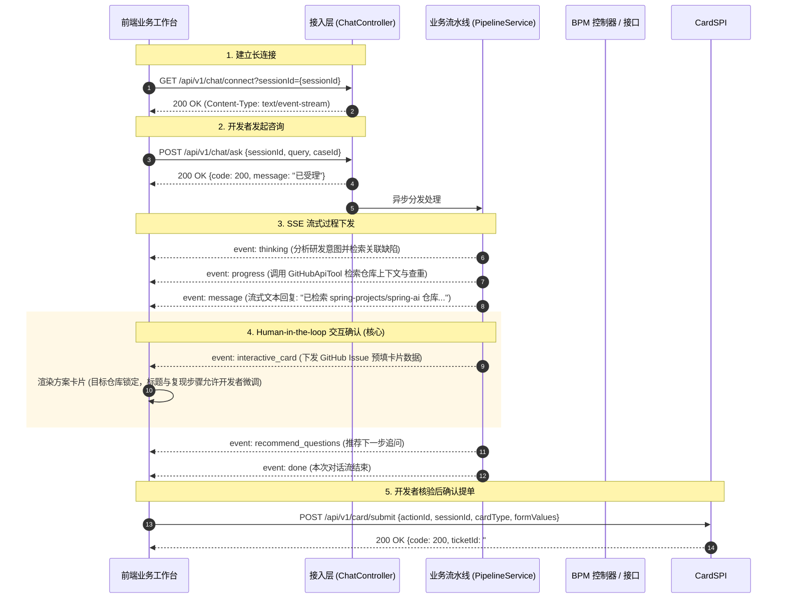

# 前后端通信协议与 SSE 事件流交互契约规范

## 1. 文档概述

本文档定义了智能业务协同与人机协同系统在**接入层（Access Layer）**的前后端交互规范。系统采用 **HTTP REST + Server-Sent Events (SSE)** 双向/流式交互模式：
- **下行通道 (Server ➔ Client)**：通过 SSE 单向长连接，实时推送大模型思考链 (`thinking`)、打字机文字块 (`message`)、工具调用进度 (`progress`)、方案确认卡片 (`bpm_confirm_card` / `interactive_card`) 以及后续推荐问题 (`recommend_questions`)。
- **上行通道 (Client ➔ Server)**：通过标准 HTTP POST 发送业务提问，并在专员核验方案后提交工单数据。

---

## 2. 交互时序流程图



---

## 3. HTTP 接口定义

### 3.1 建立 SSE 通道连接
* **接口路径**：`GET /api/v1/chat/connect`
* **协议头**：`Accept: text/event-stream`
* **请求参数**：
  | 参数名 | 类型 | 必填 | 说明 |
  | :--- | :--- | :--- | :--- |
  | `sessionId` | String | 是 | 唯一会话标识，用于多轮对话关联与 Emitter 索引 |

* **返回格式**：`text/event-stream;charset=UTF-8`

---

### 3.2 开发者发送提问
* **接口路径**：`POST /api/v1/chat/ask`
* **Content-Type**：`application/json`
* **请求体 (Request Body)**：
```json
{
  "sessionId": "sess_88921a9f-4310",
  "query": "我们在 spring-projects/spring-ai 仓库发现 Redis 连接池高并发泄漏，请协助建一个 Issue",
  "userId": "DEV_OCTO_007",
  "caseId": "spring-projects/spring-ai"
}
```
* **响应体 (Response Body)**：
```json
{
  "code": 200,
  "message": "请求已提交处理",
  "sessionId": "sess_88921a9f-4310"
}
```

---

### 3.3 确认并提交交互卡片 (SPI 统一提报接口)
* **接口路径**：`POST /api/v1/card/submit`
* **Content-Type**：`application/json`
* **请求体 (Request Body)**：
```json
{
  "actionId": "act_9f8a32b14e9a",
  "sessionId": "sess_88921a9f-4310",
  "cardType": "GITHUB_ISSUE_SUBMIT",
  "formValues": {
    "repo": "spring-projects/spring-ai",
    "issue_type": "Bug Report",
    "title": "[Bug]: Redis 连接池高并发下偶发泄漏问题",
    "labels": "bug, high-priority, redis",
    "body": "在高并发压测场景下，Redis 连接池句柄未被正确归还，导致连接池耗尽。"
  }
}
```
* **响应体 (Response Body)**：
```json
{
  "code": 200,
  "message": "GitHub Issue #1035 已在仓库 spring-projects/spring-ai 成功创建，并已自动打上标签与指派研发维护团队！",
  "ticketId": "#1035",
  "cardType": "GITHUB_ISSUE_SUBMIT"
}
```

---

## 4. SSE 事件流协议与 Payload 契约

后端向前端推送的标准格式遵循 W3C EventSource 规范：
```text
event: <eventType>\n
id: <timestamp>\n
data: <JSON_STRING>\n\n
```

### 4.1 事件全集一览

| 事件类型 (`event`) | 产生时机 | 前端渲染表现 |
| :--- | :--- | :--- |
| `thinking` | Agent 推理中 | 灰色字体折叠面板，带有“思考中...”动态动画 |
| `progress` | 调用 RAG / GitHub 工具 / 仓库查重时 | 步骤条/轻提示（如：“已完成仓库上下文检索与 Issue 查重核验”） |
| `message` | 大模型文本输出 | 打字机逐字输出 Markdown 正文 |
| `interactive_card` | 形成明确解决方案，需人工核验提单 | 渲染交互式表单卡片，关键参数锁定，微调参数允许编辑，支持一键提交 |
| `recommend_questions`| 流结束前 | 输出 2~3 个相关联的快捷提问气泡 |
| `done` | 当前回合结束 | 停止加载动画，激活提问输入框 |
| `error` | 处理发生严重异常 | 红色轻提示或降级错误信息 |

---

### 4.2 核心事件 Payload 样例

#### (1) `thinking` 思考事件
```json
{
  "event": "thinking",
  "data": {
    "content": "未命中 L1 极速指令，MasterAgent 正在委派 GithubIssueAgent 研发协同专家并检索关联仓库与已知缺陷..."
  }
}
```

#### (2) `progress` 业务进度事件
```json
{
  "event": "progress",
  "data": {
    "stage": "GITHUB_SYNC",
    "description": "已完成 spring-projects/spring-ai 仓库上下文检索与现有 Issue 缺陷查重核验"
  }
}
```

#### (3) `message` 打字机内容流
```json
{
  "event": "message",
  "data": {
    "content": "您好！我是 GitHub Issue 治理与研发协同专家。已结合仓库上下文完成排查与查重，请核验下方工单内容：\n"
  }
}
```

#### (4) `interactive_card` 方案确认卡片（关键协议）
```json
{
  "event": "interactive_card",
  "data": {
    "actionId": "act_9f8a32b14e9a",
    "cardType": "GITHUB_ISSUE_SUBMIT",
    "title": "GitHub Issue 提报与缺陷确认单",
    "description": "基于多智能体分析与已知缺陷查重，已自动装配规范 Issue 模板。关键信息已锁定，支持微调复现步骤后一键提报：",
    "fields": [
      {
        "fieldKey": "repo",
        "label": "目标仓库 (Repository)",
        "type": "text",
        "value": "spring-projects/spring-ai",
        "editable": false,
        "required": true
      },
      {
        "fieldKey": "issue_type",
        "label": "缺陷类型 (Issue Type)",
        "type": "text",
        "value": "Bug Report (缺陷报告)",
        "editable": false,
        "required": true
      },
      {
        "fieldKey": "title",
        "label": "Issue 标题",
        "type": "text",
        "value": "[Bug]: Redis 连接池高并发下偶发泄漏问题",
        "editable": true,
        "required": true
      },
      {
        "fieldKey": "labels",
        "label": "关联标签 (Labels)",
        "type": "text",
        "value": "bug, high-priority, redis",
        "editable": true,
        "required": false
      },
      {
        "fieldKey": "body",
        "label": "复现步骤与排查说明",
        "type": "textarea",
        "value": "### 现象描述\n在高并发压测场景下，Redis 连接池句柄未被正确归还，导致连接池耗尽抛出异常。\n\n### 复现步骤\n1. 配置 Redis 连接池最大连接数为 20\n2. 启动并发请求压测 (QPS > 1500)\n3. 持续 10 分钟后触发 RedisConnectionException",
        "editable": true,
        "required": true
      }
    ],
    "confirmButtonText": "确认并在 GitHub 创建 Issue",
    "cancelButtonText": "放弃"
  }
}
```

#### (5) `recommend_questions` 推荐问题事件
```json
{
  "event": "recommend_questions",
  "data": {
    "questions": [
      "如何查看此 Issue 关联的 PR 修复分支？",
      "查询 spring-projects/spring-ai 的最新 Release 版本",
      "查看当前 GitHub Actions CI 流水线状态"
    ]
  }
}
```

#### (6) `done` 流终结事件
```json
{
  "event": "done",
  "data": {
    "status": "completed"
  }
}
```

---

## 5. 前端 EventSource 集成示例代码

```javascript
// 前端初始化 SSE 监听示例
const sessionId = "sess_" + Date.now();
const eventSource = new EventSource(`/api/v1/chat/connect?sessionId=${sessionId}`);

eventSource.addEventListener("thinking", (e) => {
  const data = JSON.parse(e.data);
  appendThinkingBubble(data.content);
});

eventSource.addEventListener("progress", (e) => {
  const data = JSON.parse(e.data);
  updateProgressBar(data.stage, data.description);
});

eventSource.addEventListener("message", (e) => {
  const data = JSON.parse(e.data);
  appendTypewriterText(data.content);
});

eventSource.addEventListener("bpm_confirm_card", (e) => {
  const cardData = JSON.parse(e.data);
  renderInteractiveFormCard(cardData, (confirmedValues) => {
    // 用户点击卡片提交工单
    fetch('/api/v1/bpm/submit-ticket', {
      method: 'POST',
      headers: { 'Content-Type': 'application/json' },
      body: JSON.stringify({
        actionId: cardData.actionId,
        sessionId: sessionId,
        caseId: confirmedValues.case_id,
        bpmProcessKey: cardData.bpmProcessKey,
        formValues: confirmedValues
      })
    }).then(res => res.json()).then(res => {
      alert('提单成功，工单号：' + res.bpmInstanceId);
    });
  });
});

eventSource.addEventListener("recommend_questions", (e) => {
  const data = JSON.parse(e.data);
  renderQuestionChips(data.questions);
});

eventSource.addEventListener("done", () => {
  enableInput();
});
```
