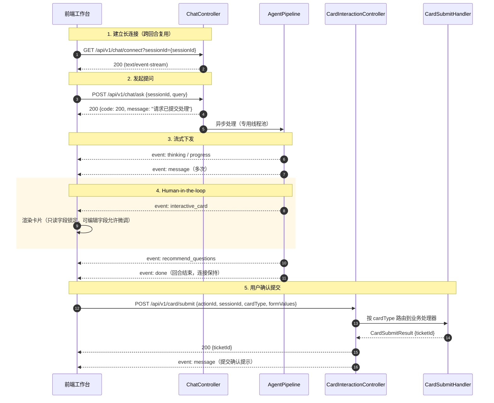

# 前后端接口与 SSE 事件流协议契约

> **文档定位**：前后端通信的**唯一事实标准**。代码（`SseEventType`、`SsePacket`、各 Controller、`frontend/src/types/chat.ts`）与本文不一致时，以本文为准修正代码或同步修订本文。  
> **状态标记**：✅ 已实现　📐 目标契约（尚未实现，详见 [07-内核架构设计与演进路线](./07-内核架构设计与演进路线.md)）  
> **命名原则**：协议只使用通用命名，业务语义通过 `cardType`、业务透传参数等字段承载。文中示例取自 GitHub 研发协同 Demo（`cardType = GITHUB_ISSUE_SUBMIT`）。

---

## 1. 通信模型

系统采用 **HTTP REST（上行）+ Server-Sent Events（下行）**：
- **下行通道（Server ➔ Client）**：SSE 长连接，推送思考链、进度、文本流、交互卡片、推荐追问与回合结束信号。
- **上行通道（Client ➔ Server）**：HTTP POST 投递提问、提交卡片。

---

## 2. 交互时序



---

## 3. HTTP 接口（数据面）

### 3.1 建立 SSE 连接 ✅
* **路径**：`GET /api/v1/chat/connect`
* **参数**：

  | 参数 | 类型 | 必填 | 说明 |
  | :--- | :--- | :--- | :--- |
  | `sessionId` | String | 是 | 会话标识，用于多轮关联与连接索引 |

* **返回**：`text/event-stream`。同一 `sessionId` 重复连接时，旧连接被关闭。

### 3.2 发送提问 ✅
* **路径**：`POST /api/v1/chat/ask`
* **请求体**：
```json
{
  "sessionId": "sess_88921a9f-4310",
  "query": "我们在 spring-projects/spring-ai 仓库发现 Redis 连接池高并发泄漏，请协助建一个 Issue",
  "userId": "DEV_OCTO_007",
  "caseId": "spring-projects/spring-ai"
}
```

  | 字段 | 必填 | 说明 |
  | :--- | :--- | :--- |
  | `sessionId` | 是 | 必须已通过 3.1 建立连接，否则下行事件会被丢弃 |
  | `query` | 是 | 用户输入，不能为空 |
  | `userId` | 否 | 用户标识 |
  | `caseId` | 否 | 宿主页面上下文 ID（历史字段名）。📐 目标契约中改为通用的 `attributes: Map<String, Object>` 业务透传 |

* **响应体**：
```json
{ "code": 200, "message": "请求已提交处理", "sessionId": "sess_88921a9f-4310" }
```
* **错误**：`sessionId` 或 `query` 为空返回 `400`。

### 3.3 一次性调试接口 ✅
* **路径**：`GET /api/v1/chat/stream-ask?sessionId=&query=&caseId=`
* **说明**：建立连接与提问合并为一次请求，便于浏览器 / Postman 调试。生产前端应使用 3.1 + 3.2。

### 3.4 提交交互卡片 ✅
* **路径**：`POST /api/v1/card/submit`
* **请求体**：
```json
{
  "actionId": "act_9f8a32b14e9a",
  "sessionId": "sess_88921a9f-4310",
  "cardType": "GITHUB_ISSUE_SUBMIT",
  "formValues": {
    "repo": "spring-projects/spring-ai",
    "issue_type": "Bug Report",
    "title": "[Bug]: Redis 连接池高并发下偶发泄漏问题",
    "labels": "bug, high-priority, redis",
    "body": "在高并发压测场景下，Redis 连接池句柄未被正确归还，导致连接池耗尽。"
  }
}
```
* **成功响应**：
```json
{
  "code": 200,
  "message": "GitHub Issue #1035 已在仓库 spring-projects/spring-ai 成功创建",
  "ticketId": "#1035",
  "cardType": "GITHUB_ISSUE_SUBMIT"
}
```
* **错误码**：

  | 场景 | HTTP | `code` |
  | :--- | :--- | :--- |
  | `actionId` 为空 / 无处理器支持该 `cardType` | 400 | 400 |
  | 同一 `actionId` 在 10 分钟内重复提交 | 409 | 409 |
  | 业务处理器返回失败或抛出异常（允许重试） | 500 | 500 |

* **服务端校验（📐 目标契约）**：提交时服务端必须校验 `actionId` 由服务端签发且属于该会话、卡片处于待提交状态、`editable=false` 字段未被篡改、可编辑字段满足 `minLimit` / `maxLimit` / `required`。当前实现只做 `actionId` 幂等（进程内、10 分钟 TTL），只读约束只在前端生效。

### 3.5 快捷指令面板 ✅
* **路径**：`GET /api/v1/commands/palette`
* **说明**：返回可用的 L1 快捷指令列表，供前端输入 `/` 时弹出面板。
* **响应项**（`CommandPaletteItem`）：`code`、`prefix`、`name`、`template`、`description`、`targetType`、`icon`。

---

## 4. HTTP 接口（控制面）✅

> 📐 控制面接口必须独立鉴权，不得与数据面共用匿名访问策略。

### 4.1 L1 规则管理 `/api/v1/admin/rules`
| 方法 | 路径 | 说明 |
| :--- | :--- | :--- |
| `GET` | `/` | 规则列表（按优先级升序） |
| `GET` | `/stats` | 规则总数 / 启用数 / 内存生效数、累计命中、快照健康状态与被跳过的异常规则 |
| `POST` | `/` | 新增规则 |
| `PUT` | `/{id}` | 修改规则 |
| `PUT` | `/{id}/toggle` | 启用 / 禁用切换 |
| `DELETE` | `/{id}` | 删除规则 |
| `POST` | `/reload` | 手动触发热重载 |

写操作完成后发布本地热重载事件，并经 `L1ClusterSync` 通知集群；响应中带 `clusterSync` 字段说明同步结果。

### 4.2 智能体注册中心 `/api/v1/admin/agents`
| 方法 | 路径 | 说明 |
| :--- | :--- | :--- |
| `GET` | `/` | 智能体列表 |
| `GET` | `/{agentCode}` | 智能体详情 |
| `POST` | `/` | 新增业务智能体（当前实现创建后直接为 `ONLINE`） |
| `PUT` | `/{agentCode}` | 修改人设、模型、工具等元数据 |
| `POST` | `/{agentCode}/status` | 生命周期流转：`DRAFT` ➔ `ONLINE` ➔ `DEPRECATED` ➔ `OFFLINE`，下线前做依赖审计 |
| `DELETE` | `/{agentCode}` | 始终拒绝（RULE-06 禁止物理删除），提示改用状态流转 |

---

## 5. SSE 事件协议

### 5.1 报文格式 ✅
```text
event: <eventType>
id: <timestamp>
data: <JSON>

```
`data` 即 `SsePacket.data` 的 JSON 序列化结果。📐 目标契约中每个事件的 `data` 额外携带 `turnId`，用于前端区分回合。

### 5.2 事件全集（8 类）✅

| 事件 (`event`) | 产生时机 | `data` 结构 | 前端表现 |
| :--- | :--- | :--- | :--- |
| `thinking` | 智能体推理中 | `{content}` | 灰色折叠思考面板 |
| `progress` | 规则命中、工具调用、检索时 | `{stage, description}` | 步骤条 / 轻提示 |
| `message` | 正文文本流 | `{content}` | 打字机追加 Markdown |
| `interactive_card` | 需要人工核验的方案 | `InteractiveCard` | 渲染交互卡片 |
| `recommend_questions` | 回合结束前 | `{questions: string[]}` | 推荐追问气泡 |
| `conversation_title` | 首轮对话后 | `{title}` | 更新会话标题 |
| `done` | 回合结束 | `{status: "completed"}` | 停止加载、激活输入框 |
| `error` | 处理异常 | `{message}` | 错误提示（连接保持，可继续提问） |

### 5.3 Payload 样例

**`thinking`**
```json
{ "content": "未命中 L1 极速指令，MasterAgent 正在委派 GithubIssueAgent 专家并检索关联仓库与已知缺陷..." }
```

**`progress`**
```json
{ "stage": "GITHUB_SYNC", "description": "已完成 spring-projects/spring-ai 仓库上下文检索与现有 Issue 缺陷查重核验" }
```

**`message`**
```json
{ "content": "您好！我是 GitHub Issue 治理与研发协" }
```

**`interactive_card`**（关键协议）
```json
{
  "actionId": "act_9f8a32b14e9a",
  "cardType": "GITHUB_ISSUE_SUBMIT",
  "title": "GitHub Issue 提报与缺陷确认单",
  "description": "基于多智能体分析与已知缺陷查重，已自动装配规范 Issue 模板。关键信息已锁定，支持微调复现步骤后一键提报：",
  "fields": [
    { "fieldKey": "repo", "label": "目标仓库 (Repository)", "type": "text", "value": "spring-projects/spring-ai", "editable": false, "required": true },
    { "fieldKey": "issue_type", "label": "缺陷类型 (Issue Type)", "type": "text", "value": "Bug Report (缺陷报告)", "editable": false, "required": true },
    { "fieldKey": "title", "label": "Issue 标题", "type": "text", "value": "[Bug]: Redis 连接池高并发下偶发泄漏问题", "editable": true, "required": true },
    { "fieldKey": "labels", "label": "关联标签 (Labels)", "type": "text", "value": "bug, high-priority, redis", "editable": true, "required": false },
    { "fieldKey": "body", "label": "复现步骤与排查说明", "type": "textarea", "value": "### 现象描述\n...", "editable": true, "required": true }
  ],
  "confirmButtonText": "确认并在 GitHub 创建 Issue",
  "cancelButtonText": "放弃"
}
```

`fields[]` 字段说明：

| 字段 | 类型 | 说明 |
| :--- | :--- | :--- |
| `fieldKey` | String | 字段键，提交时作为 `formValues` 的 key |
| `label` | String | 展示名 |
| `type` | String | `text` / `number` / `textarea` |
| `value` | Any | 推荐预填值 |
| `minLimit` / `maxLimit` | Any | 数值上下限（可选） |
| `editable` | Boolean | `false` 表示只读锁定 |
| `required` | Boolean | 是否必填 |
| `placeholder` | String | 占位提示（可选） |

**`recommend_questions`**
```json
{ "questions": ["如何查看此 Issue 关联的 PR 修复分支？", "查看当前 GitHub Actions CI 流水线状态"] }
```

**`done`**
```json
{ "status": "completed" }
```

**`error`**
```json
{ "message": "流水线执行异常: ..." }
```

---

## 6. 连接生命周期

| 项 | 当前实现 ✅ | 目标契约 📐 |
| :--- | :--- | :--- |
| 长连接复用 | `/connect` 承载多个回合；`done` / `error` 只结束回合，不关闭连接 | 同左 |
| 保活 | 服务端定期发送心跳 | 同左 |
| 断线 | 发送失败即移除连接，流水线停止本回合；依赖浏览器 `EventSource` 自动重连 | 重连期间的事件不保证补发；前端以 `turnId` 去重 |
| 多节点 | 连接保存在单机内存，要求同一会话请求落在同一节点 | 网关会话亲和，或经 `SessionEventBus` 跨节点投递（见 07 第 5.5 节） |

---

## 7. 前端集成示例

完整实现见 `frontend/src/api/sseClient.ts`，核心片段：

```typescript
const eventSource = new EventSource(`/api/v1/chat/connect?sessionId=${encodeURIComponent(sessionId)}`);

const eventTypes = ['thinking', 'message', 'progress', 'interactive_card',
  'recommend_questions', 'conversation_title', 'done', 'error'];

eventTypes.forEach((type) => {
  eventSource.addEventListener(type, (e: MessageEvent) => onEvent(type, JSON.parse(e.data)));
});

// 提问
await fetch('/api/v1/chat/ask', {
  method: 'POST',
  headers: { 'Content-Type': 'application/json' },
  body: JSON.stringify({ sessionId, query }),
});

// 卡片确认
await fetch('/api/v1/card/submit', {
  method: 'POST',
  headers: { 'Content-Type': 'application/json' },
  body: JSON.stringify({ actionId: card.actionId, sessionId, cardType: card.cardType, formValues }),
});
```
