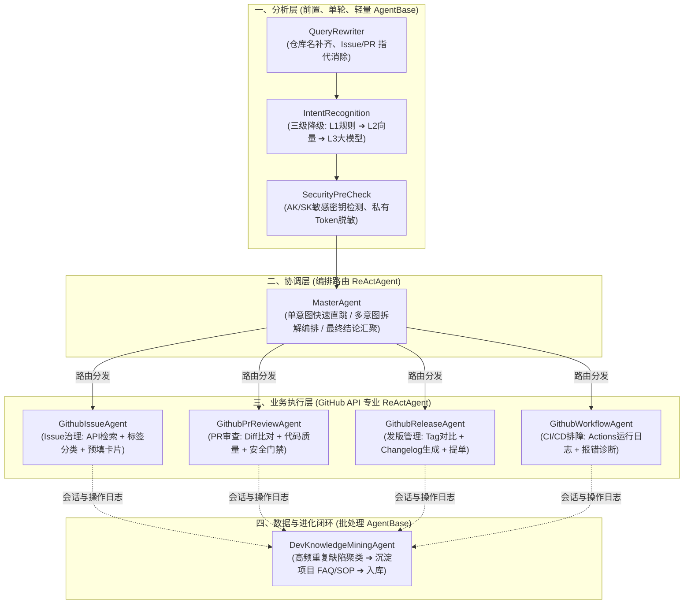
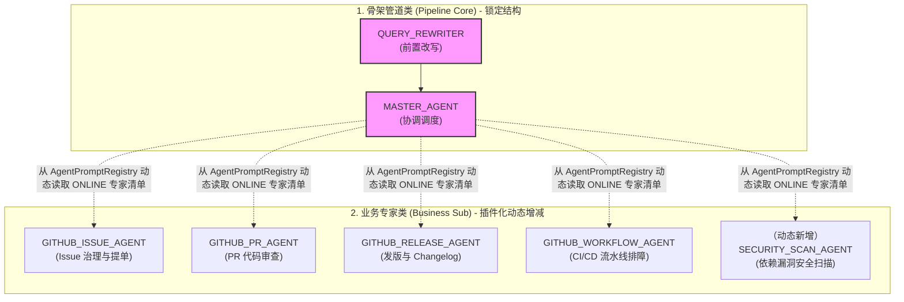
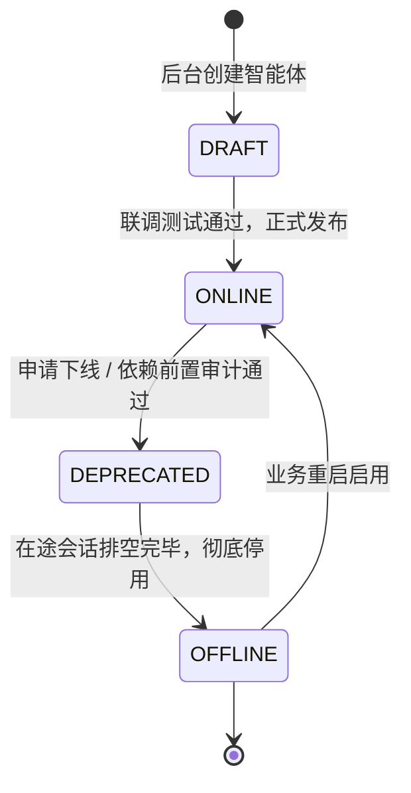

# 基于 GitHub API 的企业研发协同多智能体职责矩阵与分层设计

> ⚠️ **文档定位：参考业务（Demo）蓝图，不属于框架核心**  
> 本文中的 GitHub 业务智能体属于框架自带的参考业务。按 [07 第 6 节](./07-内核架构设计与演进路线.md#6-交付形态模块拆分) 的规划，它们的行为实现最终放在 Demo 模块中，框架内核只保留骨架类智能体（见 [00 RULE-08](./00-工程规范与编码守则.md)）。  
> 各智能体与框架扩展点的映射及实现现状见 [第 5 节](#5-与框架扩展点的映射与实现现状)。

## 1. 架构设计哲学

本系统面向企业级 GitHub 研发协同与开源项目运维治理场景，采用 **“按生命周期流水线拆分、按能力复杂度选型（AgentBase vs. ReActAgent）”** 的多智能体协作范式，坚决杜绝“一个大模型兼管所有任务”。

---

## 2. 智能体职责清单与技术选型对照表

| 分层 | 智能体编码 (`AgentType`) | 智能体名称 | 核心职责 | Agent 选型模式 | 依赖能力 / 工具 (Tools) |
| :--- | :--- | :--- | :--- | :--- | :--- |
| **分析层** | **QUERY_REWRITER** | 会话分析与查询重写智能体 | 结合多轮历史，将“这个PR为什么挂了”、“看下上次报的那个Bug”补齐为“spring-projects/spring-ai 仓库下 PR #512 构建失败原因” | `AgentBase` (轻量单轮) | 会话短期记忆缓存 (Redis) |
| | **INTENT_ROUTER** | 意图识别与分级路由器 | 判断开发者诉求属于速查仓库信息、Issue缺陷排查、代码Review还是发版 | `AgentBase` (分级降级) | L1 前缀/正则规则、L2 VectorStore、L3 ChatModel |
| | **SECURITY_GUARD** | 研发安全与凭证预检智能体 | 开发者输入文本中 GitHub Token、AWS AK/SK、数据库密码脱敏与拦截 | `AgentBase` (正则优先) | 正则掩码引擎 + 敏感词 Trie 树 |
| **协调层** | **MASTER_AGENT** | GitHub 协同主协调调度智能体 | 单意图时直接绕过（Skip）；多意图时分解为子任务并编排依赖（例如：先查 CI 失败日志，再比对 PR Diff，最后输出综合分析报告） | `ReActAgent` (任务调度编排) | SubAgentTool 动态注册表 |
| **业务层** | **GITHUB_ISSUE_AGENT** | Issue 治理与表单装配智能体 | 检索历史 Issue、根据报错堆栈判定标签（bug/enhancement）、装配创建 Issue 的 `InteractiveCard` 预填卡片供专员核验一键提交 | `ReActAgent` (工具计算+卡片) | `githubApiTool.queryIssues`, `githubApiTool.searchIssues` |
| | **GITHUB_PR_AGENT** | Pull Request 代码审查智能体 | 拉取 PR Diff 变更文件列表、执行代码规范与静态缺陷审查、评估合并风险并给出审查意见 | `ReActAgent` (代码审查) | `githubApiTool.queryPullRequest` |
| | **GITHUB_RELEASE_AGENT** | Release 版本发布与 Changelog 智能体 | 抓取相邻 Release Tag 之间的提交记录、自动生成结构化 Changelog、装配发版确认卡片供 Maintainer 审核发布 | `ReActAgent` (文本提炼+流程卡片) | `githubApiTool.queryLatestRelease` |
| | **GITHUB_WORKFLOW_AGENT**| CI/CD 流水线与排障智能体 | 检索 GitHub Actions 工作流状态、提取构建失败错误栈（单元测试失败、依赖拉取超时等）并给出修复指导 | `ReActAgent` (日志诊断) | `githubApiTool.queryWorkflowRuns` |
| **数据闭环**| **DEV_KNOWLEDGE_MINER** | 研发知识沉淀与 FAQ 挖掘智能体 | 汇总仓库未命中或高频咨询的缺陷问题，离线聚类沉淀为标准 FAQ 或 Troubleshooting 指南，反哺生产知识库 | `AgentBase` (离线定时批处理) | 文本聚类算法 (HDBSCAN) + 总结 Prompt |

---

## 3. 与本项目的分阶段推进关系

- **阶段一（已完成）**：完成接入层与 SSE 总线，建立通用 `InteractiveCard` 与交互流程骨架；
- **阶段二**：落地 `sys_agent_definition` 数据库持久化与管理后台，重点打通业务层的 `GITHUB_ISSUE_AGENT`（根据报错日志分析并预填 Issue 提交卡片）的单意图 MVP 闭环；
- **阶段三**：落地分析层（`QUERY_REWRITER`）和协调层（`MASTER_AGENT` 动态感知子专家），实现多意图（如查 PR + 查 CI 日志）协同与三级响应降级；
- **阶段四**：引入数据闭环层 `DEV_KNOWLEDGE_MINER`，完成“高频 Issue 自动沉淀为项目 Troubleshooting SOP”的最终飞轮。

---

## 4. 智能体生命周期与动态注册治理中心 (Agent Hub)

为摆脱硬编码枚举与繁琐发版，系统引入 MySQL 维度的智能体注册中心，实现人设热重载与业务 Sub-Agent 插件化动态增减。

### 4.1 分层治理边界

1. **骨架管道类 Agent (`is_system_core = 1`)**：
   - 处于流水线调用主链路上，Java 代码编译期决定了其拓扑顺序；
   - **数据库维护范畴**：系统人设（System Prompt）、采样温度（Temperature）、模型底座版本；
   - **红线**：严禁修改 `agent_code`，严禁下线或删除节点。
2. **业务领域 Sub-Agent (`is_system_core = 0`)**：
   - 本质上是 `MasterAgent` 的动态专家池；
   - **支持能力**：后台动态新增、修改人设、挂载工具池（Tool Catalog）、平滑下线。

### 4.2 智能体生命周期状态机（“减要慎重”防线）

严格禁止在数据库执行物理 `DELETE`。任何智能体必须遵从以下生命周期流转：

- **DRAFT（草稿）**：仅用于沙箱环境调试，`MasterAgent` 不可见。
- **ONLINE（在线运行）**：正常对外提供服务，`MasterAgent` 自动纳入意图分流与任务分解清单。
- **DEPRECATED（弃用排空中）**：切断新流量入口（`MasterAgent` 调度描述中剔除该专家），但在途的多轮会话或正在等待专员确认的卡片允许继续执行完毕。
- **OFFLINE（彻底下线）**：停止处理所有请求，降级抛出不可用提示。

### 4.3 动态下线前的“三道防线”依赖审计

在将任何业务 Sub-Agent 标记为 `DEPRECATED` 或 `OFFLINE` 前，管理后台自动执行审计：
1. **系统核心锁校验**：检查 `is_system_core`，为 1 则强行拦截操作；
2. **规则引擎关联校验**：检查 `sys_rule_definition` 中是否有规则的 `target_ref` 直接指定该 Agent；
3. **工作流编排关联校验**：检查多步规则链（`sys_rule_chain_step`）或父级编排中是否存在依赖引用。

### 4.4 MasterAgent 动态感知机制

`MasterAgent` 在执行多意图编排时，通过以下逻辑动态组装系统调度清单：
1. 从 [AgentPromptRegistry](../src/main/java/com/example/springai/pipeline/agent/AgentPromptRegistry.java) 过滤拉取 `layer = BUSINESS` 且 `status = ONLINE` 且 `isEnabled = 1` 的所有智能体；
2. 将各智能体的 `agentCode` 与 `dispatchDesc`（调度意图语义）动态注入到 `MasterAgent` 的 Prompt 模版；
3. 任何后台对业务 Agent 的增、改、下线，经事件广播后，`MasterAgent` 均在毫秒级内自动同步专家清单。

> 🚧 **实现现状**：第 1、2 步已由 `AgentPromptRegistry.buildMasterAgentPrompt()` 实现，但该方法目前没有调用方。实际路由由 `MasterAgentRouter` 完成：它用硬编码关键词判断意图，只有“专家是否在线”是动态的，而且尚未接入 Pipeline。改造计划见 [07 第 5.2 节](./07-内核架构设计与演进路线.md#52-路由策略)。

---

## 5. 与框架扩展点的映射与实现现状

| 智能体 | 框架扩展点 | 归属 | 现状 |
| :--- | :--- | :--- | :--- |
| `QUERY_REWRITER` | 📐 `QueryRewriter`（读取本智能体元数据） | 框架骨架 | 只有元数据，无执行链路 |
| `INTENT_ROUTER` | 📐 `IntentResolver` 降级链（框架提供 L1/L2/L3，业务只提供规则与语料数据） | 框架 + 业务数据 | L1 ✅；L2/L3 意图识别未实现 |
| `SECURITY_GUARD` | 📐 `AgentHook.beforeResolve` / `onMessageChunk` | 业务模块 | 未实现 |
| `MASTER_AGENT` | 🚧 `MasterAgentRouter` ➔ 📐 输出 `Route` | 框架骨架 | 关键词路由，未接入 Pipeline |
| `GITHUB_ISSUE_AGENT` | 📐 `SubAgent` + `CardSubmitHandler`（`GitHubIssueCardSubmitHandler` ✅） | Demo 模块 | 🚧 可运行，但链路写死在 Pipeline 中 |
| `GITHUB_PR_AGENT` | 📐 `SubAgent` | Demo 模块 | 只有元数据与 Mock 工具 |
| `GITHUB_RELEASE_AGENT` | 📐 `SubAgent`（下发发版确认卡片） | Demo 模块 | 只有元数据与 Mock 工具 |
| `GITHUB_WORKFLOW_AGENT` | 📐 `SubAgent` | Demo 模块 | 只有元数据与 Mock 工具 |
| `DEV_KNOWLEDGE_MINER` | 📐 `AgentHook.afterTurn`（采集）+ 离线任务 | Demo 模块 | 未实现 |

**判定标准**：新增一个业务智能体时，只需在注册中心登记元数据、提供 `SubAgent` 实现（如需写操作再加 `CardSubmitHandler`），不应修改 Pipeline 或 `AgentType` 枚举。做不到这一点，说明框架还缺对应的扩展点（见 [00 RULE-08](./00-工程规范与编码守则.md)）。
