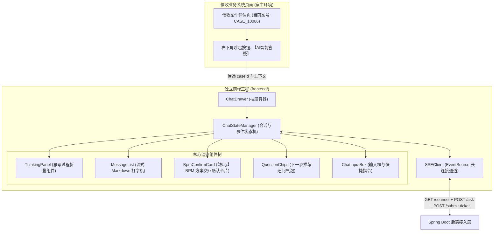

# 前端工程架构与组件设计说明书

## 1. 架构定位与集成模式

本项目前端定位为**“催收业务系统外挂式智能助手（ChatDrawer）”**，采用 **React 18 + TypeScript + Vite** 构建独立前端工程，具备以下三种部署与集成能力：
1. **独立模式 (Standalone)**：作为独立的催收知识答疑工作台全屏运行。
2. **抽屉嵌入模式 (Embedded Drawer, 推荐)**：作为右侧滑出抽屉或右下角浮窗，无侵入嵌入到现有催收业务系统或案件详情页，自动获取并绑定当前页面案件号 `caseId`。
3. **微前端 / Web Component 模式 (Micro-Frontend)**：未来可打包为标准化组件，供呼叫中心、CRM 任意系统一键挂载。



---

## 2. 状态管理与事件驱动设计

前端采用统一的事件监听与响应状态机，严格与后端定义的 6 类 SSE 事件相匹配：

| SSE 事件名 | 前端状态流转 | UI 响应动作 |
| :--- | :--- | :--- |
| `thinking` | `status = 'thinking'` | 展开或更新 `ThinkingPanel`，显示思考过程动态骨架/文字 |
| `progress` | `status = 'progress'` | 顶部弹出进度轻提示（如：“正在向账务系统查询逾期本息…”） |
| `message` | `status = 'streaming'` | 追加文本到当前消息气泡，启用 Markdown 逐字渲染 |
| `bpm_confirm_card` | `hasCard = true` | 挂载 `BpmConfirmCard` 交互组件，填充推荐方案，设置只读与编辑态 |
| `recommend_questions`| `questions = [...]` | 消息底部渲染快捷追问药丸标签，支持一键点击重发 |
| `done` | `status = 'idle'` | 结束当前回合，启用输入框焦点 |
| `error` | `status = 'error'` | 弹出错误提示气泡，提供“重新生成”按钮 |

---

## 3. 核心组件规范

### 3.1 `BpmConfirmCard.tsx`（核心交互组件）
- **功能**：承载 Human-in-the-loop 人机协同方案确认。
- **行为规范**：
  - 自动渲染表单项：对 `editable: false` 的项（如案件编号、减免类型）展示为只读置灰状态；对 `editable: true` 的项（如拟减免金额、申请理由说明）提供编辑输入框。
  - 金额越界校验：输入金额不得超过后端给定的 `maxLimit`。
  - 防重复提交：点击提交后按钮进入 `loading` 状态，并禁用表单所有输入，成功后回写工单单号 `bpmInstanceId`。

### 3.2 `ThinkingPanel.tsx`（思考折叠面板）
- **功能**：展示 SubAgent 推理链，避免冗长的内部思考打乱正式回答。
- **行为规范**：
  - 流式推送时默认展开，带有“思考中...”旋转图标；
  - 正式 `message` 开始输出后，自动缩拢为“已深度思考 (展开查看)”折叠条。

---

## 4. 前端工程目录结构规划

```text
d:\projects\ai-demo\frontend\
├── index.html                      // 单页入口
├── package.json                    // 依赖清单 (React 18 + Vite + Lucide图标)
├── vite.config.ts                  // Vite 构建与后端 /api 代理配置
├── tsconfig.json                   // TS 编译配置
└── src/
    ├── main.tsx                    // 挂载入口
    ├── App.tsx                     // 宿主模拟容器（支持嵌入模式与全屏模式切换）
    ├── api/
    │   └── sseClient.ts            // SSE 连接封装、重试与消息分发
    ├── types/
    │   └── chat.ts                 // 严格对齐后端契约的 TS 接口类型
    ├── components/
    │   ├── ChatDrawer.tsx          // 抽屉式对话总成容器
    │   ├── ThinkingPanel.tsx       // 思考折叠组件
    │   ├── BpmConfirmCard.tsx      // BPM 方案确认卡片组件
    │   └── QuestionChips.tsx       // 推荐追问小药丸组件
    └── styles/
        └── index.css               // 现代化流式气泡与卡片样式
```
