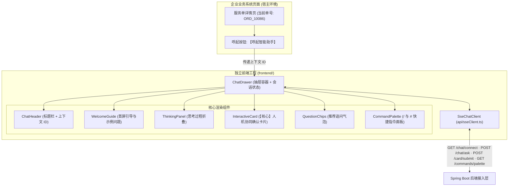

# 前端工程架构与组件设计说明书

> **文档定位**：框架配套前端工作台的工程设计。前后端通信以 [03-前后端接口与SSE协议契约](./03-前后端接口与SSE协议契约.md) 为准；组件与协议均使用通用命名，业务差异通过 `cardType` 与宿主上下文参数承载。

## 1. 架构定位与集成模式

前端定位为**“企业业务系统外挂式智能助手（ChatDrawer）”**，采用 **React 18 + TypeScript + Vite** 构建独立前端工程，支持三种集成方式：
1. **独立模式 (Standalone)**：作为独立的知识答疑与工单协同工作台全屏运行。
2. **抽屉嵌入模式 (Embedded Drawer，推荐)**：以右侧抽屉或右下角浮窗形式无侵入嵌入宿主业务系统，自动获取当前页面的上下文 ID（当前实现字段为 `caseId`，📐 目标契约为通用 `attributes`）。
3. **微前端 / Web Component 模式**：📐 未来打包为标准化组件，供客服工作台、CRM、OA 等任意系统一键挂载。



> 当前实现中，消息列表、打字机渲染与输入框内聚在 `ChatDrawer.tsx` 中；规模增长后可再拆分为 `MessageList` / `ChatInputBox`。

---

## 2. 状态管理与事件驱动设计

前端以统一的事件监听驱动状态流转，与后端定义的 8 类 SSE 事件一一对应：

| SSE 事件名 | 前端状态流转 | UI 响应动作 |
| :--- | :--- | :--- |
| `thinking` | `status = 'thinking'` | 展开或更新 `ThinkingPanel` |
| `progress` | `status = 'progress'` | 进度轻提示（如：“已完成仓库上下文检索与 Issue 查重核验”） |
| `message` | `status = 'streaming'` | 追加文本到当前消息气泡，Markdown 渲染 |
| `interactive_card` | `hasCard = true` | 挂载 `InteractiveCard` 组件，按字段设置只读 / 编辑态 |
| `recommend_questions` | `questions = [...]` | 渲染快捷追问标签，支持一键重发 |
| `conversation_title` | `title = ...` | 更新会话标题（📐 已订阅事件，UI 尚未处理） |
| `done` | `status = 'idle'` | 回合结束，恢复输入框 |
| `error` | `status = 'error'` | 错误提示气泡 |

**回合与连接**：`done` / `error` 只表示回合结束，长连接跨回合保持。📐 目标契约中每个事件携带 `turnId`，前端据此丢弃不属于当前回合的迟到事件（见 03 第 6 节）。

---

## 3. 核心组件规范

### 3.1 `InteractiveCard.tsx`（核心交互组件）
- **功能**：承载 Human-in-the-loop 方案确认，对应 `interactive_card` 事件。
- **行为规范**：
  - 按 `fields[]` 自动渲染表单项：`editable: false` 的字段（如目标仓库、业务单号）只读置灰并标注“系统锁定”；`editable: true` 的字段（如标题、复现步骤、申请理由）提供输入框。
  - 数值越界校验：输入不得超过后端给定的 `maxLimit`（📐 `minLimit` 校验待补）。
  - 防重复提交：点击提交后按钮进入 `loading`，成功后锁定整张卡片并回写 `ticketId`。
  - 安全边界：前端锁定只是交互层约束，真正的防篡改由服务端 `CardRegistry` 校验保证（📐 框架 M3）。

### 3.2 `ThinkingPanel.tsx`（思考折叠面板）
- **功能**：展示智能体推理链，避免冗长的内部思考打乱正式回答。
- **行为规范**：
  - 流式推送时默认展开，带“思考中...”动画；
  - 正式 `message` 开始输出后，自动收拢为“已深度思考（展开查看）”折叠条。

### 3.3 `CommandPalette.tsx`（快捷指令面板）
- **功能**：输入以 `/` 或 `#` 开头时弹出 L1 快捷指令列表，支持上下键选择，选中后把指令模板填入输入框。
- **数据来源**：启动时调用 `GET /api/v1/commands/palette` 拉取（`CommandPaletteItem`）。

### 3.4 `QuestionChips.tsx` / `WelcomeGuide.tsx` / `ChatHeader.tsx`
- `QuestionChips`：渲染 `recommend_questions`，点击即作为新问题发送。
- `WelcomeGuide`：会话为空时的首屏引导，提供示例问题一键发送。
- `ChatHeader`：抽屉标题栏，展示宿主上下文 ID 与关闭按钮。

---

## 4. 前端工程目录结构

```text
frontend/
├── index.html                      // 单页入口
├── package.json                    // 依赖清单 (React 18 + Vite + Lucide 图标)
├── vite.config.ts                  // 开发端口 3000，/api 代理到 8080
├── tsconfig.json                   // TS 编译配置
└── src/
    ├── main.tsx                    // 挂载入口
    ├── App.tsx                     // 宿主模拟容器（嵌入模式与全屏模式切换）
    ├── api/
    │   ├── sseClient.ts            // SSE 连接、提问、卡片提交、快捷指令拉取
    │   └── adminClient.ts          // L1 规则管理接口封装（📐 管理界面尚未接入）
    ├── types/
    │   ├── chat.ts                 // 对齐 03 协议契约的 TS 类型
    │   └── admin.ts                // 规则管理相关类型
    ├── components/
    │   ├── ChatDrawer.tsx          // 抽屉式对话总成（消息列表 + 输入框 + 状态）
    │   ├── ChatHeader.tsx          // 标题栏
    │   ├── WelcomeGuide.tsx        // 首屏引导
    │   ├── ThinkingPanel.tsx       // 思考折叠组件
    │   ├── InteractiveCard.tsx     // 人机协同确认卡片
    │   ├── QuestionChips.tsx       // 推荐追问组件
    │   └── CommandPalette.tsx      // 快捷指令面板
    └── styles/
        └── index.css               // 流式气泡与卡片样式
```
