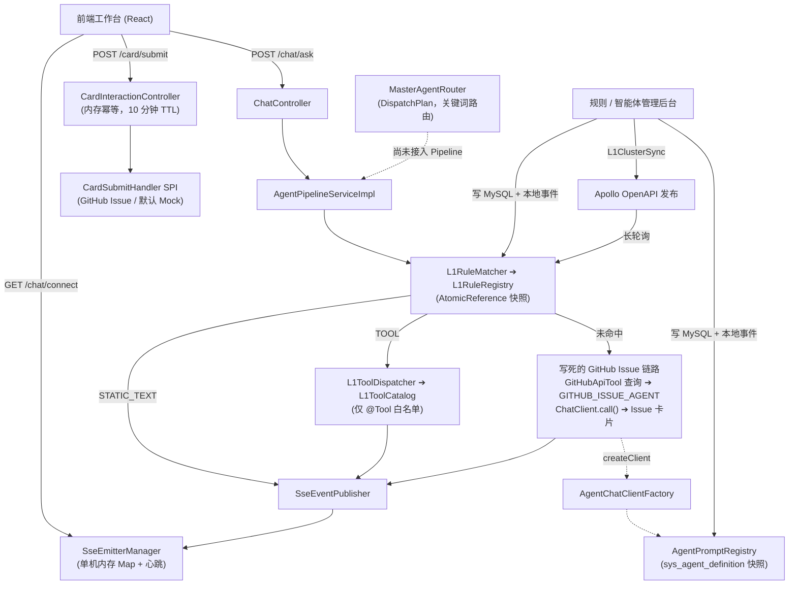
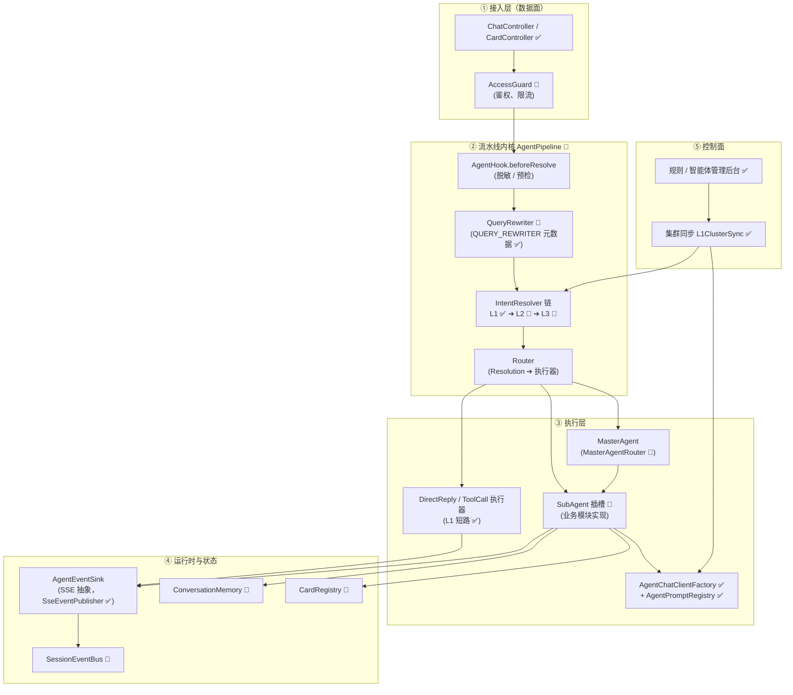
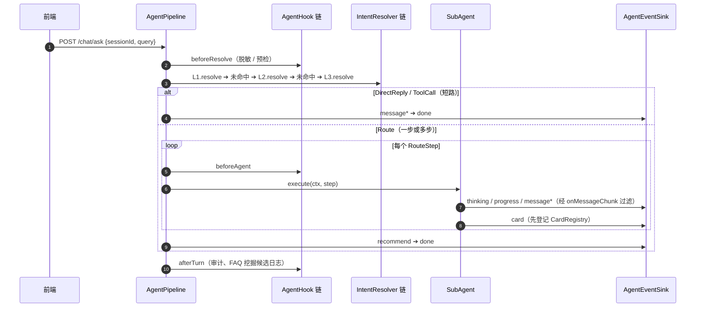
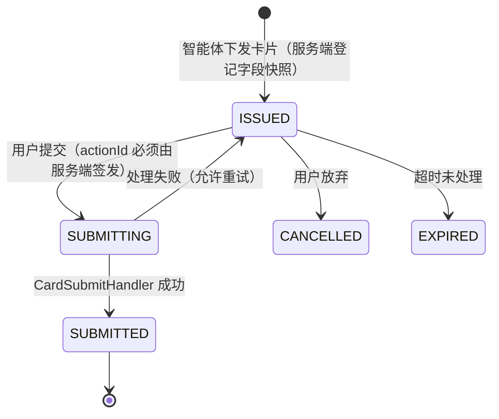
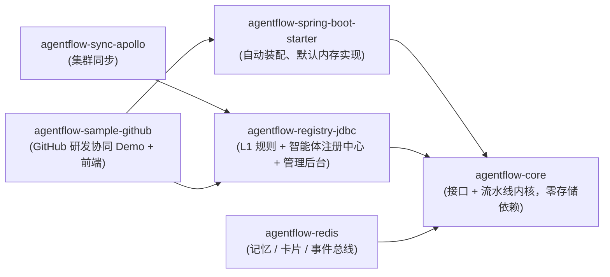
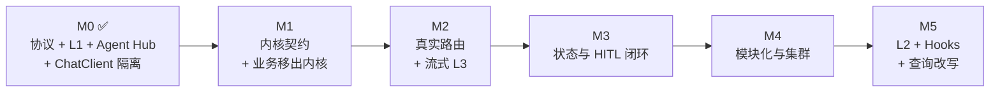

# 内核架构设计与演进路线（Kernel Architecture & Roadmap）

> **文档版本**：v1.1.0  
> **更新时间**：2026-10-09  
> **文档定位**：框架“微内核”的目标架构与演进路线。[02-通用Agent骨架边界与设计哲学](./02-通用Agent骨架边界与设计哲学.md) 定义“框架是什么、不能有什么”，本文定义“内核长什么样、按什么顺序建”。  
> **状态标记**：✅ 已实现　🚧 部分实现　📐 设计稿（未实现，接口以本文为准，落地时可微调）

---

## 目录
1. [项目目标：两层定位](#1-项目目标两层定位)
2. [现状快照：代码实际做到了哪里](#2-现状快照代码实际做到了哪里)
3. [架构差距与核心判断](#3-架构差距与核心判断)
4. [目标内核架构](#4-目标内核架构)
5. [关键设计决策](#5-关键设计决策)
6. [交付形态：模块拆分](#6-交付形态模块拆分)
7. [演进路线与验收标准](#7-演进路线与验收标准)
8. [文档一致性约定](#8-文档一致性约定)

---

## 1. 项目目标：两层定位

| 层次 | 定位 | 承载文档 |
| :--- | :--- | :--- |
| **外层（框架）** | 通用、开源的 Multi-Agent **流式微内核框架**：框架只定协议与扩展点，不含任何业务 | `02`、`03`、`05`、本文 |
| **内层（参考业务 / Demo）** | **GitHub 研发协同助手**：Issue 治理、PR 审查、发版、CI 排障，用于验证框架能否支撑真实多智能体场景 | `01`、`04`（参考蓝图，不属于框架核心） |

框架要标准化的 4 件事：

1. **SSE 流式交互**：统一的事件协议（thinking / progress / message / interactive_card / recommend_questions / done …）。
2. **Human-in-the-loop**：大模型只“提方案”，由人确认后才执行写操作。
3. **三级意图降级**：L1 规则 ➔ L2 向量 ➔ L3 大模型，兼顾时延与成本。
4. **前端工作台组件**：思考面板、打字机、交互卡片、推荐追问、快捷指令面板。

**终极交付标准**：业务方以依赖方式引入框架，只写 `SubAgent` / `CardSubmitHandler` / `AgentHook` 等插头实现、在注册中心配置智能体元数据即可上线，**底座零改动**。

---

## 2. 现状快照：代码实际做到了哪里

### 2.1 当前请求链路（真实代码）



### 2.2 能力实现矩阵

| 能力 | 状态 | 说明 |
| :--- | :---: | :--- |
| SSE 事件协议与推送 | ✅ | `SsePacket` + `SseEventType`（8 类事件）；发送失败时流水线停止本回合 |
| SSE 连接生命周期 | ✅ | `done` / `error` 只结束回合不关连接；心跳保活；按 `(sessionId, emitter)` 精确移除 |
| 交互卡片模型与提交 SPI | ✅ | `InteractiveCard` + `CardSubmitHandler`；带 TTL 的内存幂等 |
| L1 规则引擎 | ✅ | MySQL 持久化、内存无锁快照、管理后台（含统计、编辑、删除）、事件热重载 |
| L1 ➔ Tool 直通 | ✅ | `L1ToolCatalog` 只允许调用 `@Tool` 方法 |
| 规则集群同步 | ✅ | `L1ClusterSync` 扩展点：管理端写入后经 Apollo OpenAPI 发布，各节点长轮询重载；未配置时为空实现 |
| 智能体注册中心（Agent Hub） | ✅ | `sys_agent_definition` + `AgentPromptRegistry` 快照 + 管理后台；生命周期状态机与下线依赖审计（RULE-06） |
| 智能体专属 ChatClient | ✅ | `AgentChatClientFactory`：按智能体隔离 System Prompt 与工具集 |
| L3 大模型调用 | 🚧 | 已接入 `ChatClient`，但只在写死的 Issue 链路中使用；`call()` 拿到全文后再切块推送，不是真流式 |
| MasterAgent 路由 | 🚧 | `MasterAgentRouter` 产出 `DispatchPlan`（单意图 / 复合 / 降级），但**未接入 Pipeline**，且以关键词规则路由 |
| 快捷指令面板 | ✅ | `/api/v1/commands/palette` + 前端 `CommandPalette` |
| 流水线编排内核 | ❌ | 无 `IntentResolver` / `SubAgent` / `AgentHook` 扩展点，Pipeline 仍是单方法 |
| L2 向量检索 | ❌ | — |
| Hooks 治理链 | ❌ | 无脱敏、合规、熔断扩展点 |
| 会话记忆 / 查询改写 | ❌ | `QUERY_REWRITER` 只有元数据，没有执行链路 |
| 卡片服务端状态 | ❌ | 卡片下发不登记，“只读锁”只在前端生效 |
| 多节点 SSE | ❌ | SSE 连接与幂等缓存仍为单机内存 |
| 接入鉴权 | ❌ | 数据面（chat）与控制面（admin）均未鉴权 |

**一句话结论**：协议层、L1、Agent Hub 和 ChatClient 隔离已经就绪，**但内核仍没有扩展点，主链路是写死的单一 GitHub Issue 路径，Demo 业务也因此混进了内核代码**。

---

## 3. 架构差距与核心判断

### 3.1 主链路已起步，但仍是写死的单一路径
L3 已接入 `ChatClient`，注册中心也已建成，这是很大的进步。但未命中 L1 的所有请求都会进入同一条 “查 GitHub 仓库 ➔ GITHUB_ISSUE_AGENT ➔ Issue 卡片” 路径，问 PR、问发版也会得到一张 Issue 卡片。**`MasterAgentRouter` 已经能产出调度计划，下一步是让它真正驱动 Pipeline。**

### 3.2 “智能体元数据”与“智能体行为”需要分开
注册中心解决的是**元数据**：人设、模型、工具清单、上下线状态，可以在后台动态改。但智能体**做什么**（调哪些工具、是否下发卡片、卡片长什么样）现在写在 Pipeline 里。两者需要同时存在：

| 概念 | 载体 | 谁维护 |
| :--- | :--- | :--- |
| 智能体元数据 | `sys_agent_definition` ➔ `AgentDefinition` | 管理员（后台动态） |
| 智能体行为 | `SubAgent` 实现类（📐），`name()` 与 `agent_code` 对应 | 开发者（代码插件） |

只有元数据、没有行为插槽，新增一个业务智能体仍然要改 Pipeline。

### 3.3 Demo 业务混进了内核
`02` 要求框架代码 100% 通用，但当前内核中出现了 Demo 业务：
- `AgentType` 枚举（位于 `pipeline.agent`）硬编码了 `GITHUB_ISSUE_AGENT` 等业务智能体；
- `AgentPipelineServiceImpl` 直接注入 `GitHubApiTool`，写死了仓库名提取、Issue 卡片装配和兜底文案；
- `MasterAgentRouter` 的关键词规则是 GitHub 专用的。

**内核只应保留 `QUERY_REWRITER`、`MASTER_AGENT` 等骨架类编码，业务智能体编码只存在于数据（注册中心）和业务模块中。** 这正是 RULE-06 “业务 Sub-Agent 动态增减”的前提。

### 3.4 L1 语义：意图识别 vs 直接执行
L1 命中后直接执行（直出文本或调用工具），不支持的类型直接报错。接入 MasterAgent 后，L1 还需要能“把请求路由给某个智能体”。三种结果应在模型上显式区分，见 [5.1](#51-意图解析结果短路-vs-路由)。RULE-06 中“下线前检查 `target_ref` 是否引用该 Agent”的依赖审计，正好与 L1 新增的 `ROUTE` 类型吻合。

### 3.5 当前是“一个应用”，不是“一个框架”
单 Spring Boot 工程，MySQL / JPA / Apollo / OpenAI 都是硬依赖，Demo 业务与内核也在同一个模块里。外部用户必须先准备 MySQL 才能体验。见 [第 6 节](#6-交付形态模块拆分)。

### 3.6 状态模型：连接已修好，会话与卡片仍缺位
- SSE 连接生命周期已修复（回合结束不关连接、心跳、精确移除）；规则和智能体元数据也已能集群同步。
- 但 SSE 连接表和卡片幂等表仍在单机内存：多节点下 `/connect` 与 `/ask` 落到不同节点就会丢消息。
- Human-in-the-loop 闭环需要服务端卡片状态机；`QUERY_REWRITER` 与多轮对话需要会话记忆。

---

## 4. 目标内核架构

### 4.1 内核分层



**数据面 / 控制面分离**：数据面（`/chat`、`/card`、`/commands`）面向终端用户，追求低时延；控制面（`/admin`）负责规则、智能体等元数据。两者鉴权策略独立，控制面必须强鉴权。

### 4.2 扩展点（SPI）全集

| 扩展点 | 职责 | 框架默认实现 | 状态 |
| :--- | :--- | :--- | :---: |
| `CardSubmitHandler` | 卡片确认后的业务写操作 | `DefaultMockCardSubmitHandler` | ✅ |
| `L1ClusterSync` | 规则变更后通知集群 | 空实现；可选 Apollo OpenAPI | ✅ |
| 智能体元数据注册中心 | 人设、模型、工具、生命周期 | `AgentPromptRegistry`（JDBC） | ✅ |
| `IntentResolver` | 意图解析（L1 / L2 / L3 统一抽象），按 `Ordered` 串成降级链 | `RuleIntentResolver`（包装现有 L1） | 📐 |
| `SubAgent` | 智能体行为：调用工具、流式输出、下发卡片 | `GeneralChatAgent`（通用对话 + `@Tool`） | 📐 |
| `AgentHook` | 前后置治理：脱敏、合规过滤、审计、熔断 | 无（空链） | 📐 |
| `QueryRewriter` | 多轮指代消除与查询改写 | 基于 `QUERY_REWRITER` 元数据的 LLM 实现 | 📐 |
| `ConversationMemory` | 会话短期记忆 | 内存实现；可选 Redis | 📐 |
| `CardRegistry` | 卡片下发登记与状态流转 | 内存实现；可选 Redis / JDBC | 📐 |
| `SessionEventBus` | 跨节点把事件投递到持有连接的节点 | 本地直投；可选 Redis Pub/Sub | 📐 |

### 4.3 核心接口草案 📐

> 以下为设计稿。落地时与现有类的关系：`AgentEventSink` 由 `SseEventPublisher` 适配；`Resolution.Route` 由 `MasterAgentRouter` 的 `DispatchPlan` 演进而来；`SubAgent` 通过 `AgentChatClientFactory.createClient(name(), tools)` 取得专属 ChatClient。

```java
/** 一次对话回合的上下文，贯穿整条流水线 */
@Data
public class AgentContext {
    private String sessionId;
    private String turnId;                  // 回合 ID，随每个 SSE 事件下发
    private String userId;
    private String query;                   // 原始输入
    private String effectiveQuery;          // 经 Hook 脱敏 / 改写后的输入
    private Map<String, Object> attributes; // 业务透传参数（如宿主页面上下文 ID、仓库名）
    private AgentEventSink events;          // 事件出口（SSE 抽象）
}

/** 意图解析器：L1 / L2 / L3 统一抽象，按 getOrder() 串行降级 */
public interface IntentResolver extends Ordered {
    String level();                                 // "L1" / "L2" / "L3"
    Optional<Resolution> resolve(AgentContext ctx); // empty = 放行至下一级
}

/** 解析结果：短路执行 or 路由到智能体（见 5.1） */
public sealed interface Resolution {
    record DirectReply(String level, String ruleCode, String text) implements Resolution {}
    record ToolCall(String level, String ruleCode, String toolRef, String jsonArgs) implements Resolution {}
    record Route(String level, List<RouteStep> steps, double confidence) implements Resolution {}
    record RouteStep(int order, String agentCode, String task, Map<String, Object> params) {}
}

/** 智能体行为插槽：name() 与 sys_agent_definition.agent_code 一一对应 */
public interface SubAgent {
    String name();
    void execute(AgentContext ctx, Resolution.RouteStep step); // 通过 ctx.getEvents() 流式输出、下发卡片
}

/** 治理钩子：所有方法默认空实现，按 Ordered 组成责任链 */
public interface AgentHook extends Ordered {
    default void beforeResolve(AgentContext ctx) {}
    default void beforeAgent(AgentContext ctx, String agentCode) {}
    default String onMessageChunk(AgentContext ctx, String chunk) { return chunk; } // 输出过滤
    default void afterTurn(AgentContext ctx, TurnOutcome outcome) {}
    default void onError(AgentContext ctx, Throwable ex) {}
}

/** 事件出口：内核只依赖该接口，不直接依赖 SseEmitter */
public interface AgentEventSink {
    boolean thinking(String content);
    boolean progress(String stage, String description);
    boolean message(String chunk);
    boolean card(InteractiveCard card);     // 内部先经 CardRegistry.issue 登记再下发
    boolean recommend(List<String> questions);
    boolean done();                         // 回合结束，不关闭长连接
    boolean error(String message);
}

/** 卡片注册表：服务端持有卡片状态，保证 Human-in-the-loop 不可绕过 */
public interface CardRegistry {
    void issue(String sessionId, InteractiveCard card);      // ISSUED
    CardRecord claim(String actionId, String sessionId);     // ISSUED ➔ SUBMITTING，非法 / 重复抛异常
    void complete(String actionId, CardSubmitResult result); // ➔ SUBMITTED / FAILED
}
```

### 4.4 一次请求的完整生命周期 📐



---

## 5. 关键设计决策

### 5.1 意图解析结果：短路 vs 路由
所有 `IntentResolver` 只输出三种结果之一：

| 结果 | 含义 | 典型来源 |
| :--- | :--- | :--- |
| `DirectReply` | 直接给出最终文本，回合结束 | L1 `STATIC_TEXT`、L2 高置信 FAQ 命中 |
| `ToolCall` | 直接调用一个 `@Tool` 并输出结果 | L1 `TOOL` |
| `Route` | 交给一个或多个智能体执行 | L1 新增 `ROUTE` 类型、L2 中置信、L3 意图分类 |

现有 L1 目标类型的映射：`STATIC_TEXT ➔ DirectReply`，`TOOL ➔ ToolCall`；`INTERACTIVE_CARD` / `WORKFLOW` 统一改为 `ROUTE`（`target_ref` = `agent_code`），由对应智能体负责出卡片或执行确定性工作流（`sys_rule_chain_step`）。

**安全约束**：`ToolCall` 只允许调用 `@Tool` 方法（已由 `L1ToolCatalog` 实现）。

### 5.2 路由策略
- **单意图高置信** ➔ 直接派发对应 `SubAgent`（Skip Master）。
- **多意图或低置信** ➔ 由 MasterAgent 产出多步 `Route`，Pipeline 按步骤执行，前一步结果写入 `AgentContext` 供后一步使用。
- **无匹配** ➔ 派发 `GeneralChatAgent`，保证开箱可用。

**MasterAgent 的演进**：当前 `MasterAgentRouter` 用硬编码关键词判断意图，只有“专家是否在线”是动态的。目标是改为 L3 结构化输出：把注册中心里所有 `ONLINE` 业务智能体的 `agent_code` 与 `dispatch_desc` 注入 Prompt，由模型输出 `Route`。拼装 Prompt 的部分已经由 `AgentPromptRegistry.buildMasterAgentPrompt()` 实现（目前无调用方），只需补上结构化输出解析，并把结果接入 Pipeline。这样新增业务智能体只需在后台登记元数据并提供 `SubAgent` 实现，路由逻辑零改动。关键词规则可作为 L1 `ROUTE` 规则保留，用于高频且确定的场景。

### 5.3 状态模型
**会话记忆**：`ConversationMemory` 保存最近 N 轮问答（含改写后的问题与命中层级），供 `QueryRewriter`、L3 与 SubAgent 使用。

**卡片状态机**：



提交时服务端必须校验：① `actionId` 存在且属于该 `sessionId`；② 状态为 `ISSUED`；③ `editable=false` 的字段值与下发快照一致；④ 可编辑字段满足 `minLimit` / `maxLimit` / `required`。**校验通过后才调用 `CardSubmitHandler`。** 当前的 TTL 幂等缓存可在 `CardRegistry` 落地后被其取代。

### 5.4 SSE 连接生命周期
- ✅ **连接级（`/chat/connect`）**：一条长连接承载多个回合，`done` / `error` 只表示回合结束；服务端定期发送心跳保活。
- ✅ **一次性（`/chat/stream-ask`）**：调试用接口。
- 📐 每个事件携带 `turnId`，前端据此丢弃不属于当前回合的迟到事件。
- 📐 L3 改用 `ChatClient.stream()`，模型 token 到达即推送，取代“全文生成后再切块”。

### 5.5 多节点部署
| 方案 | 做法 | 适用阶段 |
| :--- | :--- | :--- |
| A. 会话亲和 | 网关按 `sessionId` 一致性哈希，`/connect`、`/ask`、`/card/submit` 落在同一节点 | 起步阶段，零改造 |
| B. 事件总线 | 任意节点处理请求，经 `SessionEventBus`（Redis Pub/Sub）投递到持有连接的节点 | 规模化阶段 |

无论哪种方案，`CardRegistry` 与幂等状态都必须使用共享存储（Redis / DB）。元数据（规则、智能体）的集群同步已由 `L1ClusterSync` + Apollo 解决，SSE 与卡片状态是剩下的单机依赖。

---

## 6. 交付形态：模块拆分 📐



| 模块 | 必选 | 内容 |
| :--- | :---: | :--- |
| `agentflow-core` | ✅ | 扩展点接口、Pipeline、SSE、卡片协议、`AgentChatClientFactory`；`AgentType` 只保留骨架类编码 |
| `agentflow-spring-boot-starter` | ✅ | 自动装配、默认内存实现、`GeneralChatAgent` |
| `agentflow-registry-jdbc` | 可选 | L1 规则、智能体注册中心、管理后台；JDBC 驱动由使用方选择 |
| `agentflow-sync-apollo` | 可选 | `ApolloL1ClusterSync` 与监听器 |
| `agentflow-redis` | 可选 | `ConversationMemory` / `CardRegistry` / `SessionEventBus` 的 Redis 实现 |
| `agentflow-sample-github` | 演示 | `GitHubApiTool`、`GitHubIssueCardSubmitHandler`、GitHub 业务智能体的 `SubAgent` 实现与种子数据、前端；使用 H2 开箱即用 |

**业务落地方式**：业务方新建模块，依赖 starter + 所需可选模块，实现 `SubAgent` / `CardSubmitHandler` / `AgentHook`，在注册中心登记智能体元数据。业务名词全部留在业务模块中。

---

## 7. 演进路线与验收标准



| 里程碑 | 内容 | 验收标准 |
| :--- | :--- | :--- |
| **M0 ✅** | SSE 协议与生命周期、卡片 SPI、L1 规则引擎与集群同步、`@Tool` 白名单、Agent Hub、`AgentChatClientFactory`、快捷指令面板、前端工作台 | 已完成 |
| **M1 内核契约** | 落地 `AgentContext` / `IntentResolver` / `Resolution` / `SubAgent` / `AgentHook` / `AgentEventSink`；L1 适配为 `RuleIntentResolver`；把 GitHub Issue 链路改写为 `GithubIssueSubAgent`；`AgentType` 只保留骨架类编码 | Pipeline 中无业务分支、不引用任何 GitHub 类；新增一个 Resolver / SubAgent / Hook 只需声明 Bean；现有测试全部通过 |
| **M2 真实路由** | `MasterAgentRouter` 接入 Pipeline 并改为 L3 结构化输出（基于注册中心 `dispatch_desc`）；支持多步 `Route`；`GeneralChatAgent` 兜底；L3 改为 `stream()` 真流式 | 问 Issue / PR / 发版 / CI 分别路由到不同智能体；后台新增一个 `ONLINE` 智能体后无需改代码即可被路由 |
| **M3 状态闭环** | `ConversationMemory`、`QueryRewriter`、`CardRegistry` 状态机与服务端字段校验、`turnId` | 篡改只读字段 / 伪造 `actionId` 的提交被拒绝；多轮指代（“这个 PR”）可被正确补全 |
| **M4 模块化与集群** | 按第 6 节拆模块；Demo 使用 H2 开箱即用；`SessionEventBus` Redis 实现；控制面鉴权 | 无 MySQL / Apollo 环境下 `clone ➔ run` 可体验；双节点下跨节点提问正常 |
| **M5 能力扩展** | L2 向量检索 Resolver、安全脱敏 / 合规 / 熔断 Hook 示例、FAQ 挖掘数据采集 | L1/L2/L3 命中层级可在审计中统计 |

**与参考业务的关系**：`01` / `04` 中 GitHub 业务智能体的落地（PR 审查、发版、CI 排障）依赖 M1~M2；FAQ 数据飞轮依赖 M3 的会话记忆与 M5 的审计采集。

---

## 8. 文档一致性约定

| 主题 | 唯一事实标准 |
| :--- | :--- |
| 框架边界与红线 | [02-通用Agent骨架边界与设计哲学](./02-通用Agent骨架边界与设计哲学.md) |
| 内核架构、扩展点、路线图 | 本文 |
| HTTP 接口与 SSE 事件 | [03-前后端接口与SSE协议契约](./03-前后端接口与SSE协议契约.md) |
| 表结构 | `sql/init_schema.sql` |
| 编码规范 | [00-工程规范与编码守则](./00-工程规范与编码守则.md) |

`01`、`04` 为参考业务（GitHub 研发协同 Demo）蓝图，其中的业务化命名与通用协议的映射见各文档顶部说明；与上表冲突时以上表为准。
