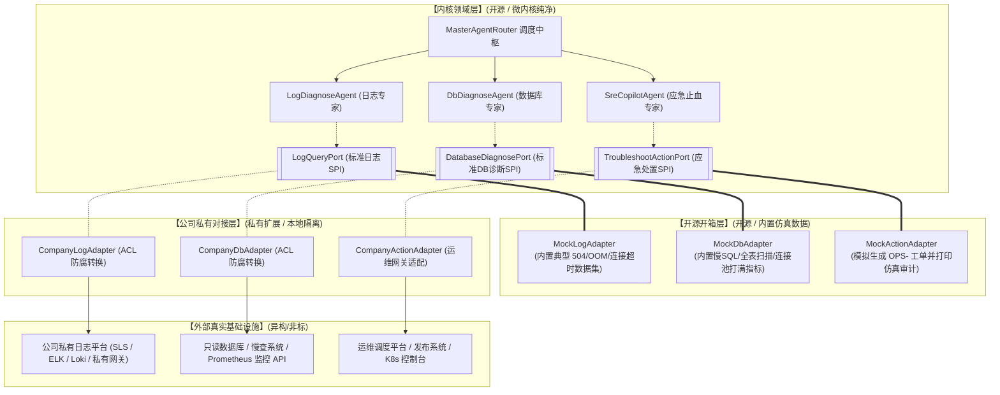
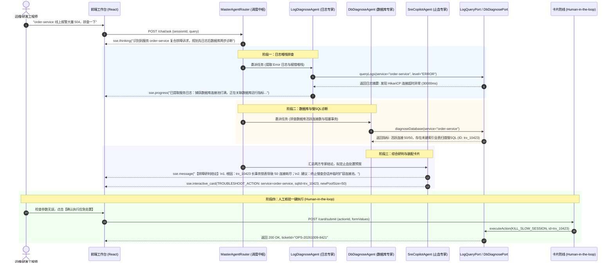

# 企业级智能运维排障架构与详细设计说明书

> **文档版本**：v1.0.0  
> **更新时间**：2026-10-09  
> **文档定位**：智能运维排障业务与通用 Agent 微内核的架构边界与详细设计说明书。遵循 [02-通用Agent骨架边界与设计哲学](./02-通用Agent骨架边界与设计哲学.md) 与 [07-内核架构设计与演进路线](./07-内核架构设计与演进路线.md)。  
> **核心原则**：**内核只定规范（Port），插件负责防腐适配（Adapter），Mock 保证开源开箱即用，真实对接物理隔离绝不入库。**

---

## 一、 架构总览：六边形架构与防腐层（ACL）

本项目采用标准的 **DDD 六边形架构（Ports and Adapters） + 防腐层（Anti-Corruption Layer）** 模式，实现微内核与企业真实异构系统之间的物理隔离：



### 1. 核心边界划分
1. **内核拥有一等公民定义权**：内核领域模型根据大模型推理与决策所必需的最小信息集定义，绝不迁就外部非标字段。
2. **防腐层（ACL）抹平异构差异**：外部系统的复杂嵌套 JSON、非标状态码由各自的 Adapter 负责翻译映射。外部系统接口变更时，仅变更对应 Adapter，内核与多智能体调度流水线零改动。
3. **开源与私有代码物理隔离**：真实对接与生产密钥只存在于未入库的本地私有目录或独立配置中，开源仓库仅包含通用内核与 Mock 演示实现。

---

## 二、 领域契约与标准端口（Port SPI）详细设计

所有的标准端口定义位于 `com.example.springai.troubleshoot.port` 包下。

### 2.1 日志与分布式链路标准端口 (`LogQueryPort`)

#### 2.1.1 接口定义
```java
package com.example.springai.troubleshoot.port;

import com.example.springai.troubleshoot.dto.LogQueryCriteria;
import com.example.springai.troubleshoot.dto.LogQueryResult;

/**
 * 日志与分布式链路查询标准端口 (LogQueryPort)
 * 供 LogDiagnoseAgent 与流水线进行只读日志检索
 */
public interface LogQueryPort {

    /**
     * 根据排障条件检索标准化日志记录与异常摘要
     *
     * @param criteria 查询过滤条件
     * @return 结构化的日志查询结论
     */
    LogQueryResult queryLogs(LogQueryCriteria criteria);
}
```

#### 2.1.2 契约模型设计 (`LogQueryCriteria` & `LogQueryResult`)
```java
public class LogQueryCriteria {
    private String service;          // 目标服务名 (如 order-service)
    private String traceId;          // 分布式 TraceID (可选)
    private String logLevel;         // 过滤级别: ERROR / WARN / ALL (默认 ERROR)
    private Long startTime;          // 检索起始时间戳 (毫秒)
    private Long endTime;            // 检索截止时间戳 (毫秒)
    private String keyword;          // 关键字模糊过滤 (如 "Connection timeout", "OutOfMemory")
    private Integer limit;           // 最大抓取条数 (默认 50，防止大模型上下文溢出)
}

public class LogQueryResult {
    private String service;                     // 服务标识
    private int totalMatches;                   // 命中总条数
    private List<LogEntry> matchedEntries;      // 关键日志条目列表
    private List<String> topExceptions;         // 聚类提取的高频异常类名 (如 "HikariPool Connection Timeout")
    private String deepestStackTrace;          // 最深层报错核心代码行 (辅助快速定位类与行号)
}

public class LogEntry {
    private String timestamp;        // 时间戳 (yyyy-MM-dd HH:mm:ss.SSS)
    private String level;            // 级别 (ERROR, WARN)
    private String threadName;       // 线程名称 (如 "http-nio-8080-exec-1")
    private String logger;           // 日志 Logger (如 "com.zaxxer.hikari.pool.HikariPool")
    private String message;          // 简短日志内容
    private String stackTraceSample; // 堆栈切片 (前 5 行关键根因)
}
```

---

### 2.2 数据库性能与连接池标准端口 (`DatabaseDiagnosePort`)

#### 2.2.1 接口定义
```java
package com.example.springai.troubleshoot.port;

import com.example.springai.troubleshoot.dto.DbDiagnoseCriteria;
import com.example.springai.troubleshoot.dto.DbDiagnoseResult;

/**
 * 数据库性能与连接池诊断标准端口 (DatabaseDiagnosePort)
 * 供 DbDiagnoseAgent 分析慢查询、锁等待与连接池水位
 */
public interface DatabaseDiagnosePort {

    /**
     * 诊断指定服务或数据源的数据库运行指标
     *
     * @param criteria 诊断过滤条件
     * @return 数据库运行状态与慢SQL诊断结果
     */
    DbDiagnoseResult diagnoseDatabase(DbDiagnoseCriteria criteria);
}
```

#### 2.2.2 契约模型设计 (`DbDiagnoseCriteria` & `DbDiagnoseResult`)
```java
public class DbDiagnoseCriteria {
    private String service;          // 目标服务标识
    private String datasourceName;   // 数据源名称 (默认 default)
    private Long slowThresholdMs;    // 慢查耗时判定阈值 (毫秒，默认 1000)
    private Boolean checkDeadlock;   // 是否同时排查死锁与阻塞链 (默认 true)
}

public class DbDiagnoseResult {
    private String service;                              // 服务标识
    private ConnectionPoolMetrics poolMetrics;           // 连接池实时水位
    private List<SlowQueryItem> activeSlowQueries;       // 当前正在运行的慢 SQL 列表
    private Boolean hasDeadlock;                         // 是否存在死锁阻断
    private List<String> optimizationAdvices;            // 基础优化建议 (如 "缺少 (status, create_time) 联合索引")
}

public class ConnectionPoolMetrics {
    private int activeConnections;   // 活跃运行连接数
    private int idleConnections;     // 空闲等待连接数
    private int maxPoolSize;         // 最大连接池容量
    private int waitingThreads;      // 当前排队等待连接的线程数
    private double usageRatio;       // 水位百分比 (如 1.00 表示 100% 打满)
}

public class SlowQueryItem {
    private String sessionProcessId; // 数据库会话/进程 ID (供后续 Kill 动作定位)
    private Long executionTimeMs;    // 已经执行的耗时 (毫秒)
    private String sanitizedSql;     // 脱敏参数后的 SQL 模板
    private Boolean isFullTableScan; // 是否触发全表扫描
    private String lockStatus;       // 锁状态 (如 "Waiting for table metadata lock")
}
```

---

### 2.3 应急止血操作标准端口 (`TroubleshootActionPort`)

#### 2.3.1 接口定义
```java
package com.example.springai.troubleshoot.port;

import com.example.springai.troubleshoot.dto.TroubleshootActionParam;
import com.example.springai.troubleshoot.dto.TroubleshootActionResult;

/**
 * 应急止血与运维处置操作标准端口 (TroubleshootActionPort)
 * 必须在 Human-in-the-loop 经由人工二次确认后调用
 */
public interface TroubleshootActionPort {

    /**
     * 执行核验通过的应急止血处置动作
     *
     * @param param 处置参数
     * @return 处置执行审计结果
     */
    TroubleshootActionResult executeAction(TroubleshootActionParam param);
}
```

#### 2.3.2 契约模型设计 (`TroubleshootActionParam` & `TroubleshootActionResult`)
```java
public class TroubleshootActionParam {
    private String service;          // 目标服务
    private String actionType;       // 动作类型: KILL_SLOW_SESSION, EXPAND_POOL_LIMIT, RESTART_POD
    private String targetIdentifier; // 目标标识: 会话 ID (如 10423) 或新连接池容量 (如 50)
    private String reason;           // 处置原因说明
    private String operator;         // 操作工程师标识 (必填审计字段)
}

public class TroubleshootActionResult {
    private boolean success;         // 是否成功
    private String ticketId;         // 运维工单号 (如 OPS-20261009-8421)
    private String auditMessage;     // 执行结果描述与影响评估
    private Long executedTimestamp;  // 执行时间戳
}
```

---

## 三、 开源开箱层设计：仿真 Mock 适配器

为了让开源用户无需连任何内网即可完整体验全链路，框架内置默认的 Mock 适配器：

| 适配器类名 | 激活条件 | 仿真行为 |
| :--- | :--- | :--- |
| `MockLogAdapter` | `troubleshoot.mode=mock` (缺省) | 当请求包含 `order-service` 且处于 504 场景时，返回 142 条典型日志，聚合展示 `HikariPool-1 - Connection is not available, request timed out after 30000ms`，精准引导至连接池打满问题。 |
| `MockDbAdapter` | `troubleshoot.mode=mock` (缺省) | 返回活跃连接 50/50（100% 耗尽），排队线程 28 个；并暴露会话 ID 为 `trx_10423` 的全表扫描慢 SQL：`SELECT * FROM t_order WHERE status = 1 ORDER BY id DESC`（执行耗时 45s）。 |
| `MockActionAdapter` | `troubleshoot.mode=mock` (缺省) | 响应卡片提交，生成 `OPS-yyyyMMdd-xxxx` 模拟工单号，并在系统日志中打印带彩色标示的控制台安全审计日志，返回前端成功提示。 |

---

## 四、 公司私有适配器与安全防腐设计（“真实对接不推上去”）

### 4.1 工程目录与 Git 物理隔离规范

在 `.gitignore` 中追加隔离指令，确保开发人员无论如何提交代码，均无法将私有适配器与内网凭据推入公开 Git 分支：

```gitignore
# 智能运维私有对接与生产凭据隔离
**/troubleshoot/internal/**
**/application-company.yml
**/application-prod.yml
**/company-credentials.json
```

### 4.2 双模式条件装配机制

采用 Spring Boot `@ConditionalOnProperty` 实现零代码入侵切换：

```java
// 开源默认：未配置或显式指定 mock 时装配
@Component
@ConditionalOnProperty(name = "troubleshoot.mode", havingValue = "mock", matchIfMissing = true)
public class MockLogAdapter implements LogQueryPort { ... }

// 公司私有：指定 company 时装配，自动取代 MockLogAdapter
@Component
@ConditionalOnProperty(name = "troubleshoot.mode", havingValue = "company")
public class CompanyLogAdapter implements LogQueryPort { ... }
```

### 4.3 公司 ACL 适配器编写模板示例
```java
@Component
@ConditionalOnProperty(name = "troubleshoot.mode", havingValue = "company")
@Slf4j
public class CompanyLogAdapter implements LogQueryPort {

    // 注入公司私有日志 SDK 或 Feign 客户端 (不暴露在开源代码中)
    // private final InternalSlSClient slsClient;

    @Override
    public LogQueryResult queryLogs(LogQueryCriteria criteria) {
        log.info("[ACL:CompanyLog] 转换标准请求至公司私有日志平台: service={}", criteria.getService());
        
        // 1. 将标准 criteria 转换为公司特定报文
        // InternalLogReq req = new InternalLogReq(criteria.getService(), ...);
        
        // 2. 调用真实网关并捕获异常兜底
        // InternalLogResp resp = slsClient.search(req);
        
        // 3. 将公司非标报文解析映射回内核标准的 LogQueryResult
        return LogQueryResult.builder()
                .service(criteria.getService())
                // .matchedEntries(...)
                .build();
    }
}
```

---

## 五、 端到端排障业务时序全景



---

## 六、 演进路线与分工矩阵

| 迭代阶段 | 阶段任务 | 交付物 | 主导分工 |
| :--- | :--- | :--- | :--- |
| **Phase 1: 契约与 Mock** | 1. 建立 `troubleshoot/port` 标准 SPI 契约；<br/>2. 编写 `troubleshoot/mock` 仿真数据集；<br/>3. 流水线接入 Port 驱动的真实 `@Tool`。 | 纯净 Port 接口、开箱即用 Mock 适配器、全部通过的单测 | **马凯主导**（偏规范定义） |
| **Phase 2: 私有适配与内网落地** | 1. 配置 Git 物理隔离规则；<br/>2. 编写 `CompanyLogAdapter` 与 `CompanyDbAdapter`；<br/>3. 内网切换 profile 联调真实告警日志。 | 本地私有适配器、真实环境验证报告、零代码污染保证 | **你主导**（偏业务落地） |
| **Phase 3: 提示词与风控深化** | 1. 优化排障 Prompt 提取指纹的准确率；<br/>2. 完善卡片幂等锁与只读状态回传。 | 高质量诊断结论、完整的应急止血闭环 | **共同协同** |
