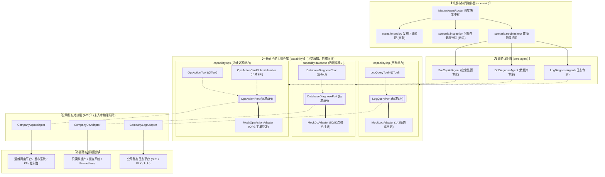
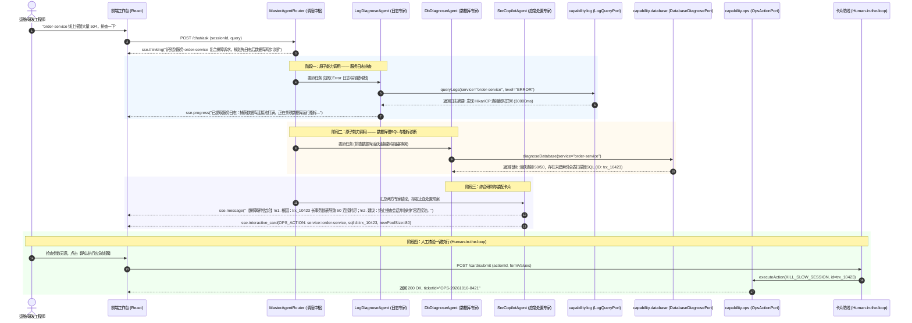

# 企业级原子能力组件矩阵与智能排障协同设计说明书

> **文档版本**：v1.1.0  
> **更新时间**：2026-10-10  
> **文档定位**：全系统一级原子能力组件（`capability.*`）与智能运维排障多智能体协同场景（`scenario.troubleshoot`）的架构设计说明书。遵循 [00-工程规范与编码守则](./00-工程规范与编码守则.md) RULE-10、[02-通用Agent骨架边界与设计哲学](./02-通用Agent骨架边界与设计哲学.md) 与 [07-内核架构设计与演进路线](./07-内核架构设计与演进路线.md)。  
> **核心原则**：**能力是一级组件（Capability），场景是协同编排（Scenario）；内核只定规范（Port），组件负责防腐适配（Adapter），Mock 保证开源开箱即用，真实对接物理隔离绝不入库。**

---

## 一、 架构总览：正交原子能力与场景自由编排

本项目严格推行 **“正交一级原子能力（First-class Capabilities） + 场景自由组合（Composable Scenarios）”** 的 DDD 六边形架构：



### 1. 核心边界划分与设计哲学
1. **原子能力是一级公民（First-class Capabilities）**：
   - 服务日志检索（`capability.log`）、数据库运行指标（`capability.database`）、运维处置执行（`capability.ops`）是横向跨领域的底层技术能力；
   - 严禁将它们作为垂直排障场景的“私有附属物”进行捆绑。每个原子能力自成闭环：拥有专属的标准 Port SPI、领域模型（Model）、开箱即用的 Mock 适配器以及专属 `@Tool`。
2. **场景只做装配与编排（Scenario Orchestration）**：
   - “线上 504 故障排障（`scenario.troubleshoot`）”不是底层组件，而是多智能体对 `log`、`database`、`ops` 能力的**经典组合应用场景**；
   - 同一套原子能力底座，未来可零成本被“日常巡检场景（组合 log + database）”或“发布验证场景（组合 log + ops）”直接复用。
3. **防腐层（ACL）抹平异构差异**：
   - 外部系统的复杂非标接口由各原子能力对应的 Adapter 负责翻译。外部基础设施接口变更时，仅变更对应 Adapter，内核与多智能体调度流水线零改动。
4. **开源与私有代码物理隔离**：
   - 真实对接与生产凭证只存在于本地未入库的 `capability/*/internal/` 目录中，开源仓库仅包含通用内核、标准 Port 与 Mock 演示实现。

---

## 二、 一级原子能力组件（Capability）详细契约设计

### 2.1 日志与链路追踪能力 (`com.example.springai.capability.log`)

#### 2.1.1 标准 SPI 端口定义 (`LogQueryPort`)
```java
package com.example.springai.capability.log.port;

import com.example.springai.capability.log.model.LogQueryCriteria;
import com.example.springai.capability.log.model.LogQueryResult;

/**
 * 日志与分布式链路查询标准端口 (LogQueryPort)
 * 供 LogDiagnoseAgent 与各场景流水线进行只读日志检索与聚合分析
 */
public interface LogQueryPort {

    /**
     * 根据过滤条件检索标准化日志记录与异常摘要
     *
     * @param criteria 查询过滤条件
     * @return 结构化的日志查询结论
     */
    LogQueryResult queryLogs(LogQueryCriteria criteria);
}
```

#### 2.1.2 领域模型设计 (`LogQueryCriteria` & `LogQueryResult`)
```java
package com.example.springai.capability.log.model;

public class LogQueryCriteria {
    private String service;          // 目标服务名 (如 order-service)
    private String traceId;          // 分布式 TraceID (可选)
    private String logLevel;         // 过滤级别: ERROR / WARN / ALL (默认 ERROR)
    private Long startTime;          // 检索起始时间戳 (毫秒)
    private Long endTime;            // 检索截止时间戳 (毫秒)
    private String keyword;          // 关键字模糊过滤 (如 "Connection timeout", "OutOfMemory")
    private Integer limit;           // 最大抓取条数 (默认 50)
}

public class LogQueryResult {
    private String service;                     // 服务标识
    private int totalMatches;                   // 命中总条数
    private List<LogEntry> matchedEntries;      // 关键日志条目列表
    private List<String> topExceptions;         // 聚类提取的高频异常类名
    private String deepestStackTrace;          // 最深层报错核心代码行
}

public class LogEntry {
    private String timestamp;        // 时间戳 (yyyy-MM-dd HH:mm:ss.SSS)
    private String level;            // 级别 (ERROR, WARN)
    private String threadName;       // 线程名称 (如 "http-nio-8080-exec-1")
    private String logger;           // 日志 Logger
    private String message;          // 简短日志内容
    private String stackTraceSample; // 堆栈切片 (前 5 行关键根因)
}
```

#### 2.1.3 大模型专属工具 (`LogQueryTool`)
```java
package com.example.springai.capability.log.tool;

@Component("logQueryTool")
@Slf4j
@RequiredArgsConstructor
public class LogQueryTool {
    private final LogQueryPort logQueryPort;

    @Tool(description = "根据微服务名称与过滤条件检索异常日志，提取报错堆栈与高频错误根因")
    public String queryServiceLogs(String service, String keyword, String logLevel) { ... }
}
```

---

### 2.2 数据库性能与诊断能力 (`com.example.springai.capability.database`)

#### 2.2.1 标准 SPI 端口定义 (`DatabaseDiagnosePort`)
```java
package com.example.springai.capability.database.port;

import com.example.springai.capability.database.model.DbDiagnoseCriteria;
import com.example.springai.capability.database.model.DbDiagnoseResult;

/**
 * 数据库性能与连接池诊断标准端口 (DatabaseDiagnosePort)
 * 供 DbDiagnoseAgent 与各业务场景分析慢查询、锁等待与连接池水位
 */
public interface DatabaseDiagnosePort {

    /**
     * 诊断指定服务或数据源的数据库运行指标
     *
     * @param criteria 诊断过滤条件
     * @return 数据库运行状态与慢SQL诊断结果
     */
    DbDiagnoseResult diagnoseDatabase(DbDiagnoseCriteria criteria);
}
```

#### 2.2.2 领域模型设计 (`DbDiagnoseCriteria` & `DbDiagnoseResult`)
```java
package com.example.springai.capability.database.model;

public class DbDiagnoseCriteria {
    private String service;          // 目标服务标识
    private String datasourceName;   // 数据源名称 (默认 default)
    private Long slowThresholdMs;    // 慢查耗时判定阈值 (毫秒，默认 1000)
    private Boolean checkDeadlock;   // 是否排查死锁与阻塞链 (默认 true)
}

public class DbDiagnoseResult {
    private String service;                              // 服务标识
    private ConnectionPoolMetrics poolMetrics;           // 连接池实时水位
    private List<SlowQueryItem> activeSlowQueries;       // 当前正在运行的慢 SQL 列表
    private Boolean hasDeadlock;                         // 是否存在死锁阻断
    private List<String> optimizationAdvices;            // 基础优化建议
}

public class ConnectionPoolMetrics {
    private int activeConnections;   // 活跃运行连接数
    private int idleConnections;     // 空闲等待连接数
    private int maxPoolSize;         // 最大连接池容量
    private int waitingThreads;      // 当前排队等待连接的线程数
    private double usageRatio;       // 水位百分比 (如 1.00 表示 100% 打满)
}

public class SlowQueryItem {
    private String sessionProcessId; // 数据库会话/进程 ID (供后续 Kill 动作定位)
    private Long executionTimeMs;    // 已经执行的耗时 (毫秒)
    private String sanitizedSql;     // 脱敏参数后的 SQL 模板
    private Boolean isFullTableScan; // 是否触发全表扫描
    private String lockStatus;       // 锁状态
}
```

#### 2.2.3 大模型专属工具 (`DatabaseDiagnoseTool`)
```java
package com.example.springai.capability.database.tool;

@Component("databaseDiagnoseTool")
@Slf4j
@RequiredArgsConstructor
public class DatabaseDiagnoseTool {
    private final DatabaseDiagnosePort databaseDiagnosePort;

    @Tool(description = "诊断目标微服务数据库运行指标，排查连接池打满水位、正在运行的阻塞慢SQL会话与长事务")
    public String diagnoseDatabase(String service, Long slowThresholdMs) { ... }
}
```

---

### 2.3 运维处置与工单执行能力 (`com.example.springai.capability.ops`)

#### 2.3.1 标准 SPI 端口定义 (`OpsActionPort`)
```java
package com.example.springai.capability.ops.port;

import com.example.springai.capability.ops.model.OpsActionParam;
import com.example.springai.capability.ops.model.OpsActionResult;

/**
 * 运维操作与应急处置标准端口 (OpsActionPort)
 * 必须在 Human-in-the-loop 经由人工二次确认后调用
 */
public interface OpsActionPort {

    /**
     * 执行核验通过的应急处置动作
     *
     * @param param 处置参数
     * @return 处置执行审计结果
     */
    OpsActionResult executeAction(OpsActionParam param);
}
```

#### 2.3.2 领域模型设计 (`OpsActionParam` & `OpsActionResult`)
```java
package com.example.springai.capability.ops.model;

public class OpsActionParam {
    private String service;          // 目标服务
    private String actionType;       // 动作类型: KILL_SLOW_SESSION, EXPAND_POOL_LIMIT, RESTART_POD
    private String targetIdentifier; // 目标标识: 会话 ID (如 10423) 或新连接池容量 (如 80)
    private String reason;           // 处置原因说明
    private String operator;         // 操作工程师标识 (必填审计字段)
}

public class OpsActionResult {
    private boolean success;         // 是否成功
    private String ticketId;         // 运维工单号 (如 OPS-20261010-8421)
    private String auditMessage;     // 执行结果描述与影响评估
    private Long executedTimestamp;  // 执行时间戳
}
```

#### 2.3.3 大模型工具与交互卡片
- **专属工具**：`OpsActionTool (@Tool)` 供自动流程下发动作；
- **交互卡片**：`OpsActionCardSubmitHandler`（实现微内核 `CardSubmitHandler` SPI，负责 Human-in-the-loop 二次核验确认）。

---

## 三、 开源开箱层设计：仿真 Mock 适配器

为了让开源用户无需连任何内网即可完整体验全链路，各原子能力内置默认的 Mock 适配器：

| 适配器类名 | 归属组件 | 激活条件 | 仿真行为 |
| :--- | :--- | :--- | :--- |
| `MockLogAdapter` | `capability.log.mock` | `capability.log.mode=mock` (缺省) | 当请求包含 `order-service` 且处于 504 场景时，返回 142 条典型日志，聚合展示 `HikariPool-1 - Connection is not available, request timed out after 30000ms`。 |
| `MockDbAdapter` | `capability.database.mock` | `capability.database.mode=mock` (缺省) | 返回活跃连接 50/50（100% 耗尽），排队线程 28 个；并暴露会话 ID 为 `trx_10423` 的全表扫描慢 SQL：`SELECT * FROM t_order WHERE status = 1 ORDER BY id DESC`（执行耗时 45s）。 |
| `MockOpsActionAdapter` | `capability.ops.mock` | `capability.ops.mode=mock` (缺省) | 响应卡片提交，生成 `OPS-yyyyMMdd-xxxx` 模拟工单号，并在系统日志中打印带彩色标示的控制台安全审计日志。 |

---

## 四、 公司私有适配器与安全防腐设计（“真实对接不推上去”）

### 4.1 工程目录与 Git 物理隔离规范

在 `.gitignore` 中追加隔离指令，确保开发人员无论如何提交代码，均无法将私有适配器与内网凭据推入公开 Git 分支：

```gitignore
# 智能运维原子能力私有对接与生产凭据隔离 (文档 08 规范)
**/capability/**/internal/**
**/application-company.yml
**/application-prod.yml
**/company-credentials.json
```

### 4.2 条件装配机制

采用 Spring Boot `@ConditionalOnProperty` 实现零代码入侵切换：

```java
// 开源默认：未配置或显式指定 mock 时装配
@Component
@ConditionalOnProperty(name = "capability.log.mode", havingValue = "mock", matchIfMissing = true)
public class MockLogAdapter implements LogQueryPort { ... }

// 公司私有：指定 company 时装配，自动取代 MockLogAdapter
@Component
@ConditionalOnProperty(name = "capability.log.mode", havingValue = "company")
public class CompanyLogAdapter implements LogQueryPort { ... }
```

---

## 五、 端到端故障排障场景协同全景 (`scenario.troubleshoot`)



---

## 六、 演进路线与分工矩阵

| 迭代阶段 | 阶段任务 | 交付物 | 主导分工 |
| :--- | :--- | :--- | :--- |
| **Phase 1: 原子能力组件化与正交解耦** | 1. 建立 `capability.log`、`capability.database`、`capability.ops` 标准端口与独立工具；<br/>2. 各组件提供独立 Mock 适配器与单测；<br/>3. 流水线与排障场景按需自由装配。 | 正交的一级原子能力包、完全解耦的单测、零反向依赖 | **核心架构协同** |
| **Phase 2: 私有适配与内网落地** | 1. 配置 Git 物理隔离规则；<br/>2. 编写 `CompanyLogAdapter` 与 `CompanyDbAdapter`；<br/>3. 内网切换 profile 联调真实告警日志。 | 本地私有适配器、真实环境验证报告、零代码污染保证 | **业务落地** |
| **Phase 3: 提示词与风控深化** | 1. 优化排障 Prompt 提取指纹的准确率；<br/>2. 完善卡片幂等锁与只读状态回传。 | 高质量诊断结论、完整的应急止血闭环 | **共同协同** |
