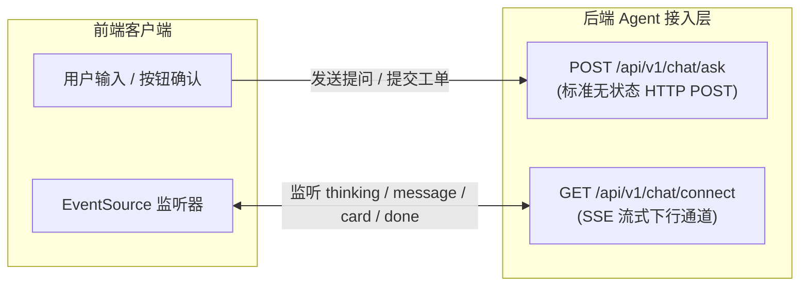

# 为什么大模型流式交互 90% 都选 SSE 而不是 WebSocket？

> **所属专栏**：企业级 Multi-Agent 架构实战手册  
> **核心标签**：`网络协议` `SSE` `WebSocket` `流式打字机`

---

## 一、 经典面试与技术选型痛点

在很多传统实时应用（如网页聊天室、在线多人联机游戏）中，工程师的第一反应往往是选用 **WebSocket**。

然而，当你观察 OpenAI (ChatGPT)、Anthropic (Claude)、阿里百炼、字节豆包等主流 AI 平台时，你会发现它们底层的打字机流式下发，**几乎 100% 选用了 Server-Sent Events (SSE)**。

为什么在 AI 时代，看似“更古老、单向”的 SSE 能够完胜“全双工、双向”的 WebSocket？

---

## 二、 核心技术深度对比

| 考量维度 | Server-Sent Events (SSE) | WebSocket |
| :--- | :--- | :--- |
| **通信形态** | **单向下行通道** (Client ➔ Server 仍走标准 HTTP，Server ➔ Client 持续推流) | **双向全双工** (连接建立后双向任意发送) |
| **底层协议** | **纯标准 HTTP** (HTTP/1.1 或 HTTP/2) | **独立协议** (基于 TCP，通过 HTTP `Upgrade` 握手) |
| **企业网关/防火墙兼容性** | **极好**（天然穿透各种公司内网 Nginx、Kong、云 WAF） | **较差**（很多企业网络策略会主动切断长存活的 WS 升级） |
| **鉴权与 Header 支持** | **原生支持**（直接复用 Cookie、Authorization Bearer、Session） | **较弱**（部分浏览器原生 WS API 无法自定义握手 Header） |
| **断线自动重连** | **浏览器原生自带**（EventSource 原生自动重试，原生支持 `Last-Event-ID` 续推） | **需手写**（需客户端手写心跳 ping-pong 和断线指数退避重连） |
| **协议开销与复杂度** | **极轻量**（就是个 MIME 为 `text/event-stream` 的文本流） | **较重**（需处理帧协议 Frame、掩码 Masking 与双向状态机） |

---

## 三、 为什么 AI 场景天然契合 SSE？

### 1. 业务交互模式是“请求-响应”，而非“多人广播”
AI 对话的本质是：
- 用户发送一段提问（**一次上行 HTTP 请求**）；
- 大模型开始吐 Token，逐字下发思考链与回答（**一段单向下行流**）。

整个过程**不需要**在服务端持续推流的同时，客户端还在同一通道里高频双向对喷数据。为了单向吐字去维护一个庞大的 WebSocket 双向有状态长连接，属于典型的“过度设计（Over-Engineering）”。

### 2. 企业级网络穿透（最致命的生产暗坑）
在银行、金融机构或大型企业内网中：
- 很多七层负载均衡器（Load Balancer）、网关（API Gateway）或安全审计防火墙，默认**不允许或严格限制** WebSocket 协议升级；
- 但它们对标准 HTTP `GET` 请求（即 SSE）是 100% 放行和原生兼容的。使用 SSE 可以避免 90% 的企业内网网络阻断问题。

---

## 四、 架构最佳实践：组合拳方案

业界大厂采用的成熟架构模式：

- **上行**：使用标准的 HTTP POST，天然具备幂等控制、统一鉴权切面、参数校验（JSR-303）；
- **下行**：使用轻量 SSE GET，实现思考过程、逐字打字机与交互卡片下发。
