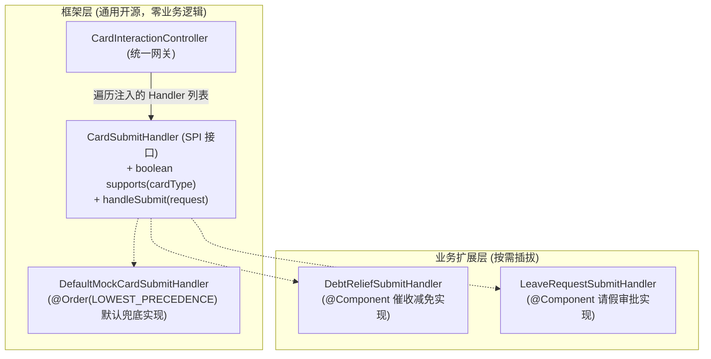

# 为什么不能用 if-else 做业务分流？基于 Spring 实现优雅的微内核 SPI

> **所属专栏**：企业级 Multi-Agent 架构实战手册  
> **核心标签**：`设计模式` `微内核` `SPI` `开闭原则` `Spring策略模式`

---

## 一、 坏味道代码：令人绝望的 if-else 链

在很多初期项目中，当系统需要支持不同的业务审批或不同类型的卡片流转时，最容易写出的代码如下：

```java
// ❌ 典型的反模式代码 (Anti-pattern)
if ("DEBT_RELIEF".equals(request.getCardType())) {
    return debtReliefService.submit(request);
} else if ("LEAVE_REQUEST".equals(request.getCardType())) {
    return leaveService.submit(request);
} else if ("IT_APPLY".equals(request.getCardType())) {
    return itService.submit(request);
} else {
    throw new IllegalArgumentException("未知业务类型");
}
```

### 这种代码有什么致命缺陷？
1. **违背开闭原则 (OCP, Open-Closed Principle)**：每当团队接入一个新业务，都必须修改底层的核心控制器（Controller）或核心服务。核心代码变得极其不稳定。
2. **多团队并行开发灾难**：团队 A 在接入催收减免，团队 B 在接入行政审批，两个人在同一个类的 `if-else` 里改代码，Git 合并冲突（Merge Conflict）频发。
3. **无法做到框架与业务分离**：如果这个项目要开源，你根本不可能在开源核心包里预先写好所有公司的业务 `if-else` 分支！

---

## 二、 架构解法：微内核 + 策略模式 SPI

优秀框架（如 Spring Boot、Dubbo、ShardingSphere）普遍采用**微内核架构（Microkernel）**。

核心思想：**“框架层只制定标准接口，业务层提供具体插件实现。核心控制器只做路由分发，不含任何业务逻辑。”**



---

## 三、 Spring 生态中最优雅的实现范式

### 1. 框架定义统一 SPI 接口
```java
public interface CardSubmitHandler {
    boolean supports(String cardType);
    CardSubmitResult handleSubmit(CardSubmitRequest request);
}
```

### 2. 框架提供一个带最低优先级的兜底 Mock
通过 `@Order(Ordered.LOWEST_PRECEDENCE)`，声明自己是“备胎兜底”，开源用户克隆代码后直接能跑通演示：
```java
@Component
@Order(Ordered.LOWEST_PRECEDENCE) // 关键：最低优先级
public class DefaultMockCardSubmitHandler implements CardSubmitHandler {
    @Override
    public boolean supports(String cardType) {
        return true; // 兜底接管所有未被业务捕获的类型
    }

    @Override
    public CardSubmitResult handleSubmit(CardSubmitRequest request) {
        return CardSubmitResult.ok("MOCK-TICKET-001", "模拟提单成功");
    }
}
```

### 3. 控制器利用 Spring 集合自动注入做动态分发
```java
@RestController
public class CardInteractionController {

    // Spring 会自动将容器中所有 CardSubmitHandler 的实现类按 @Order 顺序收集到 List 中
    private final List<CardSubmitHandler> handlers;

    public CardInteractionController(List<CardSubmitHandler> handlers) {
        this.handlers = handlers;
    }

    @PostMapping("/submit")
    public ResponseEntity<?> submit(@RequestBody CardSubmitRequest request) {
        // 一行代码优雅路由，完全消灭 if-else！
        CardSubmitHandler handler = handlers.stream()
                .filter(h -> h.supports(request.getCardType()))
                .findFirst()
                .orElseThrow(() -> new IllegalArgumentException("未找到支持的处理器"));

        return ResponseEntity.ok(handler.handleSubmit(request));
    }
}
```

### 4. 业务方接入体验（丝滑至极）
以后你把框架拉到公司仓库，要对接真实的催收 BPM，**不需要改框架里的任何一行代码**，只需要在业务包写一个类：
```java
@Component
public class CompanyBpmSubmitHandler implements CardSubmitHandler {
    @Override
    public boolean supports(String cardType) {
        return "DEBT_RELIEF".equals(cardType);
    }

    @Override
    public CardSubmitResult handleSubmit(CardSubmitRequest request) {
        // 调用公司真实 BPM OpenAPI
        return companyBpmClient.createInstance(request);
    }
}
```
**Spring 启动时会自动发现这个 Bean，并且因为它的优先级高于兜底的 Mock，控制器会自动调用该业务类完成提单！** 这就是微内核架构的魅力。
