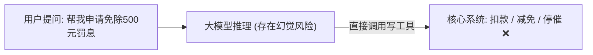
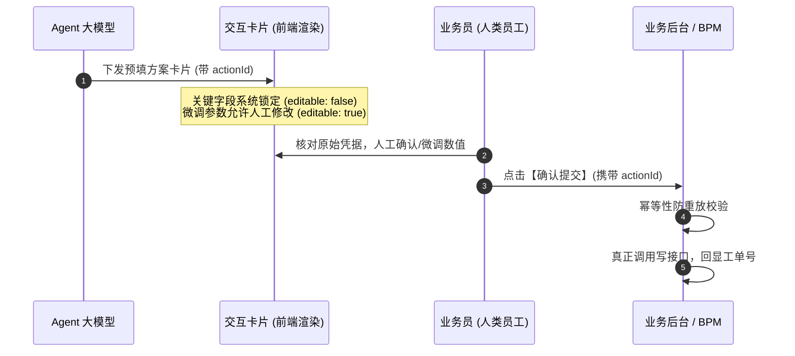

# Human-in-the-loop 防线：为什么不能让大模型直接拥有“系统写权限”？

> **所属专栏**：企业级 Multi-Agent 架构实战手册  
> **核心标签**：`人机协同` `Human-in-the-loop` `幂等性` `数据安全` `卡片协议`

---

## 一、 核心痛点：为什么不能让大模型直接拥有“系统写权限”？

在开发智能体（Agent）时，很多团队急于求成，直接给大模型挂载了包含“修改数据库”、“发起正式工单”、“银行扣划”的 Tool：



### 这种“全自动写接口”在企业生产中是绝对灾难：
1. **幻觉（Hallucination）不可预测**：模型可能因为少看了某条政策，多免除了 1000 元本金；或者提取错一位订单号，导致对错误的目标客户执行了停催。
2. **法律合规与审计责任无法界定**：在金融、政企与医疗场景中，如果发生资损或合规处罚，**“大模型让我这么干的”不能作为抗辩免责理由**。企业内部必须明确每一笔审批动作的**自然人主体责任**。

---

## 二、 架构解法：卡片驱动的人机协同（Human-in-the-loop）

业界的最高安全准则：**“大模型只做决策方案测算与表单预填，系统写权限牢牢握在人类员工手中。”**



---

## 三、 设计原理剖析：两个关键防线

### 1. 防线一：`actionId`（全局幂等防重放键）
在分布式网络与网页交互中，经常发生：
- 员工点击提交后网络抖动无响应，急促连续点击了 3 次；
- 员工刷新了浏览器重新加载了卡片；
- 恶意的重放抓包请求。

**如果没有 `actionId`**，下游的 BPM 系统或审批系统就会收到 3 份一模一样的工单申请！

#### 解决方案：
- 后端 Agent 生成卡片时，生成唯一的 `actionId = "act_" + UUID`；
- 前端提交时必须原封不动带上这个 `actionId`；
- 后端 Controller 在调用底层业务前，使用 Redis 或并发缓存进行幂等判定：
```java
if (idempotencyCache.putIfAbsent(request.getActionId(), Boolean.TRUE) != null) {
    return ResponseEntity.status(409).body("检测到重复提交，系统已拦截");
}
```

### 2. 防线二：`editable: false`（关键标识只读锁）
在卡片表单字段模型 `CardFormField` 中，我们设计了 `editable` 属性：

```json
{
  "fieldKey": "case_id",
  "label": "案件编号",
  "value": "CASE_10086",
  "editable": false,     // 关键：系统只读锁
  "required": true
},
{
  "fieldKey": "apply_quota",
  "label": "申请额度",
  "value": 500,
  "maxLimit": 800,       // 关键：动态上限校验
  "editable": true,      // 允许员工微调
  "required": true
}
```

#### 为什么不能全部允许编辑？
- 如果案件编号、借款人证件号或用户工号允许编辑，恶意用户或疏忽的员工可能会篡改案号，导致把减免额度充值到别人的账号上（越权漏洞）。
- **因此：从底层数据库查出来、用于唯一锚定目标的数据，必须强制只读锁死；只有方案测算出的数值指标，才允许人工在 `maxLimit` 范围内弹性微调。**
