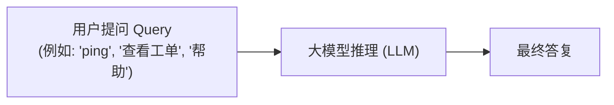
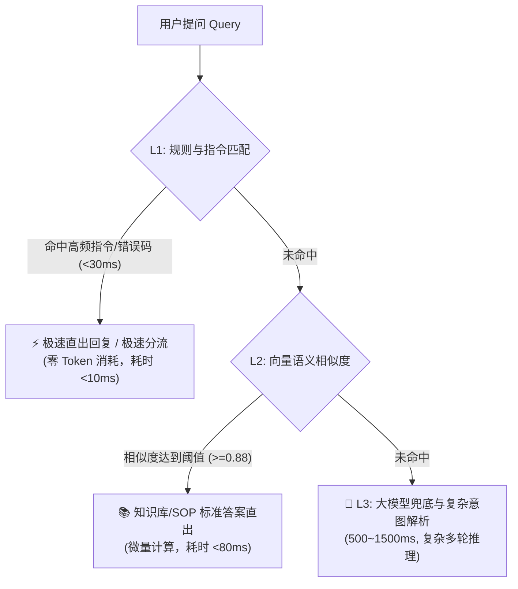

# 三级意图降级实战：为什么绝不能所有问题都直接调大模型？

> **所属专栏**：企业级 Multi-Agent 架构实战手册  
> **核心标签**：`意图识别` `成本优化` `响应时延` `三级降级` `架构权衡`

---

## 一、 新手常犯的架构误区：“万物皆调 LLM”

刚接触智能体（Agent）开发的工程师，往往会构建出这样一条极其脆弱的流水线：

在开发者本地 Demo 时，并发只有 1，几十毫秒的感知差异不明显；但**一旦系统推向企业生产环境（成百上千名员工或海量坐席在线）**，这种“单一大模型一把梭”的架构会瞬间遭遇两个灭顶之灾：
1. **时延雪崩（Latency Disaster）**：大模型首字返回（TTFT）通常在 600ms ~ 1500ms，整句吐完需要 3~5 秒。用户仅仅是想输入一个固定指令或查询状态，却不得不干瞪眼等待几秒钟的打字机。
2. **Token 账单暴涨（Token Cost Explosion）**：企业高频固定问答占到总流量的 30%~50%，每一次无意义的 LLM 调用都在真金白银地烧钱。

---

## 二、 算一笔真实的企业生产账

我们以一家拥有 **2,000 名客服/坐席** 的中型金融或电商企业为例，每天产生约 **100 万次** 咨询请求：

| 对比维度 | 全量直接调大模型 (LLM) | 引入三级意图降级体系 (L1/L2/L3) | 收益提升 |
| :--- | :--- | :--- | :--- |
| **平均请求耗时** | **1,800ms ~ 3,500ms** | **~450ms** (高频请求 <30ms 直出) | **响应提速 4~8 倍** ⚡ |
| **单日 LLM 调用量**| 1,000,000 次 | 约 550,000 次 (45% 被 L1/L2 拦截) | **大模型压力骤降 45%** |
| **单日 Token 消耗** | 约 15 亿 Tokens (含上下文Prompt) | 约 8.2 亿 Tokens | **Token 账单直接减半** 💰 |
| **极端高并发稳定性** | 易触发大模型网关 Rate Limit 限流 | 高频流量被本地内存规则消化，抗并发能力极强 | **可用性大幅提升** |

---

## 三、 架构解法：L1 ➔ L2 ➔ L3 串行降级三道防线

企业级 Agent 架构普遍推行**“分级过滤、逐层下沉”**漏斗机制：

### 1. 第一道防线：L1 规则匹配 (`L1RuleMatcher`, <30ms)
- **拦截目标**：系统级硬指令（如 `ping`、`help`）、已知的特定系统错误码（如 `ERR_GATEWAY_504`）、固定单号直查。
- **技术实现**：内存 Hash 表、前缀匹配或轻量正则。
- **特性**：完全在应用服务本地内存完成，零网络 IO，耗时只有微秒级到个位数毫秒。

### 2. 第二道防线：L2 向量匹配 (`L2VectorMatcher`, <100ms)
- **拦截目标**：已有成熟标准答案的标准化 FAQ / 业务 SOP（如“如何申请员工停车位”、“年假结算标准”）。
- **技术实现**：计算 Query 向量，在向量数据库中进行余弦相似度检索。
- **特性**：语义泛化性强，只要相似度超过设定阈值（例如 0.88），即可直接使用标准审核答案，无需大模型二次发散生成。

### 3. 第三道防线：L3 大模型兜底与意图改写 (`L3LlmMatcher`, 500~1200ms)
- **拦截目标**：模糊口语化描述、多轮复杂诉求（既要请假又要改签）、全新未见过的问题。
- **技术实现**：调用大模型进行意图分类与 Query 改写。

---

## 四、 核心架构总结

三级意图降级不是“省去大模型”，而是**“把大模型用在刀刃上”**。

让确定性的高频问题走毫秒级确定性通道，让复杂、开放的深层语义问题走大模型推理通道。这是每一个工业级 Multi-Agent 系统必须迈出的关键一步。
