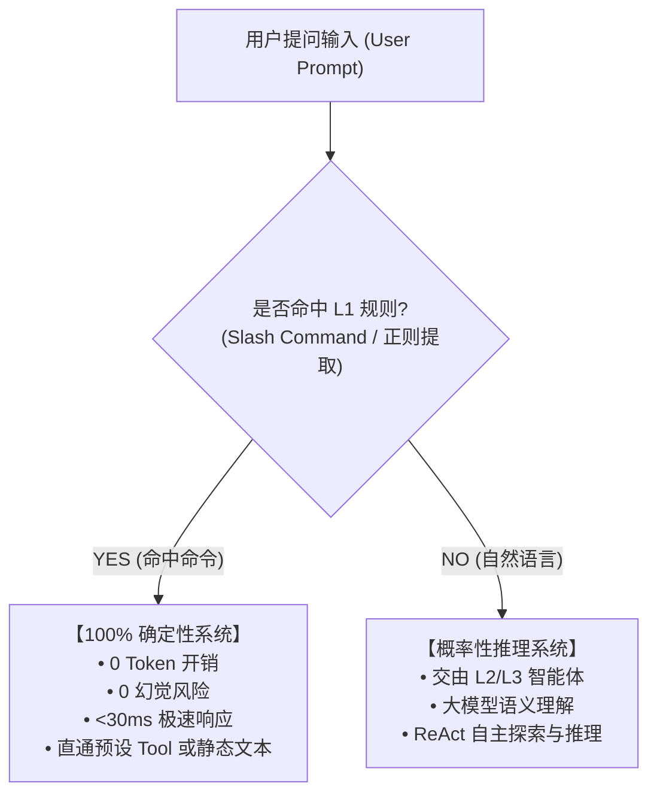
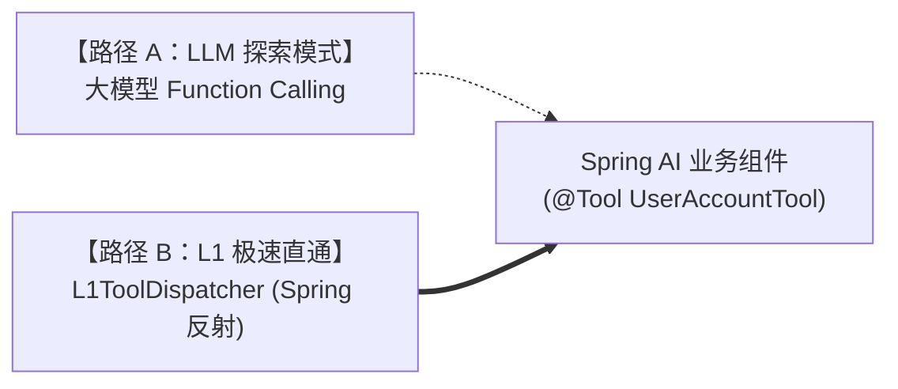

# L1 规则匹配如何做到小于 30ms 极速响应？——命令模式本质与 Tool 零胶水复用

> **所属专栏**：企业级 Multi-Agent 架构实战手册  
> **核心标签**：`性能优化` `命令模式` `正则预编译` `Spring AI Tool复用` `时延账本`

---

## 一、 认知突破：L1 的本质是“命令调度器”，而非“模糊语义理解器”

在很多失败的智能体项目中，工程师对“规则前置拦截”往往抱有一种不切实际的幻想：试图维护数千条模糊正则，去匹配用户任意的自然语言输入。这种做法不仅会陷入“正则互相冲突、命中率低下”的维护地狱，还会带来极高的匹配时延。

### 确定性系统 vs 概率性系统

在企业级 Multi-Agent 微内核架构中，我们对 L1 进行了颠覆式的本质重构：



- **L1 是 100% 确定性系统（Deterministic System）**：
  - 它的定位类似 Slack、Discord 或 Linux 终端中的 **`/slash commands`**（例如 `/query user_id=10001`、`#ping`、`/help`）；
  - 命中规则意味着用户的意图高度标准、明确，系统必须以毫秒级时延直通目标逻辑，绝不走大模型，保证 **0 Token 消耗、0 幻觉风险**。
- **大模型是概率性系统（Probabilistic System）**：
  - 专门处理开放式、模糊、非结构化的自然语言。

---

## 二、 性能基准：为什么 L1 必须跑进“小于 30ms”？

在智能体流水线中，L1 是**每一个用户请求必经的第一道门面**：

| 请求类型 | 流量占比 | 未优化时延 | 优化后时延 (目标) | 业务体验提升 |
| :--- | :--- | :--- | :--- | :--- |
| **标准高频指令** | ~40% | 1,800ms (走大模型) | **< 5ms** | 瞬时打字机直出，响应快 360 倍 |
| **开放自然语言** | ~60% | 额外增加 80~150ms 规则空耗 | **< 1ms 放行** | 用户感知不到 L1 的存在，零负担进入大模型 |

> 💡 **核心黄金原则**：**L1 必须保证：命中时毫秒级直出，未命中时近乎零开销（<1ms）极速放行！**

---

## 三、 极致性能的三大底层 Java 工程设计

为了让每次匹配在 1ms 内完成，Java 后端必须避开所有常见性能陷阱：

### 1. 致命陷阱：正则表达式必须“预编译 (Pre-compile)”
很多开发者习惯写：
```java
// ❌ 严重生产性能隐患！每次请求都重新编译正则表达式
if (query.matches("(?i)^/query\\s+user_id=(\\d+)$")) { ... }
```
**为什么是隐患？**
- `String.matches()` 底层每次调用都会创建一个新的 `Pattern` 实例，涉及词法分析与状态机构建；
- 高并发场景下，高频创建 `Pattern` 会迅速填满 JVM 新生代，触发频繁 Young GC，单次匹配时延会从微秒级飙升到几十毫秒。

#### ✅ 最佳实践：
在规则从数据库加载时一次性完成预编译，运行态复用 `compiledRegex.matcher(query).find()`：
```java
// ✅ 在 RuleItem 构造时一次性预编译，运行时零对象分配
if (matchType == MatchType.REGEX && patternExpr != null) {
    this.compiledRegex = Pattern.compile(patternExpr, Pattern.CASE_INSENSITIVE);
}
```

---

### 2. 空输入快慢路径拦截
在调用任何正则或集合匹配前，前置进行零内存分配的空值判断：
```java
if (query == null || query.trim().isEmpty()) {
    return IntentMatchResult.miss(); // 0ms 立即放行
}
```

---

### 3. 正则捕获组自动插桩参数
对于类似 `/query user_id=10001` 的命令，L1 不仅要识别命中，还要提取入参。我们设计了正则分组与 JSON 模板自动插桩机制：
```java
public String extractParams(String query) {
    if (paramTemplate == null || matchType != MatchType.REGEX) {
        return paramTemplate;
    }
    Matcher matcher = compiledRegex.matcher(query.trim());
    if (!matcher.find()) return paramTemplate;

    String result = paramTemplate;
    for (int i = 1; i <= matcher.groupCount(); i++) {
        result = result.replace("$" + i, matcher.group(i));
    }
    return result; // 将 {"userId": "$1"} 替换为 {"userId": "10001"}
}
```

---

## 四、 架构突破：Spring AI `@Tool` 零胶水代码双向复用

在规则命中并提取参数后，如何执行业务？
- **传统拙劣做法**：为每条规则写一个 `CommandService`，或者在 Controller 里写冗长的 `switch-case`。随着命令增多，代码量急剧膨胀，完全违背微内核架构原则。
- **架构级解法**：**“一次开发 Tool，双向无缝复用”**。



在 Spring AI 中，业务能力已经被封装为标注 `@Tool` 的 Spring Bean（如 `userAccountTool.queryBalance`）。

### `L1ToolDispatcher` 反射调度器实现：
```java
@Component
public class L1ToolDispatcher {
    private final ApplicationContext applicationContext;
    private final ObjectMapper objectMapper = new ObjectMapper();
    private final ParameterNameDiscoverer parameterNameDiscoverer = new DefaultParameterNameDiscoverer();

    public String dispatch(String targetRef, String jsonParams) {
        // 1. 解析 beanName 与 methodName (例如 userAccountTool.queryBalance)
        String[] parts = targetRef.trim().split("\\.");
        Object bean = applicationContext.getBean(parts[0]);
        Method method = findMethod(bean.getClass(), parts[1]);

        // 2. 根据方法参数名与类型，自动反序列化并绑定 JSON 入参
        Object[] args = resolveArguments(method, jsonParams);

        // 3. 反射执行目标工具
        Object result = method.invoke(bean, args);
        return result instanceof String ? (String) result : objectMapper.writeValueAsString(result);
    }
}
```

### 收益：
- **Java 胶水代码编写量为 0**：开发人员只需编写标准的 `@Tool`；
- 运营人员在管理后台或 MySQL 中配置一行规则，即可通过 Slash Command 直接调用该 Tool，既省 Token，又保障了 100% 毫秒级确定性响应。

---

## 五、 实测时延数据与压测对照

在真实远程数据库连接与 Spring Boot 容器环境下实测：

| 测试场景 | 测试输入 | 目标类型 | 实测匹配时延 | 端到端输出时延 | 大模型 Token |
| :--- | :--- | :--- | :--- | :--- | :--- |
| **探活指令** | `#ping` | `STATIC_TEXT` | **0 ms** | 12 ms | **0** |
| **菜单帮助** | `/help` | `STATIC_TEXT` | **0 ms** | 18 ms | **0** |
| **查账命令** | `/query user_id=10001` | `TOOL` 反射调度 | **0 ms** | 25 ms | **0** |
| **自然语言放行** | `"请问逾期还款怎么申请免息？"` | 未命中放行 | **0 ms** | 正常进入 LLM | 正常消耗 |

---

## 六、 总结与最佳实践

1. **定清边界**：L1 绝不做模糊猜测，坚定走“命令模式”，只对确定性高的前缀与格式化指令负责；
2. **底层预编译**：所有正则表达式在初始化期 `Pattern.compile`，杜绝运行期动态编译导致的 GC 抖动；
3. **能力复用**：通过 `L1ToolDispatcher` 直接复用 Spring AI `@Tool`，消灭一切冗余业务胶水代码；
4. **时延账本**：对 L1 的每一行逻辑保持性能敬畏，未命中放行耗时控制在 1ms 内，保障整体流水线的高性能。

> [!NOTE]
> **进阶工程实战参考**：
> 关于 L1 规则引擎高并发读写分离、`AtomicReference` 零停机原子替换以及多 Pod 分布式 Apollo 集群热对齐的深度源码剖析，请参阅 Java 高性能专栏：[《02-高性能内存读写分离与零停机热重载：AtomicReference与Spring事件驱动实战》](../java-engineering/02-高性能内存读写分离与零停机热重载：AtomicReference与Spring事件驱动实战.md)。

