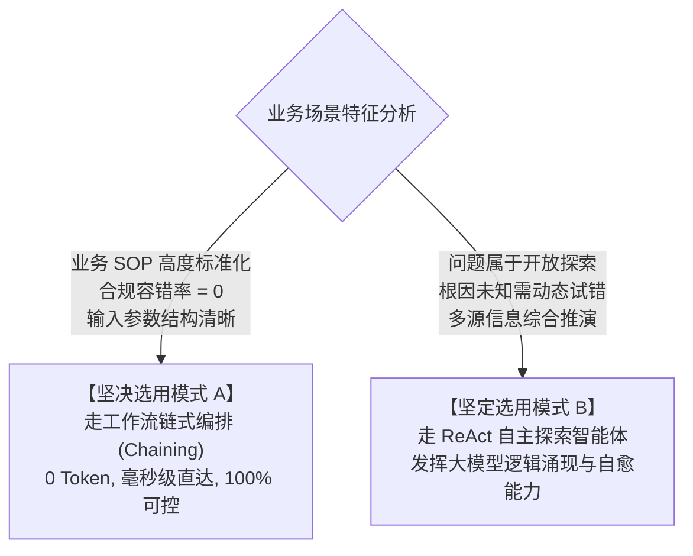
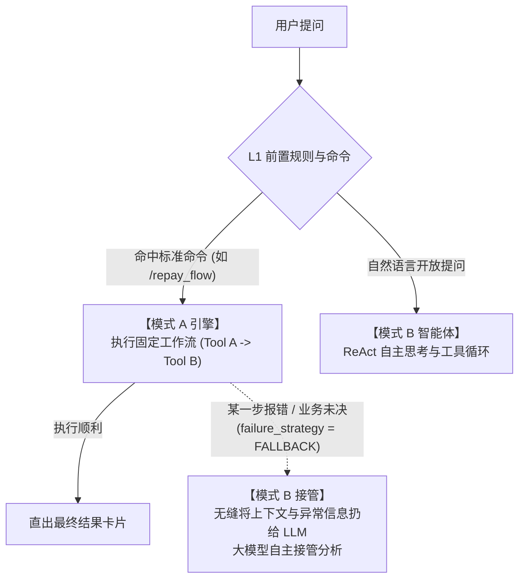

# 多步 Tool 调用谁来决策？——确定性工作流 (Chaining) 与模型自主推理 (ReAct) 的架构权衡

> **所属专栏**：企业级 Multi-Agent 架构实战手册  
> **核心标签**：`多工具编排` `工作流模式A` `ReAct模式B` `架构权衡` `确定性与概率性`

---

## 一、 核心命题：多步工具链调用的灵魂拷问

在真实的生产业务中，几乎没有哪个严肃业务仅靠“单次调用工具”就能搞定。通常是一个链式过程：
> 示例：用户咨询账单异常 $\to$ 调用 Tool A（查用户最新账单） $\to$ 拿到逾期天数与罚息 $\to$ 调用 Tool B（核算政策减免方案） $\to$ 调用 Tool C（生成带确认按钮的卡片）。

此时，架构师面临一个直击灵魂的选择：
**当 Tool A 执行完毕得到结果之后，下一个 Tool 的调用到底由谁来做决策？**
- 方案 1：是由我们写在配置/代码里的固定工作流按步骤串行调用？
- 方案 2：还是把 Tool A 的输出扔给大模型，让大模型自主思考决定下一步该调什么？

很多团队非黑即白地站队：要么坚守传统 BPM 工作流，认为 Agent 纯属炒作；要么激进地让大模型接管一切工具调用，结果在线上频频翻车、时延爆炸。

本文将为您深度拆解这两种模式的本质、边界与混合架构的最佳实践。

---

## 二、 两大模式的深度架构对比

```mermaid
flowchart TD
    subgraph ModeA ["【模式 A：确定性工作流编排 (Chaining)】"]
        StartA["触发指令"] --> Step1A["执行 Tool A"]
        Step1A --> StateCheck["状态流转 (规则配置/DAG)"]
        StateCheck --> Step2A["执行 Tool B"]
        Step2A --> FinishA["毫秒级直出最终结果"]
    end

    subgraph ModeB ["【模式 B：大模型自主推理 (ReAct Loop)】"]
        StartB["自然语言输入"] --> LLMThought1["LLM 思考 (Thought 1)"]
        LLMThought1 --> Action1["调度 Tool A (Action 1)"]
        Action1 --> Obs1["工具返回结果 (Observation 1)"]
        Obs1 --> LLMThought2["LLM 再次思考 (Thought 2)"]
        LLMThought2 --> Action2["调度 Tool B (Action 2)"]
        Action2 --> FinishB["综合输出答复"]
    end
```



### 核心维度对比矩阵

| 对比维度 | 模式 A：确定性工作流编排 (Chaining) | 模式 B：大模型自主推理 (ReAct Loop) |
| :--- | :--- | :--- |
| **决策大脑** | 预置配置表（如 `sys_rule_chain_step`）/ 状态机 | 大模型（LLM）的推理与上下文评估能力 |
| **执行载体** | L1 规则工作流引擎 / DAG 调度器 | L3 业务 SubAgent (ReAct Agent) |
| **单步决策时延** | **< 1ms**（内存读取配置） | **1,000ms ~ 3,000ms**（每一次思考都是一次完整 LLM 推理） |
| **Token 账单** | **0 Token** | 随着步骤增加，上下文不断累加，Token 呈阶梯式暴涨 |
| **确定性与合规** | **100% 确定**，路径受控，绝对不走偏 | **概率性**，存在偶发幻觉、漏调或死循环风险 |
| **泛化与适应力** | 极低（遇到预设分支以外的情况只能报错） | **极高**（能动态应对未知分支，具备容错与自愈能力） |

---

## 三、 企业级选型决策树：什么时候用 A？什么时候用 B？

我们在真实生产落地中，提炼出一套极为清晰的决策法则：



### 1. 必须使用“模式 A (配置工作流)”的典型场景
- **金融/交易类资产核算**：
  查余额 $\to$ 查欠款明细 $\to$ 查核销规则 $\to$ 产出单据。此类业务受监管合规强约束，任何一步调用跳过或参数偏差都会造成资损。**绝不能把步骤路由权交给概率性的大模型**。
- **高频高并发查账与提单**：
  日调用量数百万次，若走大模型，企业 Token 成本将难以承受。

### 2. 必须使用“模式 B (大模型 ReAct)”的典型场景
- **未知故障根因排查**：
  用户反馈“系统连接异常”。智能体必须先查日志（Tool A），若日志无异常则转而查网络监控（Tool B），若发现丢包再查机房配置（Tool C）。**步骤无法预知，完全取决于前一步的排查结果**。
- **跨域多策略协同与综合问答**：
  用户提问复杂多变，涉及多个知识库检索与动态追问。

---

## 四、 架构终局：模式 A 与模式 B 的混合协作拓扑

在真正成熟的企业级 Multi-Agent 微内核中，**模式 A 与模式 B 绝不是对立的，而是分层协同的“插座与插头”关系**：



### 关键架构机制：`FALLBACK_TO_AGENT` 降级容灾
在我们的表结构设计 `sys_rule_chain_step` 中，特别设计了：
```sql
`failure_strategy` VARCHAR(32) NOT NULL DEFAULT 'ABORT' 
COMMENT '失败策略：ABORT(中断), CONTINUE(忽略继续), FALLBACK(降级转大模型)'
```
**设计哲学**：
- 当模式 A 的固定流程在执行过程中，如果遇到未预期的业务分支（如账户冻结、数据冲突）或下游接口报错；
- 系统绝不把死板的系统异常直接抛给用户，而是触发 `FALLBACK`，将历史出参和错误上下文打包成一个 Prompt，无缝呼起背后的 ReAct 智能体；
- 大模型接入后，动态评估原因并用自然语言向用户解释或引导下一步。

---

## 五、 架构总结与箴言

1. **不要为了 AI 而 AI**：
   如果一个业务链路有明确的 SOP、固定的逻辑顺序，使用工作流配置（模式 A）是最敬畏企业成本与时延的优雅做法。
2. **各司其职，楚河汉界**：
   - **模式 A** 是高速公路的“直达快车道”，负责承载 80% 的确定性高频业务；
   - **模式 B** 是全地形的“越野探索车”，负责承载 20% 探索性、复杂推理的未知场景。
3. **混合微内核才是正解**：
   将确定性工作流沉淀于 L1 前置引擎，将动态自主推理托付于 L3 SubAgent，二者通过统一的 Spring AI `@Tool` 实现底层能力无缝共享。
