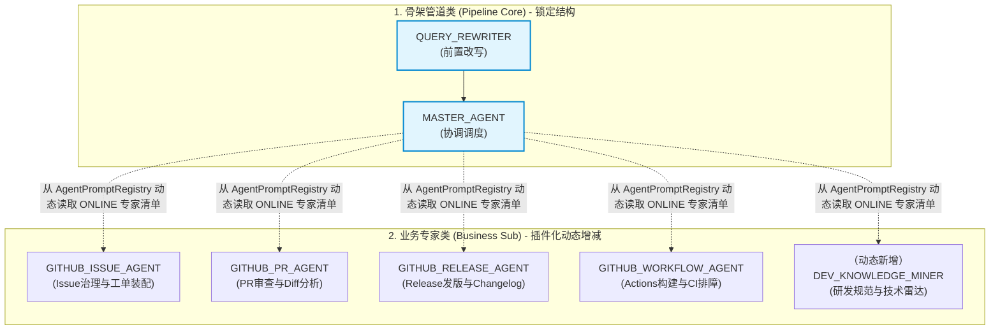
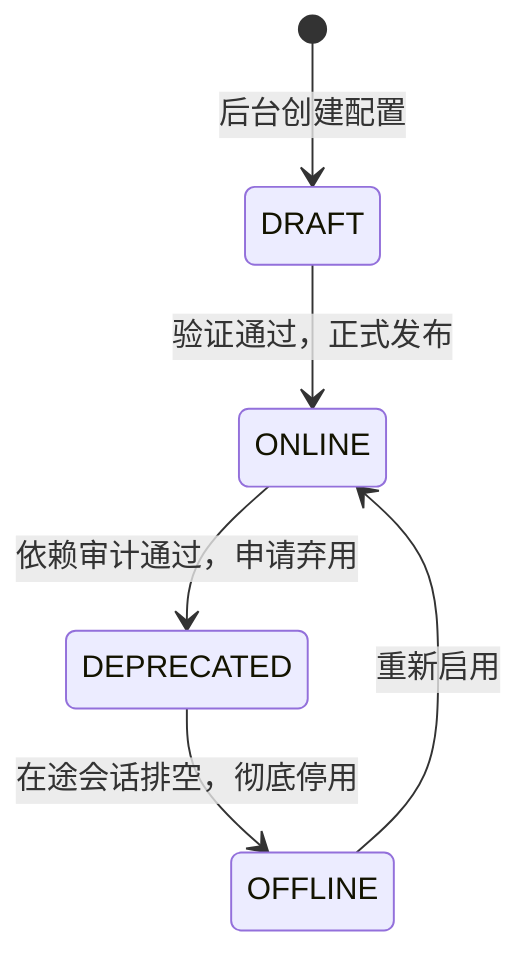

# 07. 动态多智能体注册中心：如何让 MasterAgent 像加载插件一样调度业务专家？

> **定位**：企业级多智能体平台架构设计与生命周期治理实战  
> **核心痛点**：修改人设提示词必须编译发版？新增业务专家必须写死代码？下线旧智能体导致线上级联报错？

---

## 一、 为什么不能把 Agent 硬编码在枚举中？

在项目初期，许多团队习惯于定义一个 Java 枚举：

```java
public enum AgentType {
    QUERY_REWRITER,
    MASTER_AGENT,
    GITHUB_ISSUE_AGENT,
    GITHUB_PR_AGENT,
    GITHUB_RELEASE_AGENT,
    GITHUB_WORKFLOW_AGENT
}
```

并在代码中硬编码各自的 System Prompt、采样温度和挂载工具。这种做法在 Demo 阶段开发极快，但一旦进入生产和多团队协作，就会立刻遭遇三大致命瓶颈：

1. **Prompt 调优与发版周期的严重错配**：
   Prompt 工程本质是高频试错与微调的过程。提示词工程师或业务专家哪怕只是优化一段 Few-Shot 示例或补充一条风控限制，都必须提交 Git 代码、走持续集成流水线、等待发版并重启服务。迭代周期以“天”甚至“周”计。
2. **模型底座与超参数无法动态调整**：
   在复杂业务中，改写任务需要低延时轻量模型（如 Qwen-Turbo），调度任务需要强推理模型（如 DeepSeek-V3 / GPT-4o），不同模型的最佳采样温度差异极大。硬编码在枚举中剥夺了系统在生产环境动态调优与降级容灾的自由度。
3. **业务能力无法插件化扩展**：
   当客户服务、HR 审批、IT 运维、法务咨询等多个业务团队希望接入多智能体平台时，平台无法通过后台开通专有业务 Agent，只能不断让平台研发改代码、加枚举。

---

## 二、 架构权衡：MySQL 维护到哪一层？

既然要升格到 MySQL 维护，是否意味着“系统里所有 Agent 都可以由运营人员在后台随意增删”？

**答案是坚决不能！必须分层治理。**



### 1. 骨架管道类 Agent（Pipeline Core，`is_system_core = 1`）
- **包含角色**：`QUERY_REWRITER`（前置输入重写）、`MASTER_AGENT`（主协调调度器）。
- **定位**：流水线上的硬拓扑节点。代码主链路严格写着：`输入 ➔ 重写 ➔ 意图分级 ➔ 协调编排`。
- **治理原则**：**只管配置，禁止增减**。可以在 MySQL 中改 Prompt、调温度、换模型，但严禁删除该记录，严禁修改编码。

### 2. 业务领域 Sub-Agent（Business Sub，`is_system_core = 0`）
- **包含角色**：`GITHUB_ISSUE_AGENT`、`GITHUB_PR_AGENT`、`GITHUB_RELEASE_AGENT`、`GITHUB_WORKFLOW_AGENT`，以及未来扩展的各类垂直业务专家。
- **定位**：`MasterAgent` 的外挂专家插件池。
- **治理原则**：**全量入库，支持动态增减**。后台可以像创建商品一样创建新专家，供 `MasterAgent` 按需调度。

---

## 三、 动态“增”的底层逻辑：积木式装配

后台如何能凭空新增一个具备实际业务能力的 Agent？核心在于 **三要素解耦**：

$$\text{专业业务 Agent} = \text{系统人设 (Prompt)} + \text{调度意图描述 (Dispatch Desc)} + \text{能力插槽 (Tools / KB)}$$

1. **调度描述（给 MasterAgent 看）**：
   例如 Release 发版专家配置：“*负责 GitHub 仓库版本发布、Changelog 生成、版本升级说明核验与发布资产检查*”。
2. **专属人设（给 LLM 执行器看）**：
   包含 GitHub 发版规范、语义化版本（SemVer）约定、对外变更答复口径。
3. **能力插槽（给执行引擎调用）**：
   - 纯知识问答：绑定企业研发规范知识库（KB ID）；
   - 业务调用：从系统现有的工具清单（如 `L1ToolCatalog`）中勾选（如 `githubApiTool.queryLatestRelease`）。

---

## 四、 为什么“减要慎重”？动态下线的四道安全防线

在生产环境中，**直接物理删除一条 Agent 记录是灾难性的**。它可能导致 `MasterAgent` 生成幻觉、依赖该 Agent 的工单流程中断、或触发 `AgentNotFoundException`。

为此，系统制定了四道防线：



1. **物理删除红线**：
   数据库与管理后台一律禁止执行 `DELETE FROM sys_agent_definition`，全部由生命周期状态字段（`status`）驱动。
2. **核心保留锁**：
   所有骨架 Agent 标记 `is_system_core = 1`。管理接口遇到该标记时，修改操作中禁止修改类型，且强行拒绝任何停用/下线指令。
3. **依赖前置审计（Dependency Audit）**：
   在下线业务 Agent 前，系统自动扫描：
   - L1 规则表（`sys_rule_definition`）的 `target_ref` 是否直接指向该 Agent；
   - 是否存在依赖该 Agent 的工作流或卡片未决会话；
   - 若存在依赖，前置拦截并返回错误依赖明细。
4. **优雅排空机制（Graceful Drain）**：
   当状态变为 `DEPRECATED` 时：
   - **入口掐断**：`MasterAgent` 在下一秒的热重载快照中立刻剔除该专家，不再给它分配新任务；
   - **在途放行**：已经在该 Agent 流程中、或者正在等待前端专员审批交互卡片的历史会话，允许完整执行完毕。

---

## 五、 MasterAgent 动态感知机制

`MasterAgent` 是如何做到不需要改代码就能感知新加入的业务专家的？

在每次任务编排前，`MasterAgent` 从 `AgentPromptRegistry` 动态拉取在线专家快照：

```java
List<AgentDefinition> onlineExperts = promptRegistry.getOnlineBusinessAgents();
// 动态拼装系统调度 Prompt
StringBuilder dispatchManifest = new StringBuilder("当前可用专业子智能体清单：\n");
for (AgentDefinition expert : onlineExperts) {
    dispatchManifest.append(String.format("- [%s]: %s (挂载工具: %s)\n",
            expert.getAgentCode(), expert.getDispatchDesc(), expert.getAttachedTools()));
}
```

后台运营人员只要将新 Agent 发布为 `ONLINE`，集群广播热重载后，`MasterAgent` 的调度清单在毫秒级内自动刷新生效。

---

## 六、 总结与最佳实践

* **混合架构是王道**：核心骨架保留代码契约保证系统健壮性与冷启动兜底，业务专家与提示词上云入库赋能敏捷迭代。
* **分层治理立边界**：固定节点管配置，业务节点管增减。
* **生命周期筑防线**：下线前先做依赖审计，用状态机代替物理删除，保障企业高并发与长流程安全。
