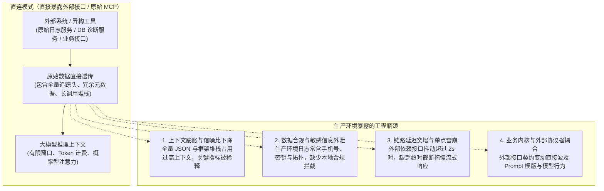
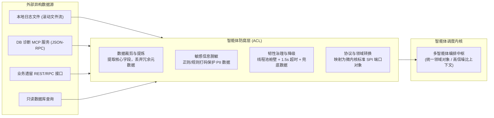
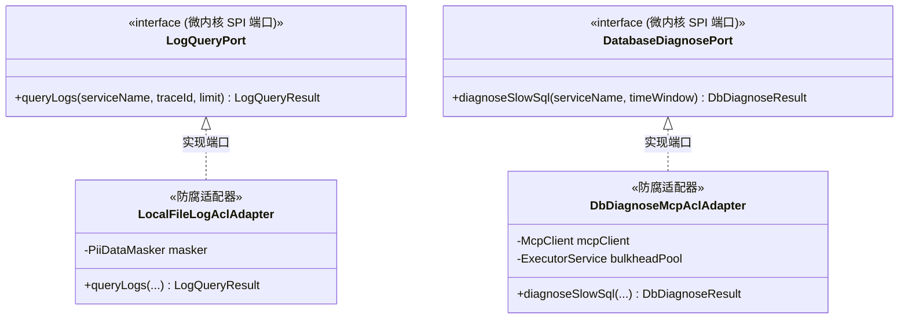

# 09. 大模型落地必须直连 MCP 吗？——为什么企业级 Agent 架构必须筑牢防腐层（ACL）

> **所属专栏**：企业级 Multi-Agent 架构实战手册  
> **核心标签**：`防腐层(ACL)` `Model Context Protocol(MCP)` `DDD六边形架构` `上下文剪裁` `数据脱敏` `韧性容灾`

---

## 一、 从生产工程场景看“直连”的局限

在构建企业级 Agent 系统时，Anthropic 提出的 **Model Context Protocol（MCP）** 提供了一套优秀的跨语言、跨进程工具发现与通信标准。借助 MCP，客户端可以通过规范化的 JSON-RPC 协议发现服务端的工具定义并执行调用。

在技术验证（POC）阶段，很多开发者倾向于直接将外部接口或 MCP 工具无缝透传给大模型：大模型通过 Function Calling 触发工具，系统将外部系统的原始返回值直接填充进上下文返回给模型。

然而，在生产环境落地（特别是运维排障、核心交易监控等场景）中，直接将外部系统或 MCP 工具裸连大模型往往会遇到四个明显的工程阻碍：



### 1. 上下文膨胀与信噪比下降
企业真实日志系统或 DB 诊断接口的单次响应通常包含数十个分布式追踪元数据（如 `spanId`, `parentSpanId`, `cluster`, `hostIp`, `traceFlags`, `k8sPodName` 等）。Java 应用抛出异常时，长达数十行的 Spring 与 Tomcat 反射堆栈极为常见。
直接透传这类原始报文，单次 Tool 返回可能消耗数千甚至数万 Tokens。一方面导致 API 调用费用和端到端首字延迟（TTFT）大幅增加；另一方面，大量低价值信息会分散大模型的注意力权重（Attention Degradation），导致模型遗漏核心的根因信息。

### 2. 数据合规与敏感信息外泄
在真实的业务与系统日志中，通常混杂着手机号、身份证号、认证 Token 以及内网服务器 IP 等敏感数据。未经本地脱敏直接提交给模型（特别是公有云模型），会违反企业安全合规要求。

### 3. 链路延迟突增与单点雪崩
Agent 系统与前端交互普遍采用 SSE（Server-Sent Events）单工流式协议，用户对实时响应的体验预期较高。若外部依赖的服务或 DB 诊断接口因网络抖动、冷启动或慢查询导致耗时超过 2 秒，在没有超时控制与断路器保护的情况下，上游多智能体调度流水线将被完全阻塞。

### 4. 业务内核与外部协议强耦合
外部第三方工具和 MCP Server 的入参和出参由其提供方定义。如果直接将外部协议引入 Agent 核心处理逻辑，一旦外部系统进行版本迭代或字段变更，智能体的 Prompt 设计和模型推理策略都必须被迫调整。

---

## 二、 DDD 防腐层（ACL）在 Agent 架构中的定位

在 Eric Evans 的领域驱动设计（DDD）体系中，**防腐层（Anti-Corruption Layer，ACL）** 的核心目标是：
> 在不同的限界上下文（Bounded Context）之间设立一层转换与隔离屏障，防止外部模型的变动侵蚀本地核心领域模型。

在传统微服务中，ACL 主要处理对象结构之间的映射（如 DTO 转换为 Domain Entity）。但在大模型与多智能体系统架构中，防腐层承担的职责需要从单纯的**结构转换**拓展为**信噪比治理、数据合规与系统韧性隔离**。



在 Agent 架构中，防腐层充当了大模型核心认知环境与外部基础设施之间的减震与适配中枢。

---

## 三、 是不是所有外部依赖都要走防腐层？

在实际工程设计中，不同的外部依赖在协议、体积和风险特征上各有差异，但它们进入模型上下文前均需要经过防腐处理：

| 外部依赖形态 | 典型代表 | 裸连直接暴露给 Agent 的潜在风险 | 防腐层（ACL）的核心处理职责 | 是否建议走防腐层 |
| :--- | :--- | :--- | :--- | :---: |
| **标准 MCP 协议** | DB 诊断 MCP、系统监控 MCP | MCP 规范仅负责通信传输（JSON-RPC/SSE），不负责业务数据精简与合规脱敏；全量报文易造成 Token 浪费；缺乏调用熔断。 | 裁剪外部响应中无关的系统元数据；对敏感字段脱敏；配置超时预算与断路器。 | **必须接入** |
| **本地日志与文件** | `/data/logs/*.log`、本地系统快照 | 大文件全量读取容易造成内存溢出；包含大量框架代理堆栈噪音；混杂用户隐私信息。 | 采用尾部缓冲区（Tail Buffer）按需滚动读取；裁剪无用框架堆栈；正则脱敏。 | **必须接入** |
| **单一业务接口** | RESTful / RPC (Dubbo, gRPC) | 包含外部框架包装结构（如 `BaseResult<T>`）；业务状态码对大模型缺乏语义说明。 | 剥离接口信封，提取纯净数据；将底层错误码翻译为结构化业务语义。 | **必须接入** |
| **数据库直连查询** | 业务只读 MySQL、报表库 | 模型生成的 SQL 行数不可控；缺乏针对 DML 的安全防护；枚举字段缺乏上下文注释。 | SQL 语法树 AST 检查（拦截写操作）；强制追加 `LIMIT` 子句；字典映射枚举含义。 | **必须接入** |
| **异步事件消息流** | Kafka、RabbitMQ | 存在并发毛刺与消息重复；原始事件包含底层分区与位移信息。 | 滑动窗口去重与聚合摘要；将短时密集事件汇总为结构化简报后再唤起模型。 | **必须接入** |

---

## 四、 防腐层的四个核心设计要素

为了实现高可靠、低延迟的工程架构，防腐层在实现上需要涵盖以下四个核心机制：

### 1. 上下文裁剪与降噪（Context Pruning）
大模型的推理质量依赖于输入上下文的信噪比。防腐层应当从源头剔除底层基础设施相关的冗余信息，仅保留与问题分析相关的核心因果要素。

* **堆栈剪枝**：针对 Java 异常堆栈，过滤包含 `org.springframework.`、`org.apache.catalina.`、`java.lang.reflect.` 等通用代理行，仅保留 `Caused by` 及业务包路径的前 5 个核心栈帧。
* **数据瘦身**：将动辄数十 KB 的原始性能监控或追踪数据，精简为仅包含关键耗时、瓶颈方法与报错类型的紧凑模型（通常控制在 500 字符以内）。

### 2. 敏感数据本地脱敏（PII Sanitization）
数据合规应当在进入大模型上下文之前由防腐层在本地闭环完成，避免将敏感信息明文送入外部网络：

```java
public class PiiDataMasker {
    private static final Pattern PHONE_PATTERN = Pattern.compile("(?<!\\d)(1[3-9]\\d)\\d{4}(\\d{4})(?!\\d)");
    private static final Pattern ID_CARD_PATTERN = Pattern.compile("(?<!\\d)(\\d{6})\\d{8}(\\w{4})(?!\\d)");
    private static final Pattern TOKEN_PATTERN = Pattern.compile("(?i)(bearer\\s+|token=)[a-zA-Z0-9_\\-\\.]+");

    public static String mask(String rawText) {
        if (rawText == null || rawText.isBlank()) {
            return rawText;
        }
        String maskedPhone = PHONE_PATTERN.matcher(rawText).replaceAll("$1****$2");
        String maskedId = ID_CARD_PATTERN.matcher(maskedPhone).replaceAll("$1********$2");
        return TOKEN_PATTERN.matcher(maskedId).replaceAll("$1[REDACTED]");
    }
}
```

### 3. 弹性韧性与舱壁容灾（Resilience & Bulkhead）
为了保障主流程的稳定性，外部依赖的异常绝不能击穿整个系统：
* **超时预算（Timeout Budget）**：为防腐层适配器设置严格的调用超时（例如不超过 1500ms）。
* **舱壁隔离（Bulkhead Pool）**：为耗时较长或不可控的外部依赖分配专用线程池，避免耗尽核心 Web 容器线程。
* **降级兜底（Fallback Strategy）**：当依赖服务超时或不可用时，防腐层捕获异常并返回预设的结构化降级快照（例如告知模型当前数据不可用并给出通用排查路径），保障用户会话不被中断。

### 4. 领域协议标准化与语义增强（Domain Normalization）
防腐层将多样化的外部通信形式（如 MCP JSON-RPC 调用、本地文件读取、REST 响应）统一转换为符合微内核 **SPI（Service Provider Interface）** 规范的标准领域对象：
* **错误码语义化**：将外部系统的非结构化错误码（如 `ERR_10054`）转化为包含原因与建议的自然语言提示，降低模型理解成本。
* **端口契约隔离**：微内核仅依赖抽象的接口（如 `DatabaseDiagnosePort`），适配器负责与底层技术实现交互，使系统具备开箱即用的扩展与替换能力。

---

## 五、 实战案例：本地日志与 DB 诊断 MCP 的防腐架构落地

以运维排障中常见的**本地日志检索**与**外部 DB 性能诊断 MCP 服务**为例，展示防腐层的具体设计与实现。

### 1. 架构接口设计（六边形端口与适配器）



### 2. 生产级 DB 诊断 MCP 防腐适配器实现

以下展示了基于 Spring Boot 与异步超时控制的 DB 诊断 MCP 防腐适配器实现：

```java
package com.company.ai.agent.adapter.acl;

import com.company.ai.agent.core.model.DbDiagnoseResult;
import com.company.ai.agent.core.port.DatabaseDiagnosePort;
import io.github.resilience4j.circuitbreaker.annotation.CircuitBreaker;
import lombok.RequiredArgsConstructor;
import lombok.extern.slf4j.Slf4j;
import org.springframework.stereotype.Component;

import java.util.Map;
import java.util.concurrent.*;

/**
 * DB 诊断 MCP 外部防腐层适配器
 * 负责协议解耦、数据裁剪、脱敏处理与调用超时熔断。
 */
@Slf4j
@Component
@RequiredArgsConstructor
public class DbDiagnoseMcpAclAdapter implements DatabaseDiagnosePort {

    private final RawMcpClient mcpClient;
    private final ExecutorService dbAclBulkheadPool;

    @Override
    @CircuitBreaker(name = "dbDiagnoseMcp", fallbackMethod = "fallbackDiagnose")
    public DbDiagnoseResult diagnoseSlowSql(String serviceName, String timeWindow) {
        log.info("[防腐层] 触发 DB 诊断适配, service={}, window={}", serviceName, timeWindow);

        // 设置 1500ms 超时预算，保障流式响应不被拖慢
        CompletableFuture<DbDiagnoseResult> future = CompletableFuture.supplyAsync(() -> {
            try {
                // 调用外部 MCP 协议获取原始性能报文
                RawDbMcpResponse response = mcpClient.executeTool(
                        "diagnose_db_performance",
                        Map.of("service", serviceName, "range", timeWindow)
                );

                // 执行数据裁剪、敏感过滤与模型语义转换
                return convertAndPrune(response);
            } catch (Exception e) {
                log.error("[防腐层] DB 诊断 MCP 工具调用失败: {}", e.getMessage(), e);
                throw new CompletionException(e);
            }
        }, dbAclBulkheadPool);

        try {
            return future.get(1500, TimeUnit.MILLISECONDS);
        } catch (TimeoutException te) {
            log.warn("[防腐层] DB 诊断 MCP 调用超时(>1.5s)，触发降级机制");
            future.cancel(true);
            return fallbackDiagnose(serviceName, timeWindow, te);
        } catch (Exception e) {
            return fallbackDiagnose(serviceName, timeWindow, e);
        }
    }

    /**
     * 数据裁剪与格式归一化：将外部冗余报文压缩提炼为紧凑的领域模型
     */
    private DbDiagnoseResult convertAndPrune(RawDbMcpResponse raw) {
        String sanitizedSql = PiiDataMasker.mask(raw.getSlowQuerySql());

        return DbDiagnoseResult.builder()
                .serviceName(raw.getApplicationName())
                .status("ANALYZED")
                .slowSqlSnippet(sanitizedSql)
                .executionTimeMs(raw.getCostTimeMs())
                .indexHit(raw.isIndexHit())
                .lockContentionWarning(raw.getLockWaitCount() > 0)
                .actionableAdvice(raw.isIndexHit() 
                        ? "SQL 命中索引但耗时较长，建议排查锁竞争或并发争用" 
                        : "未命中有效索引，存在全表扫描隐患")
                .build();
    }

    /**
     * 兜底降级实现：确保主流水线平稳运行
     */
    public DbDiagnoseResult fallbackDiagnose(String serviceName, String timeWindow, Throwable ex) {
        log.warn("[防腐层] DB 诊断服务触发降级, 原因: {}", ex.getMessage());
        return DbDiagnoseResult.builder()
                .serviceName(serviceName)
                .status("DEGRADED")
                .slowSqlSnippet("-- [数据降级] DB 诊断服务响应超时，暂无法获取实时 SQL 快照")
                .executionTimeMs(-1)
                .indexHit(false)
                .lockContentionWarning(false)
                .actionableAdvice("底层 DB 诊断源暂时不可用，建议提示运维人员通过监控大盘进行人工核查")
                .build();
    }
}
```

---

## 六、 总结与工程边界建议

在企业级 Agent 的系统建设中，应当清晰界定各层组件的技术职责：

1. **协议层与治理层的明确切分**  
   * **MCP（协议层）**：负责解决大模型与外部系统之间的工具自发现、传输编码与跨语言调用链路。
   * **内核 SPI（契约层）**：定义智能体业务所需的标准领域端口，维持核心调度逻辑与外部实现的解耦。
   * **防腐层（治理层）**：承担报文裁剪、PII 脱敏、超时控制与领域语义对齐等工程治理职责。
2. **保持模型上下文的精简与高纯度**  
   输入给大模型的上下文字符越少、信噪比越高，模型的推理耗时就越短，输出结果的稳定性和准确性也越高。
3. **将容灾与降级作为一等公民**  
   任何外部系统调用都必须受限于超时预算并配置断路器。即便下游外部服务整体宕机，智能体也应通过结构化的降级说明向用户呈现友好反馈，杜绝因外部依赖异常造成全局阻塞。
