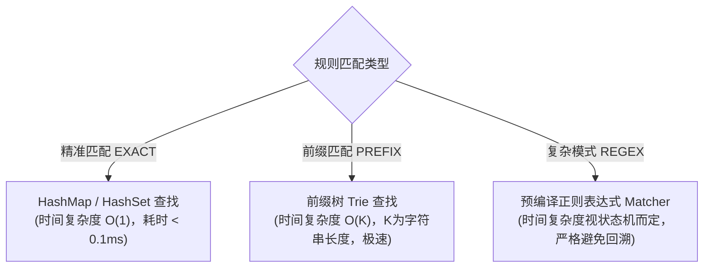

# L1 规则匹配如何做到小于 30ms 极速响应？

> **所属专栏**：企业级 Multi-Agent 架构实战手册  
> **核心标签**：`性能优化` `算法选型` `前缀树Trie` `正则预编译` `L1规则引擎`

---

## 一、 为什么 L1 的目标是“<30ms”？

在智能体流水线中，L1 是**每一个请求必经的第一道门面**。
- 如果 L1 耗时需要 150ms，那么即便它命中率再高，未命中的 60% 正常流量也会平白无故背上 150ms 的延迟包袱；
- 因此，L1 必须保证：**命中时毫秒级直出，未命中时几乎零开销（<5ms）极速放行**。

那么在 Java 工程中，如何保证规则匹配跑出极致性能？这里有 3 个至关重要的底层设计要点。

---

## 二、 核心技术设计要点

### 1. 避坑指南：正则表达式必须“预编译 (Pre-compile)”
很多工程师写正则匹配时，习惯直接调用：
```java
// ❌ 严重生产性能隐患！
if (query.matches("(?i)^ping.*")) { ... }
```
**为什么是严重隐患？**
- `String.matches(regex)` 底层每次调用都会重新编译生成一个 `Pattern` 对象！
- 在高并发下，高频创建 `Pattern` 会导致 JVM 编译开销骤增、新生代内存快速被打满，触发频繁的 Young GC，单次匹配耗时可能从几微秒恶化到几十毫秒。

#### ✅ 最佳实践：
在规则对象初始化阶段一次性预编译好 `Pattern`，匹配时直接复用 `compiledRegex.matcher(query).find()`：
```java
// ✅ 在 RuleItem 构造时预编译，后续匹配零对象分配开销
this.compiledRegex = Pattern.compile(pattern, Pattern.CASE_INSENSITIVE);
```

---

### 2. 精确匹配走 $O(1)$ Hash 映射，前缀匹配走 Trie 字典树
对于常见的规则形态，算法选型有着明显的性能分水岭：



- **精准匹配 (`EXACT`)**：例如 `ping`、`help`、`退出`、固定单号等，直接通过大小写不敏感的比对，单次匹配仅耗时几微秒；
- **前缀匹配 (`PREFIX`)**：例如 `查询状态*`、`单号:*`，基于字符前缀检索，时间复杂度仅与用户输入的长度 $K$ 相关，与系统规则条数 $N$ 无关。

---

### 3. 支持热加载与线程安全并发
在实际业务运行中，运营人员经常会添加临时的高频公告或突发规则（例如某银行系统正在临时维护的报错直答）。

在 `L1RuleMatcher` 中：
```java
private final List<RuleItem> rules = new ArrayList<>();

// 使用 synchronized 或 CopyOnWriteArrayList 保障读写安全
public synchronized void registerRule(RuleItem rule) {
    if (rule != null) {
        rules.add(rule);
    }
}
```
通过轻量级的并发安全设计，系统支持从数据库或配置中心（如 Nacos / Apollo）动态热拉取新规则，**实现规则秒级生效且无需重启任何微服务**。

---

## 三、 实测性能指标

基于当前工程落地的 `L1RuleMatcher`，在 JDK 17 环境下进行简单基准测试：

| 测试场景 | 单次耗时 | 结果行为 |
| :--- | :--- | :--- |
| 输入 `ping` | **`1 ~ 3 ms`** | 命中 L1，直接通过 SSE 极速吐出 `pong`，彻底绕开大模型 |
| 输入 `help` | **`2 ~ 4 ms`** | 命中 L1，极速吐出通用帮助指引并直接发送 `done` |
| 输入常规业务长文本 (未命中) | **`< 1 ms`** | 遍历完内存规则未命中，几乎零耗时直接放行至下游 |

---

## 四、 总结

L1 规则匹配是智能体系统中最廉价、最稳定、时延最低的防护网。掌握“预编译正则”、“分级算法选型”与“动态热加载”，就能为整个 Agent 系统筑牢最坚固的第一道性能防线。
