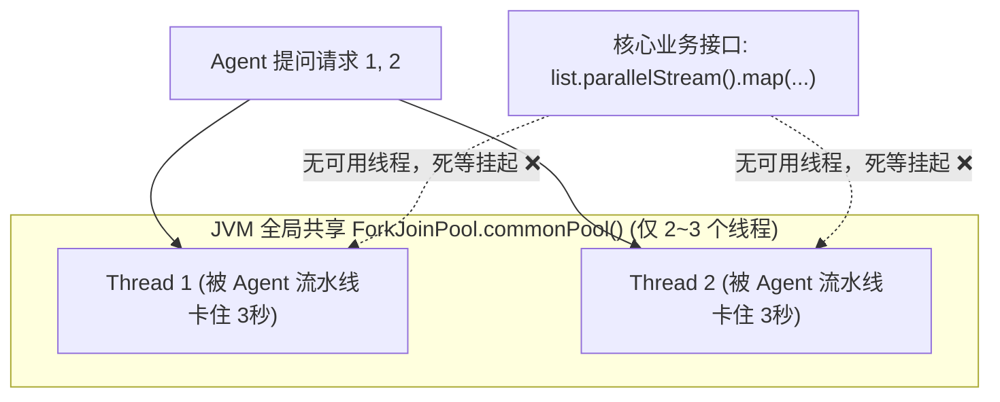
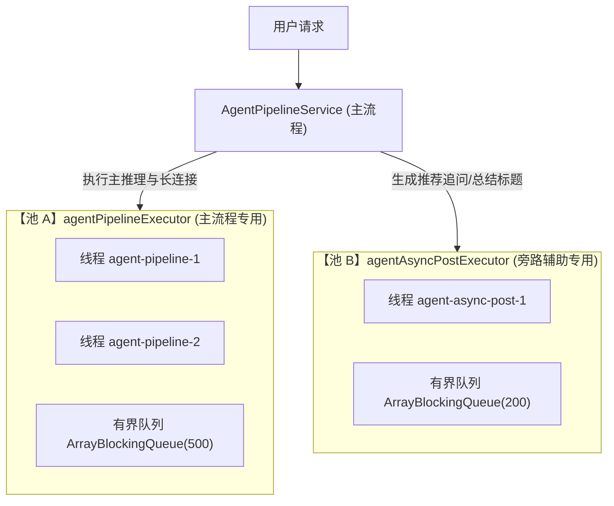

# 警惕 ForkJoinPool 陷阱：为什么 CompletableFuture 必须指定隔离线程池？

> **所属专栏**：Java 高并发与工程底座避坑手册 (`docs/java-engineering/`)  
> **核心标签**：`Java并发` `CompletableFuture` `ForkJoinPool` `线程池隔离` `舱壁模式`

---

## 一、 生产惨案还原：一个耗时任务拖垮整个 JVM

在异步编程中，很多工程师习惯随手写下这行代码：

```java
// ❌ 典型的生产高危代码！
CompletableFuture.runAsync(() -> {
    // 耗时调用：调用大模型推理 (2~3秒) 或 请求第三方接口
    doSlowNetworkCall();
});
```

在开发者本地单机调试时，一切都很正常。但一旦部署到生产环境，并发量稍微上升，**整个 JVM 实例就会瞬间无响应，各种甚至完全不相干的接口全部超时报警！**

### 为什么会发生整个应用的“连带雪崩”？

---

## 二、 深度底层原理解析

### 1. 默认池的致命真相：`ForkJoinPool.commonPool()`
当调用 `CompletableFuture.runAsync(runnable)` 且**没有显式传入第二个 `Executor` 参数**时，底层会强制使用 JVM 全局唯一的：
```java
ForkJoinPool.commonPool()
```

这个公共池的设计初衷是用于处理**短平快的 CPU 计算密集型任务（如递归分治算法、并行数组排序）**。

它的默认大小极其苛刻：
$$\text{默认线程数} = \text{Runtime.getRuntime().availableProcessors()} - 1$$

> ⚠️ **在 2 核或 4 核的云服务器/Docker 容器中，这个全局公共池的线程数往往只有 1 ~ 3 个！**

### 2. 线程饥饿（Thread Starvation）与灾难蔓延
- 智能体编排与外部 API 调用是典型的 **IO 密集型长耗时任务**（调大模型通常要等 1~3 秒）；
- 只要有 2~3 个并发请求进入流水线，全局 `commonPool` 的所有线程就会瞬间被耗尽；
- **最致命的灾难来了**：Java 8 的 `List.parallelStream()`、Spring 的部分默认异步组件、以及应用中其他使用该公共池的代码，**全部因为拿不到线程而陷入死锁般的阻塞等待！**



---

## 三、 架构解法：舱壁隔离模式 (Bulkhead Pattern)

借鉴造船业的“防沉舱壁”设计（一个船舱进水，其他船舱依然密封安全）：**不同业务属性、不同优先级的任务，必须分池物理隔离！**



### 1. 主流程池 vs. 旁路任务池物理隔离
- **`agentPipelineExecutor`（流水线专用池）**：
  - 核心线程数设置较大（如 `CPU核心数 * 2`），专管 SSE 长连接与智能体编排；
  - 队列必须有界（如 500），防止流量激增时无界排队耗尽堆内存引发 OOM。
- **`agentAsyncPostExecutor`（异步后处理池）**：
  - 负责生成推荐问题、会话标题、写审计日志等旁路低优先级任务；
  - 即使该池被打满，也绝不影响用户的正常问答主流程。

---

## 四、 生产级线程池必须具备的 4 个要素

```java
@Configuration
public class ThreadPoolConfig {

    @Bean("agentPipelineExecutor")
    public Executor agentPipelineExecutor() {
        ThreadPoolTaskExecutor executor = new ThreadPoolTaskExecutor();
        // 1. 核心与最大线程数 (IO密集型)
        executor.setCorePoolSize(8);
        executor.setMaxPoolSize(16);
        // 2. 严禁用无界队列 (防 OOM)
        executor.setQueueCapacity(500);
        // 3. 必须配置自定义前缀 (排查日志和 jstack 的救命稻草)
        executor.setThreadNamePrefix("agent-pipeline-");
        // 4. 拒绝策略: CallerRunsPolicy 形成天然反压
        executor.setRejectedExecutionHandler(new ThreadPoolExecutor.CallerRunsPolicy());
        // 5. 优雅停机: 容器关闭时等待任务执行完，不直接强杀
        executor.setWaitForTasksToCompleteOnShutdown(true);
        executor.setAwaitTerminationSeconds(30);
        executor.initialize();
        return executor;
    }
}
```

### 为什么拒绝策略选 `CallerRunsPolicy`？
当线程池和队列全满时，`CallerRunsPolicy` 会让提交任务的主线程（Tomcat 线程）自己去执行该任务。
- 这会减慢 Tomcat 接收新请求的速度；
- 从而**在系统入口天然形成了反压（Backpressure）**，有效防止上游把系统彻底压垮！

---

## 五、 总结与最佳实践准则

在任何 Java 企业级开发中，请将此规则牢记心头：

> **“永远不要使用无参的 `CompletableFuture.runAsync()` 或 `supplyAsync()`。所有异步任务必须显式传入经过容量规划、命名前缀与拒绝策略定制的专用线程池！”**
