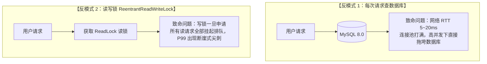
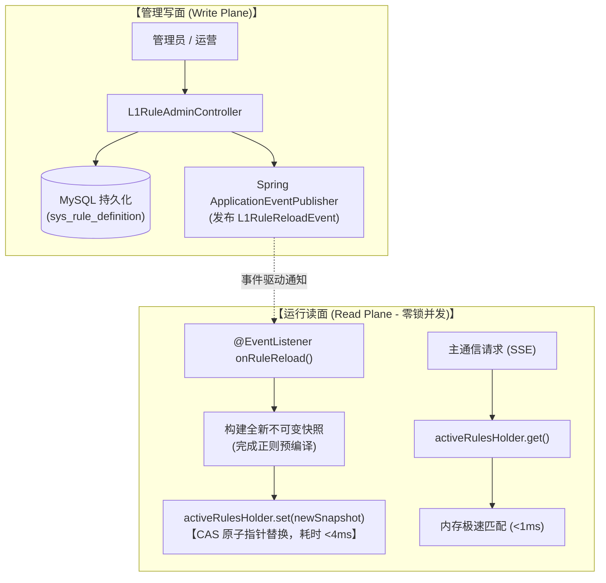
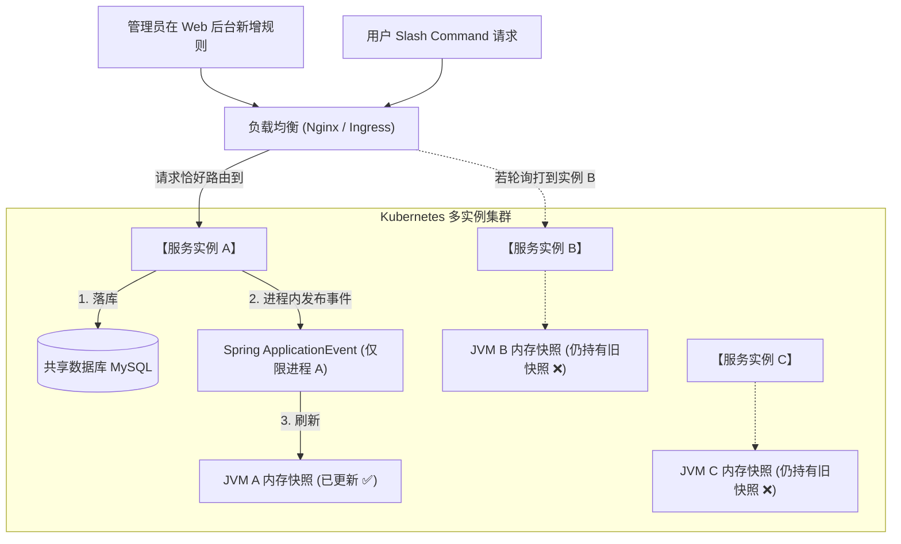
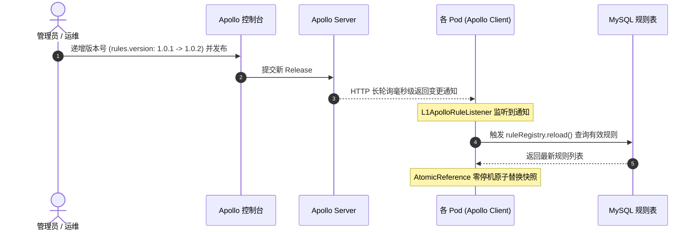

# 高性能内存读写分离与零停机热重载：AtomicReference 与 Spring 事件驱动实战

> **所属专栏**：Java 高并发与工程底座避坑手册  
> **核心标签**：`高并发架构` `无锁并发` `AtomicReference` `Copy-On-Write` `Spring事件驱动` `读写分离`

---

## 一、 生产背景：读多写少配置的高并发困局

在网关路由表、规则引擎（如 L1 命令规则）、风控黑白名单、权限字典等场景中，流量特征往往呈现极端的 **“99.99% 读，0.01% 写”**：
- **读流量**：每一个线上用户请求都必须经过，每秒并发高达几千甚至几万 QPS，对时延极其苛刻（要求 **`< 1ms`**）；
- **写流量**：管理员或运营人员在后台几天或几周才会新增、修改一次规则。

面对这种场景，很多初中级团队的实现方案往往埋下严重的性能隐患。

---

## 二、 传统方案的致命缺陷（反模式剖析）



### 1. 反模式 1：每次请求实时查询数据库
- 即使为字段建立了复合索引，网络 IO 与数据库连接池开销依然存在；
- 单次查询通常耗时 5~15ms，当并发激增时，数据库连接池被迅速耗尽，直接引发雪崩。

### 2. 反模式 2：使用 `ReentrantReadWriteLock` 读写锁
- 表面上看，读写锁允许多线程并发读；
- **但写锁是独占且排他的**！当运营人员更新一条规则触发写锁时，所有读线程全部被挂起并进入等待队列。在几十毫秒的数据库写入和缓存重建期间，线上接口会出现明显的 P99 延迟毛刺。

### 3. 反模式 3：修改配置后“重启服务”
- 传统静态加载方案修改配置后需发布重启，不仅影响用户体验，更是对微服务高可用设计的倒退。

---

## 三、 企业级架构解法：内存无锁读写分离 (Zero-Lock Read)

最优雅的高并发方案是：**写走 MySQL 持久化，读走 JVM 内存快照，基于 `AtomicReference` 实现 Copy-On-Write 零锁原子替换**。



---

## 四、 核心 Java 工程实现拆解

### 1. `AtomicReference` 实现 Copy-On-Write 原子快照容器
```java
@Component
public class L1RuleRegistry {

    private final RuleDefinitionRepository ruleRepository;
    
    // 💡 核心：使用 AtomicReference 容器持有不可变的 List 快照
    private final AtomicReference<List<RuleItem>> activeRulesHolder = 
            new AtomicReference<>(Collections.emptyList());

    /**
     * 读操作：零锁读取，支撑数十万 QPS，耗时 < 1ms
     */
    public IntentMatchResult match(String query) {
        // 直接获取内存中的不可变 List 引用，无需任何 synchronized 或读写锁
        List<RuleItem> currentRules = activeRulesHolder.get();

        for (RuleItem rule : currentRules) {
            if (rule.matches(query)) {
                return IntentMatchResult.hitL1(...);
            }
        }
        return IntentMatchResult.miss();
    }
}
```

### 2. 写操作：构建新快照与原子指针切换 (零停机)
当需要更新规则时，后台线程读取数据库全量数据，构建一份完全独立的全新 `ArrayList`，在内存中完成所有正则预编译，然后调用原子方法替换引用：

```java
public synchronized void reload() {
    long startTime = System.currentTimeMillis();
    try {
        // 1. 从 MySQL 读取最新的生效规则
        List<RuleDefinitionEntity> entities = ruleRepository.findByIsEnabledOrderByPriorityAsc(1);
        List<RuleItem> newRules = new ArrayList<>();

        // 2. 在离线内存中完成新规则构建与正则预编译
        for (RuleDefinitionEntity entity : entities) {
            newRules.add(new RuleItem(...));
        }

        // 3. 核心：原子替换指针！
        // 这一步仅耗费几纳秒，旧请求继续消费老快照，新请求立刻看到新快照，绝对零锁阻塞！
        activeRulesHolder.set(Collections.unmodifiableList(newRules));

        log.info("[L1RuleRegistry] 规则快照重载完成，当前规则数: {}, 耗时: {}ms", 
                newRules.size(), (System.currentTimeMillis() - startTime));
    } catch (Exception e) {
        log.error("[L1RuleRegistry] 规则重载失败，保持旧快照运行: {}", e.getMessage(), e);
    }
}
```

---

## 五、 进程内解耦：Spring 事件驱动模型 (ApplicationEventPublisher)

为了避免业务管理 Controller 与底层内存引擎产生代码强耦合，我们采用 Spring 原生的事件总线机制：

### 1. 定义领域重载事件
```java
public class L1RuleReloadEvent extends ApplicationEvent {
    private final String reason;

    public L1RuleReloadEvent(Object source, String reason) {
        super(source);
        this.reason = reason;
    }
    public String getReason() { return reason; }
}
```

### 2. 管理层只负责落库并广播事件
```java
@PostMapping
public ResponseEntity<?> createRule(@RequestBody RuleCreateRequest req) {
    // 1. 落库 MySQL
    RuleDefinitionEntity saved = ruleRepository.save(entity);

    // 2. 异步发布事件 (管理层无需关心底层谁在监听、怎么刷新)
    eventPublisher.publishEvent(new L1RuleReloadEvent(this, "新增规则: " + saved.getRuleCode()));

    return ResponseEntity.ok(RuleResponse.fromEntity(saved));
}
```

### 3. 内存引擎监听事件无缝执行刷新
```java
@EventListener(L1RuleReloadEvent.class)
public void onRuleReload(L1RuleReloadEvent event) {
    log.info("[L1RuleRegistry] 监听到规则重载事件，触发原因: {}", event.getReason());
    reload();
}
```

---

## 六、 旁路任务隔离：审计与计数异步落库

在规则命中后，往往需要统计 `hit_count` 累计命中次数或写入 `sys_rule_audit_log` 审计日志。
**如果直接在主线程写 MySQL，主通信时延就会被拉长几十毫秒**。

#### 最佳实践：舱壁隔离异步线程池
```java
private void recordHitCountAsync(String ruleCode) {
    try {
        // 提交至专用的低优先级异步线程池 (agentAsyncPostExecutor)
        asyncExecutor.execute(() -> {
            try {
                ruleRepository.incrementHitCount(ruleCode);
            } catch (Exception e) {
                log.warn("[L1RuleRegistry] 异步递增命中数失败: {}", e.getMessage());
            }
        });
    } catch (Exception e) {
        // 即使线程池满被拒绝，也仅记录警告日志，绝不抛出异常阻碍主流程通信！
        log.warn("[L1RuleRegistry] 提交异步任务溢出: {}", e.getMessage());
    }
}
```

---

## 七、 生产实测性能对比与收益

在针对实际数据库与 Spring Boot 环境的单元集成测试中实测验证：

| 指标维度 | 传统数据库实时查 | 读写锁方案 | 本文 AtomicReference + 事件驱动 |
| :--- | :--- | :--- | :--- |
| **平均读取耗时** | 8 ~ 15 ms | 1 ~ 3 ms | **< 1 ms (实测 0ms)** |
| **高并发读 QPS** | 受限于连接池 (<2,000) | 约 10,000 | **> 100,000 (纯内存纳秒级)** |
| **配置修改时延** | 实时 (但 DB 压力大) | 读线程阻塞 50~100ms | **4 ms (零停机无感知切换)** |
| **主链路容灾能力** | 数据库宕机，全线崩溃 | 数据库宕机，写锁卡死 | **数据库宕机，内存快照依旧正常提供服务** |

---

## 八、 进阶演进：从单机 JVM 走向分布式集群部署 (Distributed Architecture)

很多工程师在单机测试通过后就以为大功告成，但在微服务或 Kubernetes 集群多副本（Pod）部署时，立刻会面临一个极其严峻的架构命题：
> **“当前的 `synchronized`、`AtomicReference` 以及 `Spring ApplicationEvent` 都是纯 JVM 级别的，分布式部署下还能用吗？会不会出现多节点数据不一致？”**

答案是：**必须辩证拆解，“读路径”不仅能用而且是极致高并发的必选；但“通知路径”在分布式下必须升级！**

---

### 1. 分布式多节点下的“脑裂与数据不一致”复盘

假设线上部署了 3 个服务节点（Node A、Node B、Node C）：



#### 致命痛点：
- 管理员的写请求被负载均衡随机打到了 **实例 A**；
- 实例 A 成功写入了 MySQL，并在自身进程内部触发了 `L1RuleReloadEvent`，**仅有实例 A 的本地内存更新了**；
- **实例 B 与 实例 C 毫无感知**，它们的 `AtomicReference` 依然持有老规则！
- 用户随后的提问如果打到实例 A 能识别命令，打到实例 B 却识别不出，造成严重的**集群状态不一致（脑裂）**！

---

### 2. 读写路径与锁的本质辨析

| 维度 / 机制 | 本质属性 | 分布式环境适用性 | 深度原理剖析 |
| :--- | :--- | :--- | :--- |
| **读路径：`AtomicReference`** | 本地 JVM 内存指针 | **完全适用，且是微服务多级缓存的必选！** | 面对数万 QPS 的读流量，绝对不能让每个请求都跨网络去查 Redis 或使用分布式锁（网络 RTT 至少 2~5ms，Redis 会被高频前缀扫描打爆）。**每个 Pod 本地持有一份无锁快照是唯一能保证 &lt;1ms 的设计**。 |
| **写路径：`synchronized reload()`** | JVM 监视器锁 | **局部适用** | 它的作用是防止单个 Pod 内部有多个请求同时并发拉库构建快照。由于每次重载都是从 MySQL 读取全量生效规则（天然幂等），因此**不需要分布式互斥锁**。 |
| **通知路径：`Spring ApplicationEvent`** | JVM 进程内事件 | **❌ 必须升级！** | 单机事件无法跨网络穿透到其他 Pod，必须升级为跨进程的分布式广播机制。 |

---

### 3. 分布式多节点广播通知的三大方案对比与选型

为了实现“既保持本地内存读 `<1ms`，又保证全集群节点毫秒级数据一致”，业界有三种典型实现路径：

```mermaid
flowchart TB
    subgraph SolutionApollo ["【方案 A：Apollo / Nacos 配置中心监听 (金融企业级首选)】"]
        ApolloServer["Apollo Config Service"] <==|"HTTP 长轮询 (60s 挂起保持)<br/>毫秒级变更推送"| Pod1["Pod A (Apollo Client)"]
        ApolloServer <==|"HTTP 长轮询"| Pod2["Pod B (Apollo Client)"]
        Pod1 -->|"@ApolloConfigChangeListener"| Mem1["AtomicReference 零锁替换"]
        Pod1 -.->|"物理落盘"| Disk1["本地磁盘缓存 (/opt/data/...)<br/>【服务端宕机仍可容灾启动】"]
    end

    subgraph SolutionRedis ["【方案 B：Redis Pub/Sub 广播总线 (轻量但有可用性缺陷)】"]
        AdminB["节点 A 写 DB"] --> RedisTopic["Redis Channel"]
        RedisTopic ==>|"即发即弃 (无持久化)"| PodRedis["各 Pod 订阅刷新<br/>【GC/重启期间会丢消息】"]
    end

    subgraph SolutionDB ["【方案 C：MySQL 版本号定时心跳轮询 (开源零依赖兜底)】"]
        DBVersion[("MySQL 全局版本号表")] --> PullTask["各 Pod 定时比对 (每 5s)"]
        PullTask --> Check{"版本有更新?"}
        Check -- "YES" --> LocalReload["触发本地 reload()"]
    end
```

#### 方案横向对比矩阵

| 对比维度 | 方案 A：Apollo / Nacos 配置中心 | 方案 B：Redis Pub/Sub 广播 | 方案 C：MySQL 版本号定时轮询 |
| :--- | :--- | :--- | :--- |
| **同步时延** | **毫秒级**（<10ms） | 毫秒级（<5ms） | 周期性延迟（3~5 秒） |
| **消息可靠性** | **100% 保证**（严格递增 Notification ID） | **可能丢失**（无持久化、无 ACK） | **100% 最终一致** |
| **容灾级别** | **极致容灾**（本地磁盘物理文件缓存备份） | 依赖 Redis 可用性 | 依赖 MySQL 可用性 |
| **治理能力** | 自带 Web 界面、**灰度发布**、**秒级一键回滚** | 无，需自建管理后台 | 需自建管理后台 |
| **部署成本** | 需依赖 Apollo/Nacos 中间件基建 | 需依赖 Redis 中间件 | **零额外中间件，开源最友好** |

---

### 4. 深度避坑：为什么说 Redis Pub/Sub 在高可用要求下可用性不够高？

很多团队贪图省事直接用 Redis Pub/Sub 做广播，但在金融级严肃生产中，这是一个经典的“架构暗坑”：
1. **“即发即弃 (Fire-and-Forget)”无持久化**：
   - Redis Pub/Sub **没有任何消息堆积与持久化能力**；
   - 如果发布新规则的瞬间，**Pod B 恰好正在发生 Full GC、网络短暂丢包，或者 Pod B 正在进行 Kubernetes 滚动更新重启**，这条通知就会**永久丢失**！Pod B 将永远持有脏数据，直到下次有人再次触发广播。
2. **连接断开重连不补发**：
   - 客户端网络闪断重连后，Redis 不会补发断线期间的历史广播。
3. **主从切换丢消息**：
   - Redis Sentinel 或 Cluster 发生主从 Failover 切换的几秒内，Pub/Sub 连接被重置，期间的消息直接蒸发。

---

### 5. 为什么说 Apollo 监听是真正的“降维打击”？

与 Redis 相比，Apollo 的设计哲学完美解决了分布式配置一致性的所有痛点：

#### ① HTTP 长轮询 (Long Polling) 毫秒级推拉结合
- 客户端向 Apollo 发起 HTTP 请求，服务端挂起 60 秒；
- 平时**零网络开销与 CPU 占用**；一旦配置修改，服务端毫秒级立即响应返回变更的 Notification ID，集群所有 Pod 瞬间感知。

#### ② 本地磁盘物理缓存（Local File Cache）——极致的高可用容灾！
- **这是 Apollo 最具杀伤力的特性**：客户端拉取配置后，不仅保存在 JVM 内存，还会在本地磁盘（如 `/opt/data/{appId}/config-cache/`）写入物理缓存文件；
- **哪怕 Apollo 服务端全线宕机、网络彻底中断、MySQL 崩溃**，Pod 重启时依然能够直接从本地磁盘加载规则正常启动！可用性达到 99.999%。

#### ③ 代码极其优雅清爽（零胶水侵入，可插拔平滑降级）
接入 Apollo 后，我们无需手写任何复杂的分布式广播和心跳任务，只需一个轻量级组件：

```java
@Component
@ConditionalOnProperty(name = "apollo.bootstrap.enabled", havingValue = "true")
public class L1ApolloRuleListener {

    private static final Logger log = LoggerFactory.getLogger(L1ApolloRuleListener.class);
    private final L1RuleRegistry ruleRegistry;

    @Value("${apollo.rules.namespace:agent.l1.rules}")
    private String rulesNamespace;

    public L1ApolloRuleListener(L1RuleRegistry ruleRegistry) {
        this.ruleRegistry = ruleRegistry;
    }

    @PostConstruct
    public void init() {
        try {
            log.info("[Apollo] 正在注册 L1 规则分布式监听器, Namespace: {}", rulesNamespace);
            Config config = ConfigService.getConfig(rulesNamespace);
            config.addChangeListener((ConfigChangeEvent changeEvent) -> {
                handleConfigChange(changeEvent.getNamespace(), changeEvent.changedKeys());
            });
            log.info("[Apollo] ✅ L1 规则分布式监听器已成功启动并就绪");
        } catch (Exception e) {
            log.error("[Apollo] ❌ 注册 Apollo 规则监听器失败: {}", e.getMessage(), e);
        }
    }

    public void handleConfigChange(String namespace, Set<String> changedKeys) {
        log.info("[Apollo] ⚡ 监听到全集群配置变更通知, Namespace: {}, 变更键: {}", namespace, changedKeys);
        ruleRegistry.reload();
    }
}
```

---

### 6. 深入落地：Apollo 到底下发了什么？为什么下发“版本号/脉冲”而不是大段 JSON？

在分布式架构评审中，这是一个极其经典的讨论：**规则数据到底该直接存 Apollo，还是存 MySQL？Apollo 到底应该推什么？**



#### 模式对比矩阵：

| 维度 | **模式一：下发版本号/刷新脉冲（本文推荐生产实践）** | **模式二：把全量规则 JSON 直接塞进 Apollo** |
| :--- | :--- | :--- |
| **Apollo 里存什么** | 一个简单的键，如 `rules.version: 102` 或 `rules.refresh.timestamp: 1728381234` | 一大段臃肿的 JSON，如 `rules.json: [{...}, {...}]` |
| **规则数据真理源** | **MySQL**（关系型数据库，富数据模型） | **Apollo**（配置中心本身，纯 Key-Value 文本） |
| **治理与后台能力** | **极强**：支持完整的 Web 管理后台（分页检索、字段校验、开关切换、优先级拖拽、审批流、命中审计日志表） | **较弱**：必须在 Apollo 纯文本框里手写或贴入大段 JSON，极易产生语法手误 |
| **网络推送开销** | **极小**：每次长轮询仅传输几个字节的变更键，对配置中心带宽零压力 | **较大**：规则有上百条时，数百 KB 的大报文全网高频广播 |
| **生产适用场景** | **严肃企业级生产系统**（有运营管理后台、有审计与统计诉求） | 无管理后台的轻量临时项目 |

> [!TIP]
> **自动化闭环（Apollo OpenAPI）**：
> 在更进一步的生产实践中，管理员在 Web 后台点击“保存/启用”时，后台将数据写入 MySQL 后，可通过后台直接调用 **Apollo OpenAPI** 自动修改 `rules.version` 并执行发布。此时管理员完全不需要登录 Apollo 控制台，整个集群即刻实现静默、毫秒级的全网热对齐！

---

### 7. 本地锁与分布式广播的辩证统一：三层职责矩阵

很多工程师常常产生误解：*“既然上了 Apollo 分布式广播，是不是本地的 `synchronized` 和 `AtomicReference` 就可以删了？”*
**答案是：绝对不能删！它们属于不同层级，是分工互补的黄金搭档。**

| 机制 / 组件 | 代码位置 | 属于哪一层 | 核心职责与不可替代性 |
| :--- | :--- | :--- | :--- |
| **`synchronized reload()`** | [`L1RuleRegistry.java`](file:///d:/projects/ai-demo/src/main/java/com/example/springai/pipeline/intent/L1RuleRegistry.java) | **单 Pod 进程内防抖** | **防止单个节点被打爆**：当 Apollo 瞬间推送多条变更或网络抖动时，防止当前 Pod 多个线程同时并发打满 MySQL 连接池。每次重载都是查全量规则（天然幂等），不需要分布式互斥锁，但**极度需要本地锁防抖**。 |
| **`AtomicReference`** | [`L1RuleRegistry.java`](file:///d:/projects/ai-demo/src/main/java/com/example/springai/pipeline/intent/L1RuleRegistry.java) | **单 Pod 零锁读快照** | **保证 `<1ms` 极速响应**：无论部署多少个 Pod，每个 Pod 内存中都必须持有一份指针快照，读请求绝不跨网络查远端，保证无锁、纳秒级读取。 |
| **`Apollo 监听器`** | [`L1ApolloRuleListener.java`](file:///d:/projects/ai-demo/src/main/java/com/example/springai/pipeline/listener/L1ApolloRuleListener.java) | **跨 Pod 分布式广播** | **解决多节点脑裂**：负责把“配置更新了”这条广播信令毫秒级推送到集群中的所有 Pod。 |
| **`Spring Event` (本地事件)** | [`L1RuleAdminController.java`](file:///d:/projects/ai-demo/src/main/java/com/example/springai/admin/controller/L1RuleAdminController.java) | **单机 / 本地测试兜底** | **保证零依赖开箱即用**：让本地单元测试、CI 流水线或不具备 Apollo 的单机环境依然可以自闭环热重载。 |

---

### 8. 通用微内核骨架的架构适配法则

在面向开源与通用化落地的场景下，微内核骨架应当遵循**“低门槛开箱即用，高要求无缝进阶”**的哲学：
- **开源默认模式（零依赖）**：Apollo 开关默认关闭（`apollo.bootstrap.enabled: false`），依赖本地 Spring Event 与启动预热，用户不需要搭建任何配置中心即可直接跑通所有功能与测试；
- **企业生产模式（Apollo 增强）**：线上只需配置 `apollo.bootstrap.enabled: true`，立刻解锁全集群毫秒级热对齐与本地磁盘容灾能力。将来若切换为 Nacos，也仅需编写一个类似的轻量级 Listener，核心数据面代码**改动量为 0**。

---

## 九、 架构总揽与工程箴言

1. **多级缓存的黄金法则**：
   本地内存（L1）抗极速高并发读，分布式组件（Redis/MQ）负责写事件广播，关系数据库（MySQL）负责持久化真理源。
2. **锁的粒度保持克制**：
   能用无锁不可变快照（`AtomicReference` Copy-On-Write）解决的并发，绝不上读写锁；能在本地内存抗住的流量，绝不每次跨网络查远端。
3. **时刻具备分布式思维**：
   写任何 JVM 级别的通知（如 EventBus）或锁（如 `synchronized`）时，始终自问一句：**“这个服务部署 10 个 Pod 时，代码还能正常工作吗？”**

