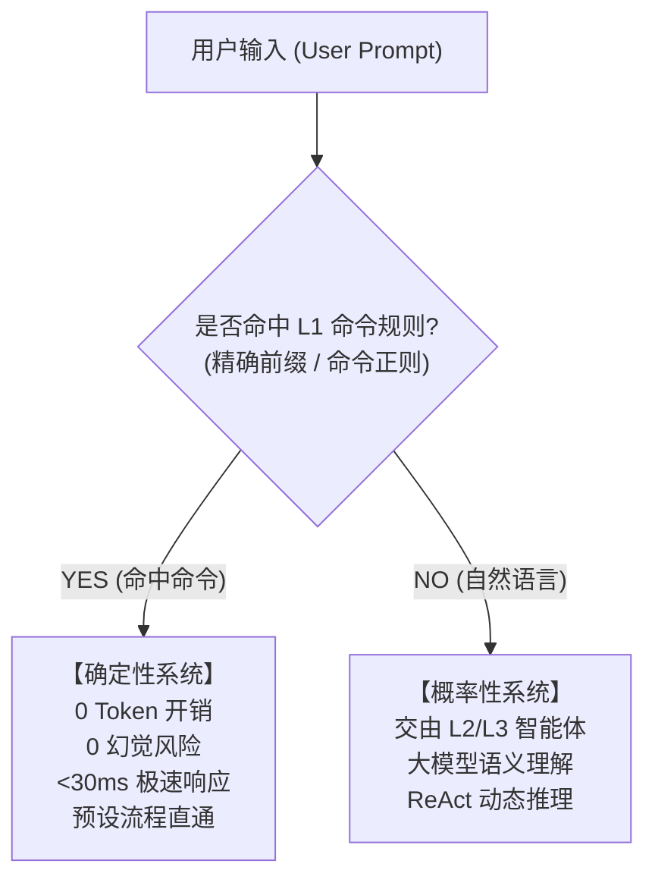
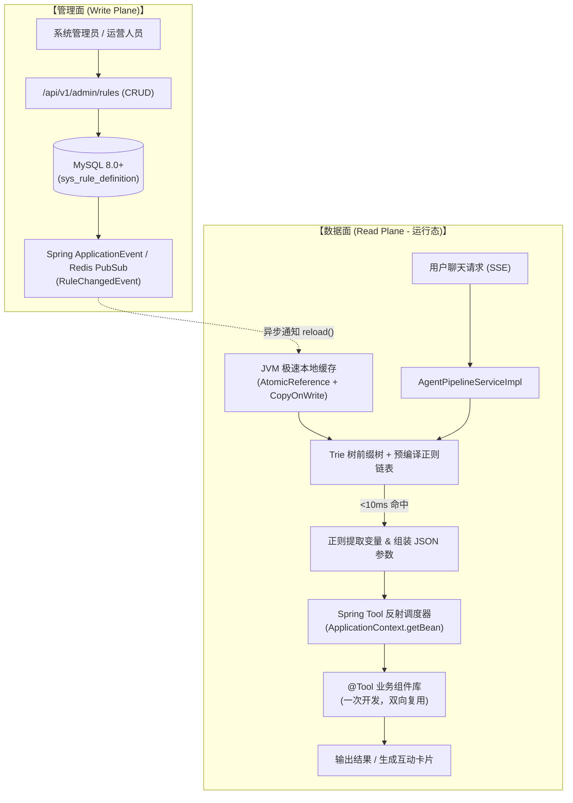
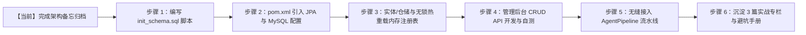

# L1 规则引擎深度共识、架构设计与落地规划全景

> **记录时间**：2026-10-08  
> **归档位置**：`docs/temp/01-L1规则引擎架构共识与技术方案.md`  
> **记录说明**：本文系统性归纳总结了关于“L1 规则引擎成熟产品化”的深度交流共识，涵盖本质认知、代码复用、决策边界、企业级存储与读写分离架构，作为后续系统小步实施的官方依据。

---

## 一、 核心交流共识与思维突破

在多轮深入交流中，我们对 Agent 系统中传统“规则引擎/意图识别”的定位进行了颠覆式的本质拆解，明确了以下五大核心共识：

### 1. 本质定位：L1 是命令调度器（Command Dispatcher / Slash Commands）
- **传统误区**：认为 L1 是一套简易的自然语言理解器，试图通过堆砌几千条模糊正则去匹配用户任意的自然语言聊天。这会导致严重的维护地狱。
- **正确定位**：L1 的本质是 **命令模式（Command Pattern）**，类似于 Slack、Discord 或 IDE 中的 `/slash commands`（如 `/query user_id=123`、`#查账 622202`、`@催收方案 A`）。
- **确定性 vs 概率性**：
  - **L1**：属于 **100% 确定性系统（Deterministic System）**。命中即执行预设工作流，绝不掺杂概率波动。
  - **LLM/SubAgent**：属于 **概率性推理系统（Probabilistic System）**。用于处理开放、模糊、未标准化的自然语言请求。

---

### 2. 避免重复开发：无缝复用 Spring AI 现存的 `@Tool`
- **核心痛点**：如果为 L1 的每条命令都手写一套 Java 业务 Service，系统将充斥大量胶水代码，违背了通用 Agent 骨架的初衷。
- **优雅解法**：**“一次开发 Tool，双向无缝复用”**。
  - 在 Spring AI 生态中，业务能力已经被封装为 `@Tool` 注解的 Spring Bean（例如 `AccountTool.queryBalance(String userId)`）。
  - L1 规则配置表仅需存储：
    - `target_tool`: `"accountTool.queryBalance"`
    - `param_template`: `{"userId": "$1"}`
  - **运行期反射分发**：L1 匹配成功并提取参数后，直接从 Spring `ApplicationContext` 获取对应的 Tool Bean 执行方法调用。
  - **收益**：**新增一条 L1 命令，Java 核心代码编写量为 0！** 只需在管理界面/数据库添加一行配置。

---

### 3. 链式调用的决策边界：模式 A 与模式 B 的终极权衡
针对“多步 Tool 调用之间，是依靠配置编排还是依靠大模型决策”的疑问，我们达成清晰的架构分类：

| 维度 | 模式 A：配置工作流编排 (Chaining) | 模式 B：大模型自主决策 (ReAct Loop) |
| :--- | :--- | :--- |
| **执行载体** | L1 规则工作流引擎 / 状态机 | L3 主管/专业 SubAgent |
| **决策来源** | 预先配置好的 SOP 步骤（如 ToolA -> ToolB） | LLM 根据 ToolA 的返回结果动态思考下一步 |
| **适用场景** | 业务逻辑高度严谨、路径固定、容错率 0（如金融查账+还款流水固化出单） | 开放式排错、未知故障根因分析、跨域多源数据综合探索 |
| **核心优势** | 速度极快（毫秒级）、结果 100% 可控、无 Token 账单 | 泛化能力强、具备逻辑涌现与自愈能力 |
| **架构归宿** | **归属于 L1 扩展编排能力** | **归属于 SubAgent 协作中枢** |

---

## 二、 企业级 L1 总体架构设计

为了实现真正面向企业生产、支持开源开箱即用，L1 绝不能停留在硬编码或本地静态配置文件层面，必须升级为 **MySQL 持久化 + 内存极速读写分离 + 零停机热重载** 的企业级形态。

### 1. 架构拓扑全景图

---

### 2. 数据库设计方案（待执行 SQL 规划）

针对开源使用者，我们将脚本独立维护在 `sql/init_schema.sql`，执行即可建表并灌入演示命令种子数据。

#### 核心表 1：`sys_rule_definition`（规则主表）
| 字段名 | 类型 | 说明 | 示例 |
| :--- | :--- | :--- | :--- |
| `id` | BIGINT PK | 主键 ID | `1` |
| `rule_code` | VARCHAR(64) | 唯一业务编码 | `CMD_QUERY_ACCOUNT` |
| `rule_name` | VARCHAR(128) | 规则名称 | `快速查账指令` |
| `match_type` | VARCHAR(32) | 匹配类型（`PREFIX`、`EXACT`、`REGEX`） | `REGEX` |
| `pattern_expr` | VARCHAR(255) | 匹配表达式 | `^/query\s+user_id=(\d+)$` |
| `target_tool` | VARCHAR(128) | 绑定的 Spring Bean 与方法 | `userAccountTool.queryBalance` |
| `param_template` | VARCHAR(1024) | 参数映射模板（支持正则分组引用） | `{"userId": "$1"}` |
| `priority` | INT | 优先级（数字越小越先匹配） | `10` |
| `is_enabled` | TINYINT(1) | 启用状态（1=启用，0=禁用） | `1` |
| `chain_mode` | VARCHAR(32) | 链式模式（`SINGLE` 单步 / `CHAIN` 多步工作流）| `SINGLE` |
| `created_at` | DATETIME | 创建时间 | 数据库当前时间 |
| `updated_at` | DATETIME | 更新时间 | 数据库自动更新 |

#### 核心表 2：`sys_rule_chain_step`（针对模式 A 的多步编排链表）
| 字段名 | 类型 | 说明 | 示例 |
| :--- | :--- | :--- | :--- |
| `id` | BIGINT PK | 主键 ID | `101` |
| `rule_id` | BIGINT | 关联规则主表 ID | `1` |
| `step_order` | INT | 步骤顺序 | `1` |
| `step_tool` | VARCHAR(128) | 本步调用的 Tool | `paymentTool.queryLatestBills` |
| `step_param_mapping` | VARCHAR(1024) | 参数映射（可引用上一步输出） | `{"accountId": "#prev.accountId"}` |

---

### 3. 运行态高性能读写分离机制（Zero-Lock 保证）

为保障线上聊天主链路 `<30ms` 的极致性能，**运行态严禁在每次请求时实时查询 MySQL**：
1. **启动预热**：服务启动时，`L1RuleRegistry` 自动从 MySQL 加载全部有效规则，完成正则预编译，构建在 JVM 内存中；
2. **读操作（Zero-Lock）**：使用 `AtomicReference<RuleCacheHolder>` 实现无锁快照读取，并发性能达数万 QPS，耗时 `<1ms`；
3. **写操作（Copy-On-Write + 零停机热重载）**：
   - 管理员通过 Web 界面新增/修改规则，数据落盘 MySQL；
   - 触发 Spring `ApplicationEventPublisher.publishEvent(new L1RuleChangedEvent())`；
   - 本地 Listener 异步重新加载全量规则、原子替换内存引用，线上请求零中断、无缝切换。

---

## 三、 开源交付物与分步实施路线图

按照“步子极小、先方案后编码、每步必留痕”的原则，整体实施划分为以下极小步：

### 极小步明细与验证标准：

1. **步骤 1：创建标准 SQL 待执行脚本**
   - 新建目录：`sql/init_schema.sql`；
   - 规范编写 DDL 建表语句与基础演示数据（含 Slash Command 样例）；
   - *标准*：脚本符合 MySQL 8.0 规范，开源用户直接 Source 即可执行。
2. **步骤 2：数据源与持久层环境配置**
   - 在 `pom.xml` 中引入 `spring-boot-starter-data-jpa` 与 `mysql-connector-j`；
   - 在 `application.yml` 中配置标准数据源（附带默认开发环境参数）。
3. **步骤 3：实体层、仓储层与内存极速加载器**
   - 编写 `L1RuleEntity`、`L1RuleRepository`；
   - 编写 `L1RuleRegistry`：实现 `@PostConstruct` 预热、`AtomicReference` 缓存、正则预编译、Spring 事件监听热重载。
4. **步骤 4：Tool 反射调度器与管理 API**
   - 编写 `L1ToolDispatcher`：根据 `target_tool` 与解析的参数，动态定位 Spring AI `@Tool` Bean 并执行；
   - 编写 `L1RuleAdminController`：提供查询、新增、修改、手动热重载接口。
5. **步骤 5：流水线完整串联与测试**
   - 在 `AgentPipelineServiceImpl` 中无缝替换旧的静态 Matcher，接入全动态 `L1RuleRegistry`；
   - 启动验证输入 `/query user_id=8888` 毫秒级直接调用 Tool 并返回卡片。

---

## 四、 后续实战技术专栏沉淀规划

每完成一个小步，必须同步沉淀至 `docs/handbook/` 专栏中，计划产出：

1. **Handbook 第 13 篇**：
   - **标题**：《L1规则的本质：命令模式(Command Pattern)与智能体的极速直通车》
   - **核心内容**：命令模式与概率性大模型的楚河汉界，Slash Command 前置拦截的最佳工程实践。
2. **Handbook 第 14 篇**：
   - **标题**：《多步Tool调用谁来决策？确定性工作流(Chaining)与模型自主推理(ReAct)的架构权衡》
   - **核心内容**：模式 A 与模式 B 的深度对比、状态机与 ReAct 协作拓扑。
3. **Handbook 第 15 篇**：
   - **标题**：《L1规则企业级生产架构：MySQL持久化、内存读写分离与零停机热重载实战》
   - **核心内容**：AtomicReference Copy-On-Write 读写分离、正则预编译时延压测、Spring 事件驱动热更新机制。
