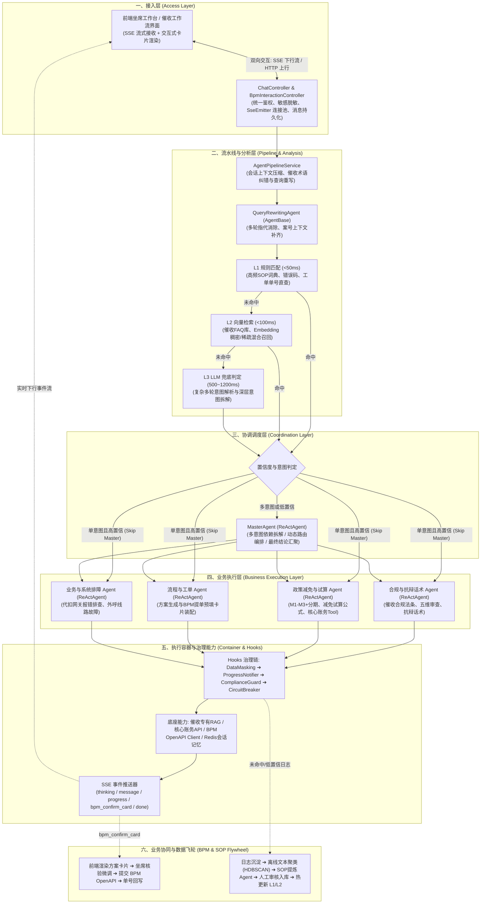
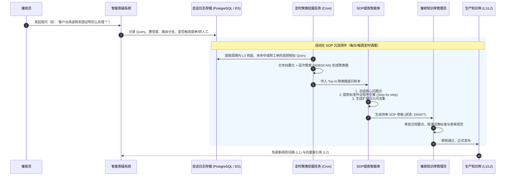
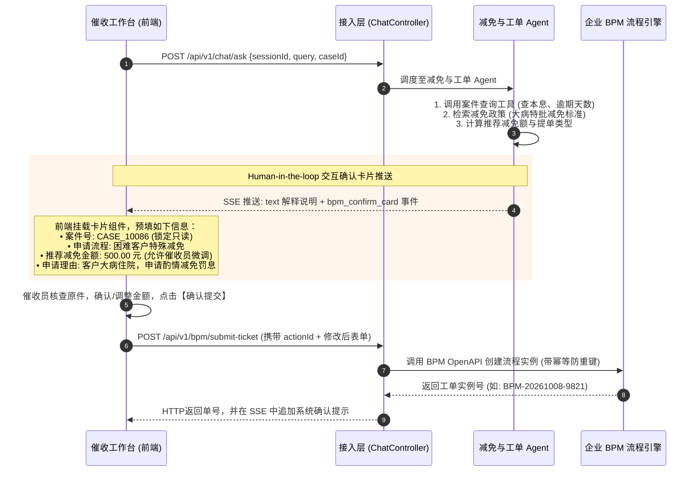
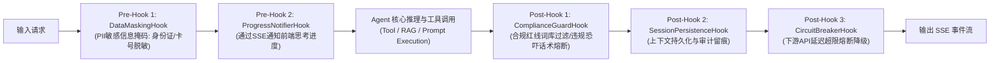
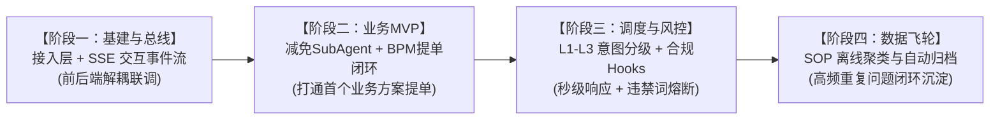

# 催收域智能答疑机器人系统架构与实施全景指南

> **文档版本**：v1.0.0  
> **更新时间**：2026-10-08  
> **适用对象**：架构师、后端研发、前端研发、AI算法工程师、BPM流程负责人、催收业务专家

---

## 目录
1. [项目背景与核心业务目标](#1-项目背景与核心业务目标)
2. [系统总体架构蓝图](#2-系统总体架构蓝图)
3. [多智能体分层矩阵与职责划分](#3-多智能体分层矩阵与职责划分)
4. [核心功能一：重复问题自动归档 SOP（数据闭环）](#4-核心功能一重复问题自动归档-sop数据闭环)
5. [核心功能二：推荐解决方案与 BPM 人机提单（Human-in-the-loop）](#5-核心功能二推荐解决方案与-bpm-人机提单human-in-the-loop)
6. [接入层通信与 SSE 事件流协议契约](#6-接入层通信与-sse-事件流协议契约)
7. [意图串行降级与安全合规 Hooks 治理链](#7-意图串行降级与安全合规-hooks-治理链)
8. [技术栈选型与系统库表设计](#8-技术栈选型与系统库表设计)
9. [分阶段实施演进路线与第一阶段验收标准](#9-分阶段实施演进路线与第一阶段验收标准)

---

## 1. 项目背景与核心业务目标

### 1.1 业务背景
在信贷资产催收业务场景中，坐席与催收员面临高频的业务规范咨询、借款人疑难抗辩应对、利息与罚息减免试算、停催报备及系统操作等问题。传统模式下依赖人工组长答疑或静态操作手册，存在**响应滞后、标准不一、合规风险高、知识无法沉淀**的痛点。

### 1.2 核心业务目标
打造一个高可用、高合规、具备自我进化能力的**催收域智能答疑机器人**，重点闭环两大核心功能：
1. **重复问题自动归档 SOP**：沉淀日常高频提问与未完全匹配的问题，基于离线语义聚类和 LLM 提炼，自动生成标准作业程序（SOP）草稿，经人工审核后热加载回流至生产知识库。
2. **推荐解决方案并闭环 BPM 提单（Human-in-the-loop）**：针对停催、息费减免、客诉升级等实质业务变更，由 AI 结合政策与案件状态输出推荐方案并预填表单，前端以交互卡片呈现供坐席核验微调，一键打通企业 BPM 系统发起正式审批工单。

---

## 2. 系统总体架构蓝图

系统参考经典企业级 Agent 架构范式，采用**“分层解耦、串行降级、人机协同、数据自进化”**的设计哲学，总体架构划分为六大核心层级：



---

## 3. 多智能体分层矩阵与职责划分

参考前沿多智能体设计哲学——**“坚决避免单大模型包揽所有任务，按业务生命周期拆解流水线，按任务复杂度选用合适类型的 Agent（轻量 AgentBase vs. 具备工具循环的 ReActAgent）”**。

### 3.1 催收智能体矩阵对照表

| 架构分层 | 智能体名称 | 智能体类型 | 核心职责 | 依赖底座与工具 (Tools) |
| :--- | :--- | :--- | :--- | :--- |
| **分析层**<br/>(前置、快速、单轮) | **QueryRewritingAgent** | `AgentBase`<br/>(单轮提示词) | **催收指代消除与案号补齐**：将口语（“这个案子他刚出院怎么减免”）改写为规范表达（“案件 CASE_10086 借款人重大疾病住院如何申请免息”）。 | 会话短期记忆 (Redis) |
| | **IntentRecognitionAgent** | `AgentBase`<br/>(串行分级) | **三层意图识别**：串行执行 L1 规则、L2 向量、L3 大模型识别，输出置信度。 | 前缀字典、VectorStore、ChatModel |
| | **CompliancePreCheckAgent** | `AgentBase`<br/>(规则+模型) | **合规前置脱敏与红线预审**：借款人身份证/银行卡 PII 掩码脱敏，高危投诉倾向预警。 | 正则脱敏引擎、敏感词 Trie 树 |
| **协调层**<br/>(编排调度) | **MasterAgent** | `ReActAgent`<br/>(任务协调) | **多意图编排与结果整合**：单意图时直接绕过（Skip）；多意图时分解为子任务并编排依赖（例如：先试算减免金额，再调度提单 Agent 组装卡片）。 | SubAgentTool 注册表 |
| **业务层**<br/>(专业执行) | **ReliefCalculationAgent** | `ReActAgent`<br/>(带计算Tool) | **减免上限试算与方案生成**：调用核心账务系统 API，结合逾期账龄（M1/M2/M3+）与困难政策，精准测算免息上限。 | `AccountCoreApiTool` |
| | **BpmTicketAgent** | `ReActAgent`<br/>(人机交互) | **BPM 工单装配与人机提报**：组装确认卡片结构；接收催收员确认后调用 BPM OpenAPI。 | `BpmOpenApiClientTool`, SSE 卡片推送器 |
| | **SpeechComplianceAgent** | `ReActAgent`<br/>(知识审查) | **抗辩应对与五维合规审核**：针对债务人各种抗辩提供规范话术，严格审查是否存在恐吓骚扰、误导借贷等违规风险。 | 催收合规法条 RAG、违规黑名单词库 |
| | **SystemDiagnoseAgent** | `ReActAgent`<br/>(系统排障) | **技术与系统答疑**：排查银行划扣异常报错码（如限额、余额不足）、电话坐席断音等操作问题。 | 划扣网关状态 API、外呼排障知识库 |
| **数据闭环**<br/>(离线沉淀) | **SopMiningAgent** | `AgentBase`<br/>(批处理提炼) | **高频重复问题聚类与 SOP 归档**：汇总未命中或低置信度的高频咨询，执行文本聚类，自动总结提炼标准问、处置路径与预填模板，形成待审草稿。 | 文本聚类算法 (HDBSCAN) + 总结 Prompt |

---

## 4. 核心功能一：重复问题自动归档 SOP（数据闭环）

### 4.1 业务流程设计
催收业务政策和突发客诉具有突发性与高重复性，通过“线上日志沉淀 $\rightarrow$ 离线聚类 $\rightarrow$ LLM 提炼 SOP $\rightarrow$ 人工审核 $\rightarrow$ 知识库更新”构建自进化闭环。



### 4.2 核心归档数据模型

```sql
-- 1. SOP 知识主表
CREATE TABLE collection_sop_knowledge (
    sop_id VARCHAR(64) PRIMARY KEY,
    title VARCHAR(255) NOT NULL,
    category VARCHAR(64) NOT NULL, -- COMPLIANCE(合规), RELIEF(减免), WORKFLOW(流转), SYSTEM(系统)
    sop_steps JSONB NOT NULL,      -- 标准化处置步骤: [{"step": 1, "action": "...", "notice": "..."}]
    standard_reply TEXT NOT NULL,  -- 标准解答/话术模板
    bpm_process_key VARCHAR(128),  -- 绑定的BPM流程定义Key(若该SOP需提单)
    synonym_queries JSONB,         -- 扩展相似问法列表(供L1/L2检索匹配)
    status VARCHAR(32) DEFAULT 'PUBLISHED', -- DRAFT(待审), PUBLISHED(已发布), ARCHIVED(已归档)
    hit_count BIGINT DEFAULT 0,    -- 被检索命中计数
    created_at TIMESTAMP DEFAULT CURRENT_TIMESTAMP,
    updated_at TIMESTAMP DEFAULT CURRENT_TIMESTAMP
);

-- 2. 问答日志与聚类候选表 (SOP 挖掘数据源)
CREATE TABLE chat_qa_cluster_candidate (
    record_id VARCHAR(64) PRIMARY KEY,
    session_id VARCHAR(64) NOT NULL,
    user_id VARCHAR(64) NOT NULL,
    user_query TEXT NOT NULL,
    rewritten_query TEXT,
    matched_level VARCHAR(16) NOT NULL, -- L1, L2, L3, UNMATCHED
    is_solved BOOLEAN DEFAULT TRUE,
    triggered_bpm BOOLEAN DEFAULT FALSE,
    embedding VECTOR(1536),             -- 语义向量表示
    cluster_group_id VARCHAR(64),       -- 聚类簇编号
    created_at TIMESTAMP DEFAULT CURRENT_TIMESTAMP
);
```

---

## 5. 核心功能二：推荐解决方案与 BPM 人机提单（Human-in-the-loop）

催收场景涉及改变案件状态（如延期还款、停催登记、利息减免），**AI 严禁在无人工授权下直接调用底层系统写接口**。系统严格推行 **“AI 测算方案 $\rightarrow$ 前端卡片确认/微调 $\rightarrow$ 坐席确权提交 $\rightarrow$ 系统调用提单”** 的人机协同架构。

### 5.1 端到端交互时序图



### 5.2 提单交互卡片数据协议 (`bpm_confirm_card`)

```json
{
  "event": "bpm_confirm_card",
  "data": {
    "actionId": "act_9f8a32b14e9a",
    "bpmProcessKey": "DEBT_SPECIAL_RELIEF_FLOW",
    "title": "催收特殊费用减免方案申请",
    "description": "系统已根据借款人病历资料与逾期账龄完成初审测算，建议减免罚息 500.00 元。",
    "formFields": [
      {
        "fieldKey": "case_id",
        "label": "案件编号",
        "type": "text",
        "value": "CASE_10086",
        "editable": false,
        "required": true
      },
      {
        "fieldKey": "relief_type",
        "label": "减免类型",
        "type": "text",
        "value": "因病特殊纾困豁免",
        "editable": false,
        "required": true
      },
      {
        "fieldKey": "relief_amount",
        "label": "拟减免金额 (元)",
        "type": "number",
        "value": 500.00,
        "maxLimit": 650.00,
        "editable": true,
        "required": true
      },
      {
        "fieldKey": "apply_reason",
        "label": "提单说明",
        "type": "textarea",
        "value": "借款人确诊重大疾病住院，已上传县级以上医院确诊诊断书，申请酌情豁免罚息。",
        "editable": true,
        "required": true
      }
    ],
    "confirmButtonText": "确认并提交审批",
    "cancelButtonText": "放弃提单"
  }
}
```

---

## 6. 接入层通信与 SSE 事件流协议契约

系统采用 **HTTP REST (上行) + Server-Sent Events (下行)** 架构。

### 6.1 HTTP 接口规范
1. **建立 SSE 连接**：`GET /api/v1/chat/connect?sessionId={sessionId}`，返回 `text/event-stream`。
2. **发送用户提问**：`POST /api/v1/chat/ask`，入参包含 `sessionId`, `query`, `userId`, `caseId`。
3. **提交工单确认**：`POST /api/v1/bpm/submit-ticket`，入参包含 `actionId`, `sessionId`, `caseId`, `bpmProcessKey`, `formValues`。

### 6.2 SSE 下行事件全集表

| 事件类型 (`event`) | 产生时机 | 前端渲染表现 |
| :--- | :--- | :--- |
| `thinking` | Agent 深度推理中 | 灰色字体折叠面板，带有“思考中...”动态动画 |
| `progress` | 调用 RAG / 核心账务 / BPM 查询时 | 步骤条/轻提示（如：“正在调取账务减免上限...”） |
| `message` | 大模型文本输出 | 打字机逐字输出 Markdown 正文 |
| `bpm_confirm_card` | 形成明确解决方案，需人工核验提单 | 渲染交互式表单卡片，提供输入框、金额微调与提交按钮 |
| `recommend_questions`| 流结束前 | 输出 2~3 个相关联的快捷提问气泡 |
| `done` | 当前回合结束 | 停止加载动画，激活提问输入框 |
| `error` | 处理发生严重异常 | 红色轻提示或降级错误信息 |

---

## 7. 意图串行降级与安全合规 Hooks 治理链

### 7.1 意图三级串行降级表

| 层级 | 技术选型与实现 | 响应耗时 | 覆盖场景 | 降级机制 |
| :--- | :--- | :--- | :--- | :--- |
| **L1 规则匹配** | 前缀字典树 (Trie)、正则表达式、精确关键词匹配表 | `< 30ms` | 错误码直查（如 `DEDUCT_504` 银行限额）、固定话术指令、工单单号直查 | 未命中时下沉到 L2 |
| **L2 向量检索** | Spring AI VectorStore + 专有 Embedding (DashScope / OpenAI) | `< 100ms` | 高频标准化催收问答、已有 SOP 库语义相似问（相似度阈值 $\ge 0.86$） | 未达到置信度下沉到 L3 |
| **L3 LLM 兜底** | Spring AI ChatModel 结构化输出（JSON Schema） | `500~1200ms` | 复合复杂诉求、口语化模糊表述改写 | 改写判定后直接进入调度，不回流 L1 |

### 7.2 安全合规 Hooks 治理链



- **DataMaskingHook**：进入模型前对身份证号（`110101********1234`）、银行卡号（`622202******1234`）、手机号执行正则掩码脱敏。
- **ComplianceGuardHook**：回复生成后进行催收违禁词扫描（严禁爆通讯录、威胁恐吓、诱导借贷）。触发时立即熔断并降级为安全标准话术。
- **CircuitBreakerHook**：核心账务或 BPM 接口超时时降级为静态操作指引，保障界面不挂起。

---

## 8. 技术栈选型与系统库表设计

### 8.1 技术栈选型
- **后端框架**：Java 21 + Spring Boot 4.x
- **AI 编排框架**：Spring AI 2.x（统一抽象 `ChatModel`, `Prompt`, `@Tool`, `VectorStore`）
- **流式通信**：Spring MVC `SseEmitter` + W3C EventSource
- **向量检索与存储**：PostgreSQL (pgvector) 或 Milvus / Elasticsearch 8.x
- **高速缓存与状态机**：Redis 7.x（会话上下文记忆、防重复提交 Token 缓存）
- **外部集成**：企业 BPM OpenAPI + 核心账务 REST/RPC 接口

### 8.2 核心库表设计 (DDL)
已在第 4 节提供 `collection_sop_knowledge`（SOP 知识表）与 `chat_qa_cluster_candidate`（聚类候选日志表），补充提单交互审计表：

```sql
-- 3. AI 辅助提单交互记录表 (Human-in-the-loop 追溯)
CREATE TABLE bpm_ai_interaction_log (
    action_id VARCHAR(64) PRIMARY KEY,
    session_id VARCHAR(64) NOT NULL,
    user_id VARCHAR(64) NOT NULL,
    bpm_process_key VARCHAR(128) NOT NULL,
    recommended_params JSONB NOT NULL,
    confirmed_params JSONB,
    user_action VARCHAR(32),
    bpm_instance_id VARCHAR(128),
    created_at TIMESTAMP DEFAULT CURRENT_TIMESTAMP
);
```

---

## 9. 分阶段实施演进路线与第一阶段验收标准

系统建设分为 4 个渐进式迭代阶段：



### 第一阶段验收标准 (Acceptance Checklist)
- [ ] **SSE 通道连通性**：前端通过 `/api/v1/chat/connect` 建立连接，能稳定接收 `thinking`, `progress`, `message`, `bpm_confirm_card`, `recommend_questions`, `done` 6 类事件。
- [ ] **打字机流畅度**：`message` 文本平滑逐块呈现，Markdown 排版与代码块渲染正常。
- [ ] **交互卡片渲染与只读控制**：`bpm_confirm_card` 正确挂载；只读字段不可更改，金额与理由字段可自由编辑。
- [ ] **提单幂等性防重**：卡片点击【确认提交】调用 `/api/v1/bpm/submit-ticket` 返回 BPM 单号；相同 `actionId` 重复点击返回 HTTP 409。
- [ ] **生命周期健壮性**：流结束触发 `done` 恢复输入框；客户端主动刷新或断开连接时，服务端正常清理连接无内存泄漏。
