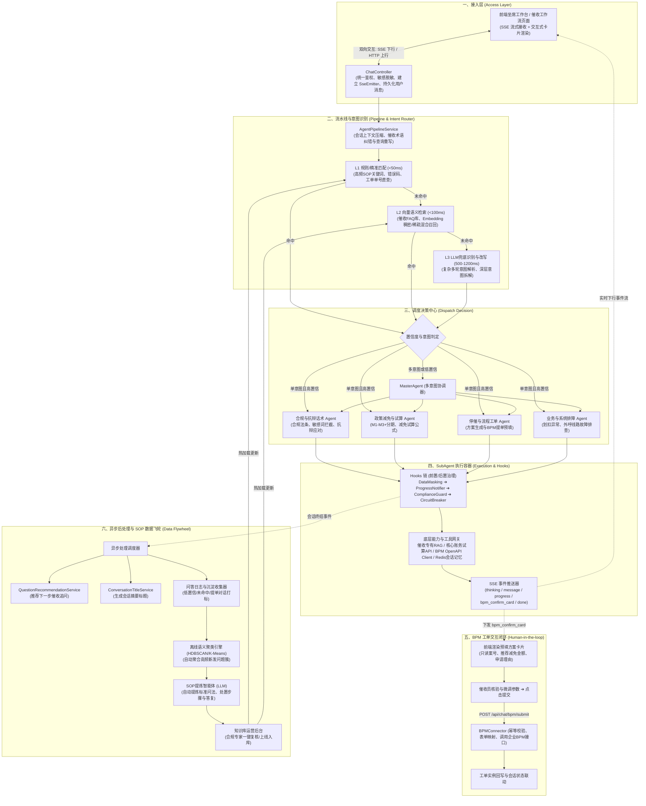
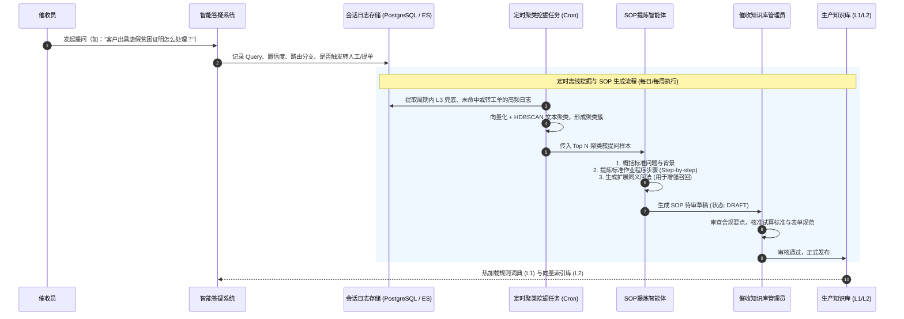
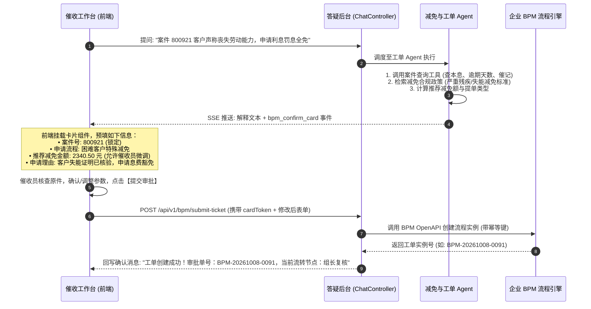
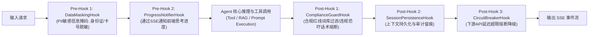

# 系统架构设计说明书：催收域智能答疑机器人

## 1. 建设背景与系统目标

在催收业务场景中，坐席与催收员面临高频的业务规范咨询、客户抗辩应对、利息与罚息减免试算、停催报备及系统操作等问题。传统模式下依赖人工组长答疑或分散在各处的静态文档，存在响应慢、口径不一致、合规风险高的问题。

本系统旨在打造一个高可用、高合规、具备自我进化能力的**催收域智能答疑机器人**，核心支撑以下两项关键业务诉求：
1. **重复问题自动归档 SOP**：沉淀催收员的日常提问，自动识别高频、重复或未解决问题，提炼形成标准作业程序（SOP）并闭环回流至知识库。
2. **推荐解决方案并闭环 BPM 提单（Human-in-the-loop）**：针对涉及实质业务变更（如停催、息费减免、客诉升级）的咨询，Agent 给出政策试算与推荐方案，通过可视化交互卡片供催收员二次核验与微调，一键打通企业 BPM 系统发起正式审批工单。

---

## 2. 总体逻辑架构

系统参考经典企业级 Agent 架构范式，采用分层解耦与响应降级设计，整体架构分为 **接入层、流水线层、意图识别与调度层、子智能体执行层、BPM交互闭环层、异步后处理与SOP数据飞轮层** 六大部分。



---

## 3. 核心流水线与意图识别（串行降级设计）

在催收场景中，高频问题追求毫秒级响应，复杂问题要求高准确率与严格合规。系统采用 L1 $\rightarrow$ L2 $\rightarrow$ L3 串行降级策略：

| 匹配层级 | 技术选型与实现 | 响应耗时 | 覆盖场景 | 降级机制 |
| :--- | :--- | :--- | :--- | :--- |
| **L1 规则匹配** | 前缀字典树 (Trie)、正则表达式、精确关键词匹配表 | `< 30ms` | 错误码直查（如 `DEDUCT_504` 银行限额）、固定话术指令、工单单号直查 | 未命中时下沉到 L2 |
| **L2 向量检索** | Spring AI VectorStore + 专有 Embedding (如 text-embedding-v3 / DashScope) | `< 100ms` | 高频标准化催收问答、已有 SOP 库语义相似问（设定相似度阈值例如 0.86） | 未达到置信度阈值下沉到 L3 |
| **L3 LLM 兜底** | Spring AI ChatModel 结构化输出（JSON Schema） | `500~1200ms` | 复合复杂诉求（如债务人既要求停催又声称要投诉涉案）、口语化模糊表述改写 | 改写并判定意图后直接进入调度决策，不回流 L1 |

**调度决策分支**：
- **单意图 + 高置信度**：跳过 MasterAgent（Skip MasterAgent），直接路由给指定 SubAgent，大幅降低推理延迟与 Token 消耗。
- **多意图 / 低置信度**：进入 MasterAgent，通过子工具调度链拆解子任务并行或串行执行。

---

## 4. 核心功能一：重复问题自动归档 SOP（数据闭环体系）

### 4.1 业务流程设计
催收业务政策和突发客诉应对具有较强的时效性，通过“线上日志沉淀 $\rightarrow$ 离线聚类 $\rightarrow$ LLM 提炼 SOP $\rightarrow$ 人工审核 $\rightarrow$ 知识库更新”构建自进化闭环。



### 4.2 核心数据结构定义

```sql
-- 1. SOP 知识主表
CREATE TABLE collection_sop_knowledge (
    sop_id VARCHAR(64) PRIMARY KEY,
    title VARCHAR(255) NOT NULL,
    category VARCHAR(64) NOT NULL,
    sop_steps JSONB NOT NULL,
    standard_reply TEXT NOT NULL,
    bpm_process_key VARCHAR(128),
    synonym_queries JSONB,
    status VARCHAR(32) DEFAULT 'PUBLISHED',
    hit_count BIGINT DEFAULT 0,
    created_at TIMESTAMP DEFAULT CURRENT_TIMESTAMP,
    updated_at TIMESTAMP DEFAULT CURRENT_TIMESTAMP
);

-- 2. 问答日志与聚类候选表
CREATE TABLE chat_qa_cluster_candidate (
    record_id VARCHAR(64) PRIMARY KEY,
    session_id VARCHAR(64) NOT NULL,
    user_id VARCHAR(64) NOT NULL,
    user_query TEXT NOT NULL,
    rewritten_query TEXT,
    matched_level VARCHAR(16) NOT NULL,
    is_solved BOOLEAN DEFAULT TRUE,
    triggered_bpm BOOLEAN DEFAULT FALSE,
    embedding VECTOR(1536),
    cluster_group_id VARCHAR(64),
    created_at TIMESTAMP DEFAULT CURRENT_TIMESTAMP
);
```

---

## 5. 核心功能二：推荐解决方案与 BPM 工单协同（Human-in-the-loop）

### 5.1 交互流程设计
催收域涉及案件状态扭转与账务减免，必须严格实行 **“AI 测算方案 $\rightarrow$ 人工确权/微调 $\rightarrow$ 系统调用提单”** 的人机协同架构。



### 5.2 SSE 交互事件格式规范 (bpm_confirm_card)

```json
{
  "event": "bpm_confirm_card",
  "data": {
    "action_id": "act_88b14e9a0f",
    "bpm_process_key": "DEBT_SPECIAL_RELIEF_V1",
    "title": "催收特殊费用减免方案申请",
    "description": "基于《困难客户救助减免SOP》测算，该案件符合利息与罚息全免标准，本金不得减免。",
    "form_fields": [
      {
        "field_key": "case_id",
        "label": "案件编号",
        "type": "text",
        "value": "CASE_800921",
        "editable": false,
        "required": true
      },
      {
        "field_key": "relief_amount",
        "label": "拟减免金额 (元)",
        "type": "number",
        "value": 2340.50,
        "max_limit": 2500.00,
        "editable": true,
        "required": true
      },
      {
        "field_key": "relief_reason",
        "label": "申请理由说明",
        "type": "textarea",
        "value": "客户遭遇不可抗力失能，已核验县级残联证明材料，申请免除全部利息罚息。",
        "editable": true,
        "required": true
      }
    ],
    "confirm_button_text": "确认并提交审批",
    "cancel_button_text": "取消"
  }
}
```

---

## 6. 执行容器与安全合规 Hooks 链

催收业务受金融监管（如不得暴力催收、严格保护 PII 隐私）高度约束，SubAgent 执行容器内嵌串行 Hooks 过滤器链：



---

## 7. 技术栈选型

- **微服务核心**：Java 21 + Spring Boot 4.x
- **AI 编排框架**：Spring AI 2.x（ChatClient、Prompt Template、Tool Calling、VectorStore）
- **流式通信**：Spring MVC `SseEmitter` / WebFlux + EventSource
- **向量检索与存储**：PostgreSQL (pgvector) / Milvus / Elasticsearch 8.x
- **高速缓存与状态机**：Redis 7.x（存储多轮短期上下文、防重复提交 Token）
- **工单集成**：企业 BPM OpenAPI (REST / gRPC) + 幂等重试机制
