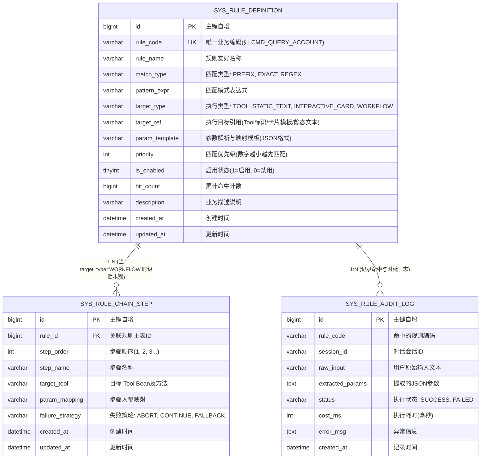

# 数据库脚本与架构规范 (sql/)

本目录包含 Multi-Agent 系统的数据库建表与初始化脚本，面向企业级部署与开源使用者一键执行。

---

## 🗄️ 文件清单

| 文件名 | 用途说明 | 适用版本 |
| :--- | :--- | :--- |
| [init_schema.sql](./init_schema.sql) | L1 规则引擎与工作流核心表结构定义及演示种子数据 | MySQL 8.0+ |

---

## 📊 实体关系图 (ER Diagram)



---

## 🚀 部署执行说明

### 1. 登录 MySQL 并创建数据库
推荐使用 UTF-8 超集编码（`utf8mb4`）以及现代排序规则（`utf8mb4_unicode_ci`）：

```sql
CREATE DATABASE IF NOT EXISTS `ai_agent_db` 
  DEFAULT CHARACTER SET utf8mb4 
  DEFAULT COLLATE utf8mb4_unicode_ci;

USE `ai_agent_db`;
```

### 2. 执行初始化脚本
通过命令行导入：
```bash
mysql -u root -p ai_agent_db < sql/init_schema.sql
```
或者在 Navicat / DataGrip / DBeaver 等可视化客户端中打开 `sql/init_schema.sql` 并在 `ai_agent_db` 下运行全部语句。
